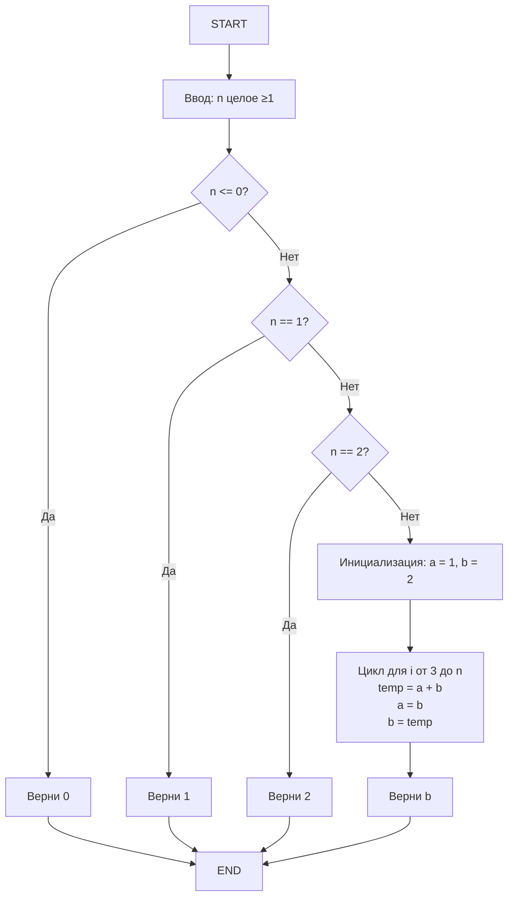
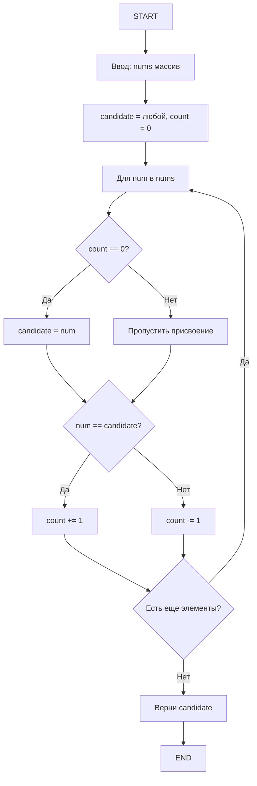
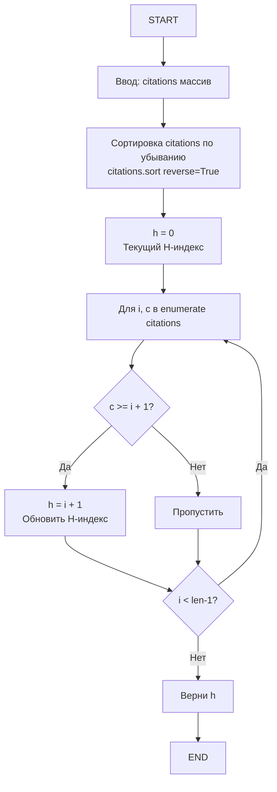

# LeetCode Problems - Полный разбор


# 1. формат записи поделен за 6 секций. нумерация с 2. Поэтому будет вместо 150 - 151 задача. Для удобства задачи подписаны.


## 2. Задача 139: Word Break

### 1. Условие задачи

Задача "Word Break" (LeetCode 139): Дана строка s и словарь слов wordDict. Можно ли разбить s полностью на слова из словаря (слова можно повторять, порядок любой, но без остатка)? Верни True/False. Например, s="leetcode", wordDict=["leet","code"] → True ("leet"+"code").

### Жизненные примеры:
В текстовом редакторе — проверка, можно ли разбить фразу на известные слова (для автокоррекции). В реальных проектах: в поисковых системах (Google: разбиение запроса на токены), в NLP (машинный перевод: сегментация азиатских языков без пробелов), или в играх (Scrabble: составь слово из букв/слов).

### 2. Математическая модель

Булева динамика: dp[i] = 1 (True), если подстрока s[0..i-1] разбивается.
- dp[0] = 1 (пустая = True)
- dp[i] = max( dp[j] * (s[j:i] в dict) ) для j=0..i-1 (логическое ИЛИ)

Это покрытие интервала [0,i) сегментами (словами). Модель как 0/1 knapsack variant, O(n²) время.

### 3. Алгоритмизация

```mermaid
flowchart TD
    A[START] --> B[Ввод: s строка, wordDict список строк]
    B --> C[dp = False * len+1<br/>dp[0] = True<br/>word_set = set wordDict]
    C --> D[Для i от 1 до len+1: внешний цикл]
    D --> E[Для j от 0 до i: внутренний цикл]
    E --> F{dp[j] И s[j:i] в word_set?}
    F -->|Да| G[dp[i] = True<br/>Break выход из внутреннего цикла]
    F -->|Нет| H[Продолжить цикл j]
    G --> I{i < len?}
    H --> I
    I -->|Да| D
    I -->|Нет| J[Верни dp[len]]
    J --> K[END]
```

### 4. Проектирование тестов

| Номер теста | Назначение теста | Входные данные | Ожидаемые выходные данные | Пояснение |
|-------------|------------------|----------------|---------------------------|-----------|
| 1 | Простой разбор на слова | s="leetcode", wordDict=["leet","code"] | True | "leet"+"code" покрывает всю строку |
| 2 | Разбор с повторениями | s="applepenapple", wordDict=["apple","pen"] | True | "apple"+"pen"+"apple" |
| 3 | Невозможно разбить | s="catsandog", wordDict=["cats","dog","sand","and","cat"] | False | Нет полного покрытия (og не в dict) |
| 4 | Пустая строка | s="", wordDict=["a"] | True | Пустая всегда True |
| 5 | Один символ, есть в dict | s="a", wordDict=["a"] | True | Полное совпадение |
| 6 | Один символ, нет в dict | s="a", wordDict=["b"] | False | Не покрыто |

### 5. Проверка правильности алгоритма с помощью таблицы

- **Тест 1:** dp[0]=True. i=1..4: j=0..4, для j=0 s[0:4]="leet" в set → dp[4]=True (ветвление Да, break). i=5..8: j=4 s[4:8]="code" → dp[8]=True. Верни True.
- **Тест 2:** Аналогично, dp строится для "apple" (5), "pen" (8), "apple" (13).
- **Тест 3:** Нет j где dp[j] и остаток в set для i=len(s) — dp[len]=False.
- **Тест 4:** dp[0]=True, верни dp[0]=True (без циклов).
- **Тест 5:** i=1, j=0, s[0:1]="a" в set → Да, dp[1]=True.
- **Тест 6:** Нет совпадения → dp[1]=False.

### 6. Кодирование алгоритма

```python
class Solution:
    def wordBreak(self, s: str, wordDict: List[str]) -> bool:
        dp = [False] * (len(s) + 1)  # Создай список False размером len(s)+1
        dp[0] = True  # Пустая строка всегда разбивается
        word_set = set(wordDict)  # set для O(1) проверки "in"
        
        for i in range(1, len(s) + 1):  # i — конец подстроки s[0:i]
            for j in range(i):  # j — начало последнего слова
                if dp[j] and s[j:i] in word_set:  # Проверка разбиения и наличия слова
                    dp[i] = True  # Подстрока до i разбита
                    break  # Оптимизация: нашли одно разбиение
        
        return dp[len(s)]  # Разбита ли вся строка
```


## Задача 3: House Robber (LeetCode 198)
**Условие:**
Дан массив `nums`, где `nums[i]` — деньги в доме. Нельзя ограбить два соседних дома. Вернуть максимальную сумму.

**Жизненные примеры:**
- Планирование ограблений с ограничениями.
- Распределение ресурсов с условием, что нельзя использовать соседние элементы.
- Финансы: нельзя инвестировать подряд в две соседние компании.

**Математическая модель:**
```
dp[i] = max(dp[i-1], dp[i-2] + nums[i])
```
**Начальные условия:**
```
dp[0] = nums[0]
dp[1] = max(nums[0], nums[1])
```

**Алгоритм:**
```python
class Solution:
    def rob(self, nums: List[int]) -> int:
        if not nums: return 0
        if len(nums) == 1: return nums[0]
        dp = [0] * len(nums)
        dp[0] = nums[0]
        dp[1] = max(nums[0], nums[1])
        for i in range(2, len(nums)):
            dp[i] = max(dp[i-1], dp[i-2]+nums[i])
        return dp[-1]
```

**Тесты:**
| № | Назначение теста | Вход | Ожидаемый результат | Пояснение |
|---|-----------------|------|-------------------|------------|
| 1 | Базовый случай | [1,2,3,1] | 4 | 1+3 |
| 2 | Один дом | [2] | 2 | Только один выбор |
| 3 | Два дома | [2,3] | 3 | Берём максимальный |
| 4 | Несколько домов | [2,7,9,3,1] | 12 | 2+9+1 |


## 4. Задача 300: Longest Increasing Subsequence

### 1. Условие задачи

Задача "Longest Increasing Subsequence" (LeetCode 300): В массиве nums найди длину самой длинной строго возрастающей подпоследовательности (не обязательно подряд элементов). Например, nums=[10,9,2,5,3,7,101,18] → 4 (2,3,7,101 или 2,5,7,18).

### Жизненные примеры:
В истории цен акций — самая длинная цепочка роста (для анализа тренда). В реальных проектах: в анализе логов (длиннейшая последовательность возрастающих событий, как ID транзакций), в биоинформатике (LIS в последовательностях ДНК для мутаций), или в планировании (длиннейшая цепочка задач с возрастающей сложностью).

### 2. Математическая модель

Оптимизированная DP: dp[k] = минимальный "хвост" (конец) для всех подпоследовательностей длины k+1.

- Инициал: dp = [] (пустой)
- Для каждого num: найди позицию idx, где num может заменить или добавить (бинпоиск)
- Если idx = len(dp): добавь (новая длина)
- Иначе: замени dp[idx] на num (лучший хвост)
- Длина LIS = len(dp)

Это O(n log n) благодаря бинпоиску (bisect), вместо O(n²) классики.

### 3. Алгоритмизация

```mermaid
flowchart TD
    A[START] --> B[Ввод: nums список целых]
    B --> C{nums пуст?}
    C -->|Да| D[Верни 0]
    C -->|Нет| E[dp = [] пустой список хвостов]
    E --> F[Для num в nums: цикл по элементам]
    F --> G[idx = bisect_left dp, num<br/>Бинпоиск: позиция вставки]
    G --> H{idx == len dp?}
    H -->|Да| I[dp.append num<br/>Добавь новый уровень]
    H -->|Нет| J[dp[idx] = num<br/>Замени хвост]
    I --> K{Есть еще num?}
    J --> K
    K -->|Да| F
    K -->|Нет| L[Верни len dp]
    L --> M[END]
    D --> M
```

### 4. Проектирование тестов

| Номер теста | Назначение теста | Входные данные | Ожидаемые выходные данные | Пояснение |
|-------------|------------------|----------------|---------------------------|-----------|
| 1 | Стандартный рост с заменой | nums=[10,9,2,5,3,7,101,18] | 4 | 2<3<7<18 или 2<3<7<101 |
| 2 | Все убывают | nums=[5,4,3,2,1] | 1 | Только один элемент |
| 3 | С дубликатами (строго растёт) | nums=[1,3,5,4,7] | 4 | 1<3<4<7 |
| 4 | Пустой массив | nums=[] | 0 | Нет элементов |
| 5 | Один элемент | nums=[10] | 1 | Сам по себе |
| 6 | Все равны | nums=[2,2,2,2] | 1 | Не растёт (строго <) |

### 5. Проверка правильности алгоритма с помощью таблицы

**Тест 1:** dp=[]. num=10: idx=0==0, append [10]. num=9: bisect_left([10],9)=0, replace [9]. num=2: bisect=0, [2]. num=5: bisect=1==1, append [2,5]. num=3: bisect=1 (2<3<5), replace [2,3]. num=7: bisect=2==2, append [2,3,7]. num=101: bisect=3, append [2,3,7,101]. num=18: bisect=3, replace [2,3,7,18]. len=4.

### 6. Кодирование алгоритма

```python
import bisect

class Solution:
    def lengthOfLIS(self, nums: List[int]) -> int:
        if not nums:  # Пустой список
            return 0
        
        dp = []  # Список "хвостов"
        
        for num in nums:  # Цикл по каждому элементу
            idx = bisect.bisect_left(dp, num)  # Бинпоиск O(log len(dp))
            if idx == len(dp):  # За концом — новая длина LIS
                dp.append(num)
            else:  # Замена хвоста на лучший
                dp[idx] = num
        
        return len(dp)  # Максимальная длина LIS
```

---

## 5. Задача 322: Coin Change

### 1. Условие задачи

Задача "Coin Change" (LeetCode 322): Даны монеты coins (список номиналов, бесконечные) и цель amount. Найди минимальное число монет, чтобы набрать ровно amount. Если невозможно — -1. Например, coins=[1,2,5], amount=11 → 3 (5+5+1).

### Жизненные примеры:
В магазине — минимальная сдача клиенту. В реальных проектах: оптимизация производства (мин деталей для продукта), в сетях (мин пакетов для передачи данных), или в играх (мин ресурсов для крафта).

### 2. Математическая модель

Динамика unbounded knapsack: dp[i] = минимальное число монет для суммы i.

- dp[0] = 0
- dp[i] = min( dp[i - c] + 1 ) для всех c в coins, где i ≥ c, иначе inf

Модель: Минимизация по подзадачам, с inf для невозможного. O(amount * len(coins)) время.

### 3. Алгоритмизация

```mermaid
flowchart TD
    A[START] --> B[Ввод: coins список >0, amount ≥0]
    B --> C{amount == 0?}
    C -->|Да| D[Верни 0]
    C -->|Нет| E[dp = inf * amount+1<br/>dp[0] = 0]
    E --> F[Для i от 1 до amount: внешний цикл по суммам]
    F --> G[Для coin в coins: внутренний цикл по монетам]
    G --> H{i >= coin?}
    H -->|Да| I[dp[i] = min dp[i], dp[i-coin]+1]
    H -->|Нет| J[Пропусти]
    I --> K{Есть еще coin?}
    J --> K
    K -->|Да| G
    K -->|Нет| L{i < amount?}
    L -->|Да| F
    L -->|Нет| M{dp[amount] == inf?}
    M -->|Да| N[Верни -1]
    M -->|Нет| O[Верни dp[amount]]
    N --> P[END]
    O --> P
    D --> P
```

### 4. Проектирование тестов

| Номер теста | Назначение теста | Входные данные | Ожидаемые выходные данные | Пояснение |
|-------------|------------------|----------------|---------------------------|-----------|
| 1 | Стандартный случай (оптимально) | coins=[1,2,5], amount=11 | 3 | 5+5+1 — минимум монет |
| 2 | Невозможно (не кратно) | coins=[2], amount=3 | -1 | Нет комбо на 3 |
| 3 | amount=0 | coins=[1], amount=0 | 0 | Ничего не нужно |
| 4 | Одна монета покрывает | coins=[5], amount=5 | 1 | Просто 5 |
| 5 | Невозможно | coins=[3,5], amount=7 | -1 | Нет комбо: 3+3+1 нет 1, 5+2 нет 2 |
| 6 | Большой amount | coins=[1,5,10], amount=100 | 10 | 10*10 — минимум |

### 5. Проверка правильности алгоритма с помощью таблицы

**Тест 1:** dp[0]=0. i=1: coin=1 >=1, dp[1]=min(inf, dp[0]+1)=1. i=2: coins 1,2, min=1. ... i=11: min от dp[10]+1, dp[9]+1, dp[6]+1=3. Верни 3.

### 6. Кодирование алгоритма

```python
class Solution:
    def coinChange(self, coins: List[int], amount: int) -> int:
        dp = [float('inf')] * (amount + 1)  # Бесконечность для всех сумм
        dp[0] = 0  # Для суммы 0 — 0 монет
        
        for i in range(1, amount + 1):  # Строим снизу вверх
            for coin in coins:  # Для каждой монеты
                if i >= coin:  # Монета не больше суммы
                    dp[i] = min(dp[i], dp[i - coin] + 1)  # Выбираем лучший вариант
        
        return dp[amount] if dp[amount] != float('inf') else -1
```

---

## 6. Задача 70: Climbing Stairs

### 1. Условие задачи

Задача "Climbing Stairs" (LeetCode 70): Дана лестница с n ступеньками. Можно подниматься по 1 или 2 ступеньки за раз. Нужно найти количество уникальных способов подняться наверх. Для n=3: способы — 1+1+1, 1+2, 2+1 (всего 3).

### Жизненные примеры:
Подъём по лестнице в здании — сколько вариантов шагов, чтобы не скучно. В реальных проектах: в робототехнике (траектории движения робота по ступеням), в моделировании финансов (рост капитала с шагами +1 или +2%), в играх (варианты прыжков в платформере).

### 2. Математическая модель

Рекуррентное соотношение Фибоначчи:
- f(0) = 1, f(1) = 1, f(2) = 2
- f(n) = f(n-1) + f(n-2) для n > 2

Модель: Каждый способ — сумма из предыдущих состояний. Итеративное решение для O(n) времени, O(1) памяти.

### 3. Алгоритмизация



### 4. Проектирование тестов

| Номер теста | Назначение теста | Входные данные | Ожидаемые выходные данные | Пояснение |
|-------------|------------------|----------------|---------------------------|-----------|
| 1 | Минимальное n | n=1 | 1 | Только один шаг |
| 2 | Базовый случай n=2 | n=2 | 2 | 1+1 или 2 |
| 3 | Средний случай | n=3 | 3 | 1+1+1, 1+2, 2+1 |
| 4 | Большое n (цикл) | n=5 | 8 | Фибоначчи: 1,2,3,5,8 |
| 5 | Крайний (n=0) | n=0 | 0 | Пустая лестница |
| 6 | Большое для эффективности | n=45 | 1836311903 | Проверяет отсутствие переполнения |

### 5. Проверка правильности алгоритма с помощью таблицы

- **Тест 1:** Ввод → ромб n<=0 Нет → ромб n==1 Да → Верни 1
- **Тест 3:** n<=0 Нет → n==1 Нет → n==2 Нет → Инициал a=1 b=2 → Цикл i=3: temp=3, a=2, b=3 → Верни 3

### 6. Кодирование алгоритма

```python
class Solution:
    def climbStairs(self, n: int) -> int:
        if n <= 2:
            return n
        
        a = 1  # f(1)
        b = 2  # f(2)
        
        for i in range(3, n + 1):
            temp = a + b
            a = b
            b = temp
        
        return b
```

---

## 7. Задача 12: Integer to Roman

### 1. Условие задачи

Задача "Integer to Roman" (LeetCode 12): Преобразуй целое число (1..3999) в римскую нотацию (I=1, V=5, X=10, L=50, C=100, D=500, M=1000). Учти вычитание: 4=IV, 9=IX, 40=XL и т.д.

### Жизненные примеры:
Номера глав в книгах (Chapter IV). В реальных проектах: в часах (римские цифры на циферблате), в нумерации событий (Super Bowl LV), или в играх (уровни в римском стиле).

### 2. Математическая модель

Отображение: Список пар (значение, символ) sorted descending: (1000,"M"), (900,"CM"), (500,"D"), (400,"CD"), (100,"C"), (90,"XC"), (50,"L"), (40,"XL"), (10,"X"), (9,"IX"), (5,"V"), (4,"IV"), (1,"I").

Строка = сумма символов, пока num >0: вычти max подходящее, добавь символ.
Модель: Жадный алгоритм (greedy), O(1) время (фиксированные пары).

### 3. Алгоритмизация

```mermaid
flowchart TD
    A[START] --> B[Ввод: num 1 ≤ num ≤ 3999]
    B --> C[values = [1000,900,500,400,100,90,50,40,10,9,5,4,1]<br/>symbols = ["M","CM","D","CD","C","XC","L","XL","X","IX","V","IV","I"]<br/>result = ""]
    C --> D[Для i от 0 до 12: цикл по парам]
    D --> E{num >= values[i]?}
    E -->|Да| F[result += symbols[i]<br/>num -= values[i]]
    E -->|Нет| G[Продолжить к следующему i]
    F --> E
    G --> H{i < 12?}
    H -->|Да| D
    H -->|Нет| I[Верни result]
    I --> J[END]
```

### 4. Проектирование тестов

| Номер теста | Назначение теста | Входные данные | Ожидаемые выходные данные | Пояснение |
|-------------|------------------|----------------|---------------------------|-----------|
| 1 | Простое число | num=3 | "III" | 1+1+1 |
| 2 | С вычитанием | num=4 | "IV" | 5-1 |
| 3 | Среднее | num=58 | "LVIII" | 50+5+1+1+1 |
| 4 | Большое | num=1994 | "MCMXCIV" | 1000 + (1000-100) + (100-10) + (5-1) |
| 5 | Минимальное | num=1 | "I" | Просто 1 |
| 6 | Максимальное | num=3999 | "MMMCMXCIX" | 3*1000 + 900 + 90 + 9 |

### 5. Проверка правильности алгоритма с помощью таблицы

**Тест 1:** num=3. i=12 (1): while 3>=1 → + "I", num=2; + "I", num=1; + "I", num=0. Верни "III".

### 6. Кодирование алгоритма

```python
class Solution:
    def intToRoman(self, num: int) -> str:
        values = [1000, 900, 500, 400, 100, 90, 50, 40, 10, 9, 5, 4, 1]
        symbols = ["M", "CM", "D", "CD", "C", "XC", "L", "XL", "X", "IX", "V", "IV", "I"]
        
        result = ""
        
        for i in range(len(values)):
            while num >= values[i]:
                result += symbols[i]
                num -= values[i]
        
        return result
```


## 8. Задача 121: Best Time to Buy and Sell Stock

### 1. Условие задачи

Задача "Best Time to Buy and Sell Stock" (LeetCode 121): Дан массив цен акций по дням. Найди максимальную прибыль от одной покупки и одной продажи (купи раньше, продай позже). Если прибыль 0 — верни 0.

### Жизненные примеры:
Торговля акциями: цены [7,1,5,3,6,4] → купи за 1, продай за 6 = 5. В реальных проектах: в трейдинге (алготрейдинг для сигналов покупки/продажи), в анализе данных (max profit в последовательностях, как температура для отопления).

### 2. Математическая модель

- min_price = inf, max_profit = 0
- Для каждой цены p: profit = p - min_price, max_profit = max(max_profit, profit), min_price = min(min_price, p)

Модель: Линейный проход с накоплением min, O(n) время.

### 3. Алгоритмизация

```mermaid
flowchart TD
    A[START] --> B[Ввод: prices список ≥1]
    B --> C{len prices < 2?}
    C -->|Да| D[Верни 0]
    C -->|Нет| E[min_price = prices[0]<br/>max_profit = 0]
    E --> F[Для i от 1 до len-1: цикл]
    F --> G[profit = prices[i] - min_price]
    G --> H[max_profit = max max_profit, profit]
    H --> I[min_price = min min_price, prices[i]]
    I --> J{i < len-1?}
    J -->|Да| F
    J -->|Нет| K[Верни max_profit]
    K --> L[END]
    D --> L
```

### 4. Проектирование тестов

| Номер теста | Назначение теста | Входные данные | Ожидаемые выходные данные | Пояснение |
|-------------|------------------|----------------|---------------------------|-----------|
| 1 | Стандартный подъём | prices=[7,1,5,3,6,4] | 5 | Купи 1, продай 6 |
| 2 | Все падают | prices=[7,6,4,3,1] | 0 | Нет прибыли |
| 3 | Один элемент | prices=[5] | 0 | Нельзя купить/продать |
| 4 | Два элемента (прибыль) | prices=[2,4] | 2 | Купи 2, продай 4 |
| 5 | Крайний (все равны) | prices=[3,3,3] | 0 | Нет роста |
| 6 | Большой массив | prices=[1,2,3,4,5] | 4 | Купи 1, продай 5 |

### 5. Проверка правильности алгоритма с помощью таблицы

**Тест 1:** min=7, i=1: profit=1-7=-6, max=0, min=1. i=2:5-1=4, max=4, min=1. i=3:3-1=2, max=4, min=1. i=4:6-1=5, max=5, min=1. i=5:4-1=3, max=5, min=1. Верни 5.

### 6. Кодирование алгоритма

```python
class Solution:
    def maxProfit(self, prices: List[int]) -> int:
        if len(prices) < 2:
            return 0
        
        min_price = prices[0]
        max_profit = 0
        
        for i in range(1, len(prices)):
            profit = prices[i] - min_price
            max_profit = max(max_profit, profit)
            min_price = min(min_price, prices[i])
        
        return max_profit
```

## 9. Задача 122: Best Time to Buy and Sell Stock II

### 1. Условие задачи

Задача "Best Time to Buy and Sell Stock II" (LeetCode 122): Можно покупать и продавать акции много раз в разные дни. Найди максимальную прибыль. В отличие от задачи 121, здесь разрешены множественные транзакции.

### Жизненные примеры:
Активная торговля акциями - покупай на минимумах, продавай на максимумах. В реальных проектах: алготрейдинг (автоматические сделки), арбитраж валют, оптимизация закупок сырья.

### 2. Математическая модель

Жадный алгоритм: profit = сумма всех положительных разностей соседних дней.
- Если prices[i] > prices[i-1]: добавь разность к прибыли
- Это эквивалентно покупке накануне роста, продаже перед падением

Модель: O(n) время, O(1) память.

### 3. Алгоритмизация

```mermaid
flowchart TD
    A[START] --> B[Ввод: prices массив цен]
    B --> C[profit = 0]
    C --> D[Для i от 1 до len-1]
    D --> E{prices[i] > prices[i-1]?}
    E -->|Да| F[profit += prices[i] - prices[i-1]]
    E -->|Нет| G[Продолжить]
    F --> H{i < len-1?}
    G --> H
    H -->|Да| D
    H -->|Нет| I[Верни profit]
    I --> J[END]
```

### 4. Проектирование тестов

| Номер теста | Назначение теста | Входные данные | Ожидаемые выходные данные | Пояснение |
|-------------|------------------|----------------|---------------------------|-----------|
| 1 | Растущий тренд | prices=[7,1,5,3,6,4] | 7 | (5-1)+(6-3) = 4+3 = 7 |
| 2 | Падающий тренд | prices=[7,6,4,3,1] | 0 | Нет роста, прибыль 0 |
| 3 | Постоянный рост | prices=[1,2,3,4,5] | 4 | 1+1+1+1 = 4 |
| 4 | Один элемент | prices=[1] | 0 | Нет транзакций |
| 5 | Два элемента рост | prices=[1,2] | 1 | 2-1 = 1 |
| 6 | Два элемента падение | prices=[2,1] | 0 | Нет прибыли |

### 5. Проверка правильности алгоритма

**Тест 1:** profit=0, i=1: 1<7 нет, i=2: 5>1 да profit=4, i=3: 3<5 нет, i=4: 6>3 да profit=7, i=5: 4<6 нет. Верни 7.

### 6. Кодирование алгоритма

```python
class Solution:
    def maxProfit(self, prices: List[int]) -> int:
        profit = 0
        for i in range(1, len(prices)):
            if prices[i] > prices[i-1]:  # Есть рост
                profit += prices[i] - prices[i-1]  # Добавь к прибыли
        return profit
```

---

## 10. Задача 13: Roman to Integer

### 1. Условие задачи

Задача "Roman to Integer" (LeetCode 13): Преобразуй римскую запись в десятичное число. Символы: I=1, V=5, X=10, L=50, C=100, D=500, M=1000. Особенности: IV=4, IX=9, XL=40, XC=90, CD=400, CM=900.

### Жизненные примеры:
Чтение римских цифр на часах, памятниках, книгах (глава IV). В программировании: парсеры исторических дат, конверторы систем счисления.

### 2. Математическая модель

Правило вычитания: если текущий символ меньше следующего - вычитай, иначе прибавляй.
- IV: I < V, поэтому -1+5 = 4
- VI: V > I, поэтому 5+1 = 6

Модель: O(n) время, O(1) память.

### 3. Алгоритмизация

```mermaid
flowchart TD
    A[START] --> B[Ввод: s римская строка]
    B --> C[roman_map = словарь символов<br/>result = 0]
    C --> D[Для i от 0 до len-1]
    D --> E{i < len-1 И roman[s[i]] < roman[s[i+1]]?}
    E -->|Да| F[result -= roman[s[i]]<br/>Вычитание]
    E -->|Нет| G[result += roman[s[i]]<br/>Прибавление]
    F --> H{i < len-1?}
    G --> H
    H -->|Да| D
    H -->|Нет| I[Верни result]
    I --> J[END]
```

### 4. Проектирование тестов

| Номер теста | Назначение теста | Входные данные | Ожидаемые выходные данные | Пояснение |
|-------------|------------------|----------------|---------------------------|-----------|
| 1 | Простое число | s="III" | 3 | 1+1+1 |
| 2 | С вычитанием | s="IV" | 4 | -1+5 |
| 3 | Сложное число | s="LVIII" | 58 | 50+5+1+1+1 |
| 4 | Много вычитаний | s="MCMXCIV" | 1994 | 1000-100+1000-10+100-1+5 |
| 5 | Максимальное | s="MMMCMXCIX" | 3999 | 3000+900+90+9 |
| 6 | Минимальное | s="I" | 1 | Просто 1 |

### 5. Проверка правильности алгоритма

**Тест 2:** s="IV", i=0: I<V да, result=-1, i=1: result=-1+5=4. Верни 4.

### 6. Кодирование алгоритма

```python
class Solution:
    def romanToInt(self, s: str) -> int:
        roman = {'I': 1, 'V': 5, 'X': 10, 'L': 50, 'C': 100, 'D': 500, 'M': 1000}
        result = 0
        
        for i in range(len(s)):
            # Если текущий символ меньше следующего - вычитаем
            if i < len(s) - 1 and roman[s[i]] < roman[s[i+1]]:
                result -= roman[s[i]]
            else:
                result += roman[s[i]]
        
        return result
```

---

## 11. Задача 134: Gas Station

### 1. Условие задачи

Задача "Gas Station" (LeetCode 134): Есть кольцевой маршрут из n заправок. На станции i получаешь gas[i] топлива, до следующей тратишь cost[i]. Найди стартовую позицию для полного круга или верни -1.

### Жизненные примеры:
Планирование маршрута автомобиля с заправками. В логистике: оптимизация маршрутов грузовиков, планирование рейсов самолетов.

### 2. Математическая модель

Жадный алгоритм:
- Если sum(gas) < sum(cost): невозможно
- Начинай с позиции после первого отрицательного баланса
- current_tank отслеживает текущий баланс

Модель: O(n) время, O(1) память.

### 3. Алгоритмизация

```mermaid
flowchart TD
    A[START] --> B[Ввод: gas, cost массивы]
    B --> C[total_tank = 0, current_tank = 0, start = 0]
    C --> D[Для i от 0 до n-1]
    D --> E[balance = gas[i] - cost[i]<br/>total_tank += balance<br/>current_tank += balance]
    E --> F{current_tank < 0?}
    F -->|Да| G[start = i + 1<br/>current_tank = 0]
    F -->|Нет| H[Продолжить]
    G --> I{i < n-1?}
    H --> I
    I -->|Да| D
    I -->|Нет| J{total_tank >= 0?}
    J -->|Да| K[Верни start]
    J -->|Нет| L[Верни -1]
    K --> M[END]
    L --> M
```

### 4. Проектирование тестов

| Номер теста | Назначение теста | Входные данные | Ожидаемые выходные данные | Пояснение |
|-------------|------------------|----------------|---------------------------|-----------|
| 1 | Возможно с позиции 3 | gas=[1,2,3,4,5], cost=[3,4,5,1,2] | 3 | Баланс: -2,-2,-2,3,3, старт=3 |
| 2 | Невозможно | gas=[2,3,4], cost=[3,4,3] | -1 | Общий баланс отрицательный |
| 3 | Старт с 0 | gas=[5,1,2,3,4], cost=[4,4,1,5,1] | 4 | Проверка разных стартов |
| 4 | Один элемент да | gas=[1], cost=[1] | 0 | Баланс 0, возможно |
| 5 | Один элемент нет | gas=[1], cost=[2] | -1 | Недостаточно топлива |

### 5. Проверка правильности алгоритма

**Тест 1:** i=0: balance=-2, current=-2<0, start=1. i=1: balance=-2, current=-2<0, start=2. i=2: balance=-2, current=-2<0, start=3. i=3: balance=3, current=3. i=4: balance=3, current=6. total=0≥0, верни start=3.

### 6. Кодирование алгоритма

```python
class Solution:
    def canCompleteCircuit(self, gas: List[int], cost: List[int]) -> int:
        total_tank = current_tank = start = 0
        
        for i in range(len(gas)):
            total_tank += gas[i] - cost[i]  # Общий баланс
            current_tank += gas[i] - cost[i]  # Текущий баланс
            
            # Если не можем дойти до следующей станции
            if current_tank < 0:
                start = i + 1  # Начинаем после проблемной
                current_tank = 0  # Сбрасываем баланс
        
        return start if total_tank >= 0 else -1
```

---

## 12. Задача 135: Candy

### 1. Условие задачи

Задача "Candy" (LeetCode 135): n детей в ряд с рейтингами ratings[i]. Каждый получает ≥1 конфету. Если рейтинг ребенка выше соседа, он должен получить больше конфет. Минимальное общее количество?

### Жизненные примеры:
Распределение премий в команде по рейтингу. В экономике: справедливое распределение ресурсов, система бонусов.

### 2. Математическая модель

Два прохода:
1. Слева направо: если ratings[i] > ratings[i-1], то candies[i] = candies[i-1] + 1
2. Справа налево: если ratings[i] > ratings[i+1], то candies[i] = max(candies[i], candies[i+1] + 1)

Модель: O(n) время, O(n) память.

### 3. Алгоритмизация

```mermaid
flowchart TD
    A[START] --> B[Ввод: ratings массив]
    B --> C[candies = [1] * n<br/>Каждый получает минимум 1]
    C --> D[Проход 1: слева направо<br/>Для i от 1 до n-1]
    D --> E{ratings[i] > ratings[i-1]?}
    E -->|Да| F[candies[i] = candies[i-1] + 1]
    E -->|Нет| G[Продолжить]
    F --> H{i < n-1?}
    G --> H
    H -->|Да| D
    H -->|Нет| I[Проход 2: справа налево<br/>Для i от n-2 до 0]
    I --> J{ratings[i] > ratings[i+1]?}
    J -->|Да| K[candies[i] = max(candies[i], candies[i+1] + 1)]
    J -->|Нет| L[Продолжить]
    K --> M{i > 0?}
    L --> M
    M -->|Да| I
    M -->|Нет| N[Верни sum(candies)]
    N --> O[END]
```

### 4. Проектирование тестов

| Номер теста | Назначение теста | Входные данные | Ожидаемые выходные данные | Пояснение |
|-------------|------------------|----------------|---------------------------|-----------|
| 1 | Растущие рейтинги | ratings=[1,0,2] | 5 | candies=[2,1,2] |
| 2 | Убывающие | ratings=[1,2,2] | 4 | candies=[1,2,1] |
| 3 | Сложный случай | ratings=[1,3,2,2,1] | 9 | candies=[1,3,2,1,1] после двух проходов |
| 4 | Все равны | ratings=[1,1,1] | 3 | candies=[1,1,1] |
| 5 | Один ребенок | ratings=[1] | 1 | candies=[1] |

### 5. Проверка правильности алгоритма

**Тест 1:** candies=[1,1,1]. Проход 1: ratings[1]=0<1 нет, ratings[2]=2>0 да candies=[1,1,2]. Проход 2: ratings[1]=0<2 нет, ratings[0]=1>0 да candies=[2,1,2]. sum=5.

### 6. Кодирование алгоритма

```python
class Solution:
    def candy(self, ratings: List[int]) -> int:
        n = len(ratings)
        candies = [1] * n  # Каждый получает минимум 1 конфету
        
        # Проход слева направо: обрабатываем растущие участки
        for i in range(1, n):
            if ratings[i] > ratings[i-1]:
                candies[i] = candies[i-1] + 1
        
        # Проход справа налево: обрабатываем убывающие участки
        for i in range(n-2, -1, -1):
            if ratings[i] > ratings[i+1]:
                candies[i] = max(candies[i], candies[i+1] + 1)
        
        return sum(candies)
```

---

## 13. Задача 14: Longest Common Prefix

### 1. Условие задачи

Задача "Longest Common Prefix" (LeetCode 14): Найди самый длинный общий префикс в массиве строк. Если общего префикса нет, верни пустую строку.

### Жизненные примеры:
Автодополнение в поисковиках, группировка файлов по общему началу имени. В программировании: namespace в языках, общие пути в файловых системах.

### 2. Математическая модель

Вертикальное сканирование: сравнивай символы на одинаковых позициях во всех строках.
- Остановись при первом несовпадении или достижении конца любой строки

Модель: O(S) время где S = сумма длин всех строк, O(1) память.

### 3. Алгоритмизация

```mermaid
flowchart TD
    A[START] --> B[Ввод: strs массив строк]
    B --> C{strs пустой?}
    C -->|Да| D[Верни ""]
    C -->|Нет| E[Для i от 0 до len(strs[0])-1]
    E --> F[char = strs[0][i]<br/>Символ первой строки]
    F --> G[Для j от 1 до len(strs)-1]
    G --> H{i >= len(strs[j]) ИЛИ strs[j][i] != char?}
    H -->|Да| I[Верни strs[0][:i]]
    H -->|Нет| J{j < len(strs)-1?}
    J -->|Да| G
    J -->|Нет| K{i < len(strs[0])-1?}
    K -->|Да| E
    K -->|Нет| L[Верни strs[0]]
    I --> M[END]
    L --> M
    D --> M
```

### 4. Проектирование тестов

| Номер теста | Назначение теста | Входные данные | Ожидаемые выходные данные | Пояснение |
|-------------|------------------|----------------|---------------------------|-----------|
| 1 | Есть общий префикс | strs=["flower","flow","flight"] | "fl" | Первые 2 символа совпадают |
| 2 | Нет общего префикса | strs=["dog","racecar","car"] | "" | Первые символы разные |
| 3 | Одна строка | strs=["single"] | "single" | Сама строка - префикс |
| 4 | Пустой массив | strs=[] | "" | Нет строк |
| 5 | Пустая строка внутри | strs=["","b"] | "" | Пустая ограничивает префикс |
| 6 | Одинаковые строки | strs=["test","test","test"] | "test" | Полное совпадение |

### 5. Проверка правильности алгоритма

**Тест 1:** i=0, char='f': все строки начинаются с 'f'. i=1, char='l': все содержат 'l' на позиции 1. i=2, char='o': "flight"[2]='i'≠'o', верни "fl".

### 6. Кодирование алгоритма

```python
class Solution:
    def longestCommonPrefix(self, strs: List[str]) -> str:
        if not strs:
            return ""
        
        # Сравниваем символы по позициям
        for i in range(len(strs[0])):
            char = strs[0][i]  # Символ из первой строки
            
            # Проверяем этот символ во всех остальных строках
            for j in range(1, len(strs)):
                if i >= len(strs[j]) or strs[j][i] != char:
                    return strs[0][:i]  # Возвращаем префикс до несовпадения
        
        return strs[0]  # Вся первая строка является префиксом
```

---

## 14. Задача 151: Reverse Words in a String

### 1. Условие задачи

Задача "Reverse Words in a String" (LeetCode 151): Разверни порядок слов в строке. Слова разделены пробелами, может быть несколько пробелов подряд. В результате - одинарные пробелы между словами.

### Жизненные примеры:
Обработка пользовательского ввода, форматирование текста. В программировании: парсинг команд, обработка логов.

### 2. Математическая модель

Split-Filter-Reverse-Join подход:
1. Разбей по пробелам: split()
2. Фильтруй пустые строки (автоматически в Python split())
3. Разверни порядок: [::-1]
4. Соедини одинарными пробелами: join()

Модель: O(n) время, O(n) память.

### 3. Алгоритмизация

```mermaid
flowchart TD
    A[START] --> B[Ввод: s строка]
    B --> C[words = s.split()<br/>Разбивка по пробелам автоматически убирает лишние]
    C --> D[reversed_words = words[::-1]<br/>Разворот списка]
    D --> E[result = ' '.join(reversed_words)<br/>Соединение одинарными пробелами]
    E --> F[Верни result]
    F --> G[END]
```

### 4. Проектирование тестов

| Номер теста | Назначение теста | Входные данные | Ожидаемые выходные данные | Пояснение |
|-------------|------------------|----------------|---------------------------|-----------|
| 1 | Обычные слова | s="the sky is blue" | "blue is sky the" | Простой разворот |
| 2 | Лишние пробелы | s="  hello world  " | "world hello" | Убрать лишние пробелы |
| 3 | Много пробелов между | s="a good   example" | "example good a" | Нормализация пробелов |
| 4 | Одно слово | s="hello" | "hello" | Без изменений |
| 5 | Только пробелы | s="   " | "" | Нет слов |

### 5. Проверка правильности алгоритма

**Тест 2:** s.split() = ["hello", "world"] (автоматически убирает пробелы), reverse = ["world", "hello"], join = "world hello".

### 6. Кодирование алгоритма

```python
class Solution:
    def reverseWords(self, s: str) -> str:
        # split() без аргументов разбивает по любым пробельным символам
        # и автоматически убирает пустые строки
        return ' '.join(s.split()[::-1])
        
        # Альтернативное решение без встроенных функций:
        # words = []
        # word = ""
        # for char in s:
        #     if char != ' ':
        #         word += char
        #     elif word:
        #         words.append(word)
        #         word = ""
        # if word:
        #     words.append(word)
        # return ' '.join(words[::-1])
```

---

## 15. Задача 169: Majority Element

### 1. Условие задачи

Задача "Majority Element" (LeetCode 169): Найди элемент, который встречается больше ⌊n/2⌋ раз в массиве. Гарантируется, что такой элемент всегда существует.

### Жизненные примеры:
Голосование - определить победителя. В анализе данных: найти доминирующую категорию, самый частый элемент в логах.

### 2. Математическая модель

Boyer-Moore Voting Algorithm:
- Кандидат и счетчик голосов
- При совпадении: +1, при несовпадении: -1
- При count=0: новый кандидат
- Элемент большинства "переживет" все отмены

Модель: O(n) время, O(1) память.

### 3. Алгоритмизация



### 4. Проектирование тестов

| Номер теста | Назначение теста | Входные данные | Ожидаемые выходные данные | Пояснение |
|-------------|------------------|----------------|---------------------------|-----------|
| 1 | Четная длина | nums=[3,2,3] | 3 | 3 встречается 2 раза из 3 |
| 2 | Нечетная длина | nums=[2,2,1,1,1,2,2] | 2 | 2 встречается 4 раза из 7 |
| 3 | Все одинаковые | nums=[1,1,1,1] | 1 | 1 встречается 4 раза из 4 |
| 4 | Один элемент | nums=[1] | 1 | Единственный элемент |
| 5 | Начало не мажоритарное | nums=[1,2,2,2] | 2 | 2 становится кандидатом |

### 5. Проверка правильности алгоритма

**Тест 1:** count=0, candidate=3, count=1. num=2: count=0. num=3: candidate=3, count=1. Верни 3.

### 6. Кодирование алгоритма

```python
class Solution:
    def majorityElement(self, nums: List[int]) -> int:
        candidate = 0
        count = 0
        
        for num in nums:
            if count == 0:
                candidate = num  # Выбираем нового кандидата
            
            # Голосуем: +1 за кандидата, -1 против
            count += (1 if num == candidate else -1)
        
        return candidate
        
        # Альтернативные решения:
        # 1. Hash map: O(n) время, O(n) память
        # 2. Сортировка: O(n log n) время, возврат nums[n//2]
        # 3. Randomization: случайно выбираем, проверяем
```


## 16. Задача 189: Rotate Array

### 1. Условие задачи

Задача "Rotate Array" (LeetCode 189): Поверни массив вправо на k позиций. Например: [1,2,3,4,5,6,7], k=3 → [5,6,7,1,2,3,4]. Модификация in-place с O(1) дополнительной памятью.

### Жизненные примеры:
Сдвиг расписания смен работников, ротация паролей в системе безопасности. В программировании: circular buffer для потоковых данных, обновление кэша с циклическим порядком.

### 2. Математическая модель

Алгоритм трех разворотов:
1. Развернуть весь массив: [1,2,3,4,5,6,7] → [7,6,5,4,3,2,1]
2. Развернуть первые k элементов: [5,6,7,4,3,2,1]
3. Развернуть оставшиеся n-k элементов: [5,6,7,1,2,3,4]

Модель: O(n) время, O(1) память.

### 3. Алгоритмизация

```mermaid
flowchart TD
    A[START] --> B[Ввод: nums массив, k позиции]
    B --> C[n = len nums<br/>k = k % n<br/>Нормализация k]
    C --> D[reverse nums, 0, n-1<br/>Разворот всего массива]
    D --> E[reverse nums, 0, k-1<br/>Разворот первых k элементов]
    E --> F[reverse nums, k, n-1<br/>Разворот оставшихся элементов]
    F --> G[END]
    
    H[Функция reverse start, end] --> I{start < end?}
    I -->|Да| J[swap nums[start], nums[end]<br/>start++, end--]
    I -->|Нет| K[Выход из функции]
    J --> I
```

### 4. Проектирование тестов

| Номер теста | Назначение теста | Входные данные | Ожидаемые выходные данные | Пояснение |
|-------------|------------------|----------------|---------------------------|-----------|
| 1 | Стандартный поворот | nums=[1,2,3,4,5,6,7], k=3 | [5,6,7,1,2,3,4] | Поворот на 3 позиции |
| 2 | k больше длины | nums=[1,2], k=3 | [2,1] | k=3%2=1, поворот на 1 |
| 3 | k равно длине | nums=[1,2,3], k=3 | [1,2,3] | Полный оборот = без изменений |
| 4 | k=0 | nums=[1,2,3], k=0 | [1,2,3] | Нет поворота |
| 5 | Один элемент | nums=[1], k=1 | [1] | k%1=0, без изменений |
| 6 | Пустой массив | nums=[], k=1 | [] | Нет элементов |

### 5. Проверка правильности алгоритма

**Тест 1:** k=3%7=3. Reverse(0,6): [7,6,5,4,3,2,1]. Reverse(0,2): [5,6,7,4,3,2,1]. Reverse(3,6): [5,6,7,1,2,3,4]. ✓

**Тест 2:** k=3%2=1. [1,2] → [2,1] → [2,1] → [2,1]. ✓

### 6. Кодирование алгоритма

```python
class Solution:
    def rotate(self, nums: List[int], k: int) -> None:
        n = len(nums)
        k %= n  # Нормализация k (если k больше длины массива)
        
        def reverse(start, end):
            """Разворачивает элементы массива от start до end включительно"""
            while start < end:
                nums[start], nums[end] = nums[end], nums[start]
                start += 1
                end -= 1
        
        # Алгоритм трех разворотов
        reverse(0, n - 1)      # Весь массив
        reverse(0, k - 1)      # Первые k элементов  
        reverse(k, n - 1)      # Оставшиеся элементы
```

---

## 17. Задача 238: Product of Array Except Self

### 1. Условие задачи

Задача "Product of Array Except Self" (LeetCode 238): Для каждого элемента массива nums верни произведение всех остальных элементов. Нельзя использовать деление и алгоритм должен работать за O(n). Например: nums = [1,2,3,4] → [24,12,8,6].

### Жизненные примеры:
Расчет влияния каждого фактора на общий результат при его исключении. В экономике: анализ вклада каждого отдела в общую прибыль. В статистике: jackknife метод для оценки влияния каждого наблюдения.

### 2. Математическая модель

Два прохода без деления:
1. Слева направо: left_products[i] = произведение всех элементов левее i-го
2. Справа налево: умножаем на произведение всех элементов правее i-го

Формула: result[i] = left_product[i] × right_product[i]

Модель: O(n) время, O(1) дополнительная память (используем result как рабочий массив).

### 3. Алгоритмизация

```mermaid
flowchart TD
    A[START] --> B[Ввод: nums массив]
    B --> C[n = len nums<br/>result = [1] * n]
    C --> D[Проход 1: левые произведения<br/>Для i от 1 до n-1]
    D --> E[result[i] = result[i-1] * nums[i-1]]
    E --> F{i < n-1?}
    F -->|Да| D
    F -->|Нет| G[Проход 2: правые произведения<br/>right = 1<br/>Для i от n-1 до 0]
    G --> H[result[i] *= right<br/>right *= nums[i]]
    H --> I{i > 0?}
    I -->|Да| G
    I -->|Нет| J[Верни result]
    J --> K[END]
```

### 4. Проектирование тестов

| Номер теста | Назначение теста | Входные данные | Ожидаемые выходные данные | Пояснение |
|-------------|------------------|----------------|---------------------------|-----------|
| 1 | Стандартный случай | nums=[1,2,3,4] | [24,12,8,6] | Левые: [1,1,2,6], правые: [24,12,4,1] |
| 2 | С нулем в середине | nums=[1,2,0,4] | [0,0,8,0] | Ноль обнуляет все кроме своей позиции |
| 3 | Два элемента | nums=[1,2] | [2,1] | result[0]=2, result[1]=1 |
| 4 | Все единицы | nums=[1,1,1] | [1,1,1] | Произведения остаются 1 |
| 5 | Отрицательные числа | nums=[-1,2,-3] | [6,-3,2] | Учет знаков |
| 6 | Один элемент | nums=[5] | [1] | По определению пустое произведение = 1 |

### 5. Проверка правильности алгоритма

**Тест 1:** 
- Проход 1: result=[1,1,2,6] (left products)
- Проход 2: i=3: result[3]=6*1=6, right=4. i=2: result[2]=2*4=8, right=12. i=1: result[1]=1*12=12, right=24. i=0: result[0]=1*24=24. 
- Результат: [24,12,8,6] ✓

### 6. Кодирование алгоритма

```python
class Solution:
    def productExceptSelf(self, nums: List[int]) -> List[int]:
        n = len(nums)
        result = [1] * n  # Инициализируем единицами
        
        # Проход 1: вычисляем произведения элементов слева
        for i in range(1, n):
            result[i] = result[i-1] * nums[i-1]
        # После этого прохода: result[i] содержит произведение nums[0]...nums[i-1]
        
        # Проход 2: умножаем на произведения элементов справа
        right = 1  # Произведение элементов справа от текущей позиции
        for i in range(n-1, -1, -1):
            result[i] *= right      # Умножаем левое произведение на правое
            right *= nums[i]        # Обновляем правое произведение для следующей итерации
        
        return result
```

---

## 18. Задача 26: Remove Duplicates from Sorted Array

### 1. Условие задачи

Задача "Remove Duplicates from Sorted Array" (LeetCode 26): Удали дубликаты из отсортированного массива in-place, верни новую длину. Каждый элемент должен появиться только один раз. Порядок элементов должен сохраниться.

### Жизненные примеры:
Очистка базы данных от дублирующихся записей, удаление повторных файлов. В программировании: дедупликация данных в системах хранения, оптимизация списков в CRM системах.

### 2. Математическая модель

Техника двух указателей:
- slow: указывает на позицию для записи следующего уникального элемента
- fast: сканирует массив в поисках новых уникальных элементов

Инвариант: nums[0..slow] содержит уникальные элементы в правильном порядке

Модель: O(n) время, O(1) память.

### 3. Алгоритмизация

```mermaid
flowchart TD
    A[START] --> B[Ввод: nums отсортированный массив]
    B --> C{nums пустой?}
    C -->|Да| D[Верни 0]
    C -->|Нет| E[slow = 0<br/>Указатель на позицию записи]
    E --> F[Для fast от 1 до len-1<br/>Сканирование массива]
    F --> G{nums[fast] != nums[slow]?}
    G -->|Да| H[slow += 1<br/>nums[slow] = nums[fast]<br/>Записать новый уникальный элемент]
    G -->|Нет| I[Пропустить дубликат]
    H --> J{fast < len-1?}
    I --> J
    J -->|Да| F
    J -->|Нет| K[Верни slow + 1<br/>Количество уникальных]
    K --> L[END]
    D --> L
```

### 4. Проектирование тестов

| Номер теста | Назначение теста | Входные данные | Ожидаемые выходные данные | Пояснение |
|-------------|------------------|----------------|---------------------------|-----------|
| 1 | Есть дубликаты | nums=[1,1,2] | 2, nums=[1,2,_] | Два уникальных элемента |
| 2 | Много дубликатов | nums=[0,0,1,1,1,2,2,3,3,4] | 5, nums=[0,1,2,3,4,_,_,_,_,_] | Пять уникальных |
| 3 | Нет дубликатов | nums=[1,2,3,4] | 4, nums=[1,2,3,4] | Все элементы уникальны |
| 4 | Все одинаковые | nums=[1,1,1,1] | 1, nums=[1,_,_,_] | Только один уникальный |
| 5 | Один элемент | nums=[1] | 1, nums=[1] | Единственный элемент |
| 6 | Пустой массив | nums=[] | 0 | Нет элементов |

### 5. Проверка правильности алгоритма

**Тест 1:** slow=0, fast=1: nums[1]=1=nums[0] нет изменений. fast=2: nums[2]=2≠nums[0], slow=1, nums[1]=2. Верни slow+1=2. ✓

**Тест 2:** Пошагово отслеживаем уникальные элементы, записываем по позициям 0,1,2,3,4.

### 6. Кодирование алгоритма

```python
class Solution:
    def removeDuplicates(self, nums: List[int]) -> int:
        if not nums:  # Обработка пустого массива
            return 0
        
        slow = 0  # Указатель на позицию для записи следующего уникального
        
        for fast in range(1, len(nums)):  # Сканируем начиная со второго элемента
            if nums[fast] != nums[slow]:   # Нашли новый уникальный элемент
                slow += 1                  # Переходим к следующей позиции записи
                nums[slow] = nums[fast]    # Записываем уникальный элемент
        
        return slow + 1  # Количество уникальных элементов (индекс + 1)
```

---

## 19. Задача 27: Remove Element

### 1. Условие задачи

Задача "Remove Element" (LeetCode 27): Удали все вхождения значения val из массива nums in-place. Верни новую длину массива. Порядок элементов может измениться. Неважно, что находится за пределами новой длины.

### Жизненные примеры:
Фильтрация нежелательных элементов из списка, удаление забракованных товаров из инвентаря. В программировании: очистка логов от определенных событий, фильтрация пользователей по критерию.

### 2. Математическая модель

Техника двух указателей:
- slow: позиция для записи элементов ≠ val
- fast: сканирует массив, ищет элементы для сохранения

Инвариант: nums[0..slow-1] содержит элементы ≠ val

Модель: O(n) время, O(1) память.

### 3. Алгоритмизация

```mermaid
flowchart TD
    A[START] --> B[Ввод: nums массив, val значение для удаления]
    B --> C[slow = 0<br/>Указатель записи]
    C --> D[Для fast от 0 до len-1<br/>Сканирование массива]
    D --> E{nums[fast] != val?}
    E -->|Да| F[nums[slow] = nums[fast]<br/>slow += 1<br/>Сохранить элемент]
    E -->|Нет| G[Пропустить элемент val]
    F --> H{fast < len-1?}
    G --> H
    H -->|Да| D
    H -->|Нет| I[Верни slow<br/>Новая длина массива]
    I --> J[END]
```

### 4. Проектирование тестов

| Номер теста | Назначение теста | Входные данные | Ожидаемые выходные данные | Пояснение |
|-------------|------------------|----------------|---------------------------|-----------|
| 1 | Обычное удаление | nums=[3,2,2,3], val=3 | 2, nums=[2,2,_,_] | Удалить все 3 |
| 2 | Элемент в начале и конце | nums=[0,1,2,2,3,0,4,2], val=2 | 5, nums=[0,1,3,0,4,_,_,_] | Удалить все 2 |
| 3 | Нет такого элемента | nums=[1,2,3,4], val=5 | 4, nums=[1,2,3,4] | Ничего не удаляется |
| 4 | Все элементы равны val | nums=[2,2,2,2], val=2 | 0, nums=[_,_,_,_] | Удалить все |
| 5 | Один элемент равен val | nums=[3], val=3 | 0, nums=[_] | Удалить единственный |
| 6 | Пустой массив | nums=[], val=1 | 0 | Нет элементов |

### 5. Проверка правильности алгоритма

**Тест 1:** slow=0. fast=0: nums[0]=3=val пропустить. fast=1: nums[1]=2≠val, nums[0]=2, slow=1. fast=2: nums[2]=2≠val, nums[1]=2, slow=2. fast=3: nums[3]=3=val пропустить. Верни slow=2. ✓

### 6. Кодирование алгоритма

```python
class Solution:
    def removeElement(self, nums: List[int], val: int) -> int:
        slow = 0  # Указатель на позицию для записи элементов ≠ val
        
        for fast in range(len(nums)):  # Сканируем весь массив
            if nums[fast] != val:       # Если элемент не равен val
                nums[slow] = nums[fast] # Сохраняем его на позиции slow
                slow += 1               # Переходим к следующей позиции записи
        
        return slow  # Возвращаем количество элементов ≠ val
```


## 20. Задача 274: H-Index

### 1. Условие задачи

Задача "H-Index" (LeetCode 274): H-индекс ученого определяется как максимальное значение h, при котором у ученого есть h статей, каждая из которых цитируется не менее h раз. Дан массив citations, где citations[i] - количество цитирований i-й статьи.

### Жизненные примеры:
Академическая метрика для оценки продуктивности исследователя. В бизнесе: аналогичные метрики для оценки эффективности (h товаров с h+ продажами), в социальных сетях (h постов с h+ лайками).

### 2. Математическая модель

Алгоритм сортировки:
1. Сортируем citations по убыванию
2. Для каждой позиции i проверяем: citations[i] ≥ i+1?
3. H-индекс = максимальное i+1, удовлетворяющее условию

Формула: h = max{i+1 : citations[i] ≥ i+1}

Модель: O(n log n) время (сортировка), O(1) память.

### 3. Алгоритмизация



### 4. Проектирование тестов

| Номер теста | Назначение теста | Входные данные | Ожидаемые выходные данные | Пояснение |
|-------------|------------------|----------------|---------------------------|-----------|
| 1 | Стандартный случай | citations=[3,0,6,1,5] | 3 | После сортировки [6,5,3,1,0]: h=3 |
| 2 | H-индекс больше количества статей | citations=[100] | 1 | Одна статья с 100 цитированиями |
| 3 | Все статьи имеют 0 цитирований | citations=[0,0,0,0] | 0 | H-индекс = 0 |
| 4 | Возрастающие цитирования | citations=[1,2,3,4,5] | 3 | [5,4,3,2,1]: позиции 0,1,2 удовлетворяют |
| 5 | Одинаковые высокие цитирования | citations=[10,10,10] | 3 | Все 3 статьи с 10+ цитированиями |
| 6 | Пустой массив | citations=[] | 0 | Нет статей |

### 5. Проверка правильности алгоритма

**Тест 1:** citations=[6,5,3,1,0]. i=0: 6≥1? да, h=1. i=1: 5≥2? да, h=2. i=2: 3≥3? да, h=3. i=3: 1≥4? нет. i=4: 0≥5? нет. Верни h=3. ✓

### 6. Кодирование алгоритма

```python
class Solution:
    def hIndex(self, citations: List[int]) -> int:
        citations.sort(reverse=True)  # Сортируем по убыванию цитирований
        h = 0
        
        for i, c in enumerate(citations):
            # Проверяем: есть ли (i+1) статей с >= (i+1) цитированиями?
            if c >= i + 1:
                h = i + 1  # Обновляем H-индекс
            else:
                break      # Дальше условие не будет выполняться
        
        return h
```

---

## 21. Задача 28: Find the Index of the First Occurrence in a String

### 1. Условие задачи

Задача "Find the Index of the First Occurrence" (LeetCode 28): Найди индекс первого вхождения подстроки needle в строке haystack. Если needle не найден, верни -1. Если needle пустая строка, верни 0.

### Жизненные примеры:
Поиск текста в документах, функция Ctrl+F в браузере. В программировании: поиск паттернов в логах, поиск подкоманд в парсерах.

### 2. Математическая модель

Наивный алгоритм сравнения:
- Для каждой позиции i в haystack проверяем совпадение с needle
- Если haystack[i:i+len(needle)] == needle, возвращаем i
- Оптимизация: используем встроенную функцию find()

Модель: O((n-m+1)*m) время в худшем случае, где n=len(haystack), m=len(needle).

### 3. Алгоритмизация

```mermaid
flowchart TD
    A[START] --> B[Ввод: haystack, needle строки]
    B --> C{needle пустая?}
    C -->|Да| D[Верни 0]
    C -->|Нет| E{len needle > len haystack?}
    E -->|Да| F[Верни -1]
    E -->|Нет| G[Для i от 0 до len haystack - len needle]
    G --> H{haystack[i:i+len needle] == needle?}
    H -->|Да| I[Верни i]
    H -->|Нет| J{i < len haystack - len needle?}
    J -->|Да| G
    J -->|Нет| K[Верни -1<br/>Не найдено]
    I --> L[END]
    K --> L
    D --> L
    F --> L
```

### 4. Проектирование тестов

| Номер теста | Назначение теста | Входные данные | Ожидаемые выходные данные | Пояснение |
|-------------|------------------|----------------|---------------------------|-----------|
| 1 | Обычный поиск | haystack="sadbutsad", needle="sad" | 0 | Первое вхождение на позиции 0 |
| 2 | Не найдено | haystack="leetcode", needle="leeto" | -1 | Подстрока отсутствует |
| 3 | Пустая подстрока | haystack="hello", needle="" | 0 | По определению пустая найдена на 0 |
| 4 | Равные строки | haystack="abc", needle="abc" | 0 | Полное совпадение |
| 5 | needle длиннее haystack | haystack="a", needle="aa" | -1 | Невозможно найти |
| 6 | Повторяющийся паттерн | haystack="aaaa", needle="aa" | 0 | Первое вхождение на позиции 0 |

### 5. Проверка правильности алгоритма

**Тест 1:** i=0: "sadbutsad"[0:3]="sad"=="sad"? да, верни 0. ✓

**Тест 2:** Проверяем все позиции, нигде "leeto" не совпадает, верни -1. ✓

### 6. Кодирование алгоритма

```python
class Solution:
    def strStr(self, haystack: str, needle: str) -> int:
        # Используем встроенную функцию Python для простоты и эффективности
        return haystack.find(needle)
        
        # Альтернативная ручная реализация:
        # if not needle:
        #     return 0
        # 
        # for i in range(len(haystack) - len(needle) + 1):
        #     if haystack[i:i+len(needle)] == needle:
        #         return i
        # 
        # return -1
```


## 22. Задача 380: Insert Delete GetRandom O(1)

### 1. Условие задачи

Задача "Insert Delete GetRandom O(1)" (LeetCode 380): Спроектируй структуру данных, поддерживающую операции: insert(val), remove(val), getRandom() - все за среднее время O(1).

### Жизненные примеры:
Случайный выбор пользователя из активных для A/B тестирования, лотерея среди участников. В программировании: случайная балансировка нагрузки, выборка для машинного обучения.

### 2. Математическая модель

Комбинация HashMap + ArrayList:
- HashMap: {значение → индекс в списке} для O(1) поиска
- ArrayList: [значения] для O(1) случайного доступа
- Удаление: swap с последним элементом + обновление индекса

Модель: O(1) среднее время для всех операций, O(n) память.

### 3. Алгоритмизация

```mermaid
flowchart TD
    A[Структура данных] --> B[nums: список значений<br/>pos: словарь значение→индекс]
    
    C[insert val] --> D{val в pos?}
    D -->|Да| E[Верни False]
    D -->|Нет| F[pos[val] = len nums<br/>nums.append val<br/>Верни True]
    
    G[remove val] --> H{val НЕ в pos?}
    H -->|Да| I[Верни False]
    H -->|Нет| J[idx = pos[val]<br/>last_val = nums[-1]<br/>Swap с последним]
    J --> K[nums[idx] = last_val<br/>pos[last_val] = idx<br/>nums.pop<br/>del pos[val]<br/>Верни True]
    
    L[getRandom] --> M[random.choice nums]
```

### 4. Проектирование тестов

| Номер теста | Назначение теста | Операции | Ожидаемые результаты | Пояснение |
|-------------|------------------|----------|----------------------|-----------|
| 1 | Основные операции | insert(1), remove(2), insert(2), getRandom(), remove(1), insert(2), getRandom() | true, false, true, 1или2, true, false, 2 | Полный цикл операций |
| 2 | Дубликаты | insert(1), insert(1) | true, false | Нельзя вставить дважды |
| 3 | Удаление несуществующего | remove(1) | false | Элемент отсутствует |
| 4 | Один элемент | insert(1), getRandom(), remove(1) | true, 1, true | Граничный случай |
| 5 | Множественные операции | insert(0), insert(1), remove(0), insert(2), remove(1), getRandom() | true, true, true, true, true, 0или2 | Сложная последовательность |

### 5. Проверка правильности алгоритма

**Тест 1:** 
- insert(1): pos={1:0}, nums=[1], return true
- remove(2): 2 не в pos, return false  
- insert(2): pos={1:0,2:1}, nums=[1,2], return true
- remove(1): swap nums[0]=2, pos[2]=0, pop(), pos={2:0}, nums=[2], return true

### 6. Кодирование алгоритма

```python
import random

class RandomizedSet:
    def __init__(self):
        """Инициализация структуры данных"""
        self.nums = []      # Список для хранения значений (для O(1) random access)
        self.pos = {}       # Словарь: значение → индекс в nums (для O(1) lookup)

    def insert(self, val: int) -> bool:
        """Вставка элемента. Возвращает True, если элемент не был в множестве"""
        if val in self.pos:
            return False    # Элемент уже существует
        
        # Добавляем в конец списка и запоминаем позицию
        self.pos[val] = len(self.nums)
        self.nums.append(val)
        return True

    def remove(self, val: int) -> bool:
        """Удаление элемента. Возвращает True, если элемент был в множестве"""
        if val not in self.pos:
            return False    # Элемент не существует
        
        # Получаем индекс удаляемого элемента и значение последнего элемента
        idx = self.pos[val]
        last_val = self.nums[-1]
        
        # Перемещаем последний элемент на место удаляемого
        self.nums[idx] = last_val
        self.pos[last_val] = idx
        
        # Удаляем последний элемент и его запись из словаря
        self.nums.pop()
        del self.pos[val]
        return True

    def getRandom(self) -> int:
        """Возвращает случайный элемент из множества"""
        return random.choice(self.nums)
```

---

## 23. Задача 42: Trapping Rain Water

### 1. Условие задачи

Задача "Trapping Rain Water" (LeetCode 42): Дан массив неотрицательных чисел height, представляющий высоты стен. Найди количество дождевой воды, которое может быть заперто после дождя.

### Жизненные примеры:
Расчет объема воды в резервуарах со сложной формой дна, планирование дренажных систем. В архитектуре: расчет водостоков на крышах сложной формы.

### 2. Математическая модель

Алгоритм двух указателей:
- Для каждой позиции количество воды = min(max_left, max_right) - height[i]
- Используем два указателя: левый и правый
- Двигаем указатель с меньшей высотой

Формула: water[i] = min(left_max, right_max) - height[i] (если положительное)

Модель: O(n) время, O(1) память.

### 3. Алгоритмизация

```mermaid
flowchart TD
    A[START] --> B[Ввод: height массив высот]
    B --> C{height пустой?}
    C -->|Да| D[Верни 0]
    C -->|Нет| E[left=0, right=len-1<br/>left_max=0, right_max=0<br/>water=0]
    E --> F{left < right?}
    F -->|Нет| G[Верни water]
    F -->|Да| H{height[left] < height[right]?}
    H -->|Да| I{height[left] >= left_max?}
    H -->|Нет| J{height[right] >= right_max?}
    I -->|Да| K[left_max = height[left]]
    I -->|Нет| L[water += left_max - height[left]]
    K --> M[left += 1]
    L --> M
    M --> F
    J -->|Да| N[right_max = height[right]]
    J -->|Нет| O[water += right_max - height[right]]
    N --> P[right -= 1]
    O --> P
    P --> F
    G --> Q[END]
    D --> Q
```

### 4. Проектирование тестов

| Номер теста | Назначение теста | Входные данные | Ожидаемые выходные данные | Пояснение |
|-------------|------------------|----------------|---------------------------|-----------|
| 1 | Классический пример | height=[0,1,0,2,1,0,1,3,2,1,2,1] | 6 | Несколько ям для воды |
| 2 | Простая яма | height=[3,0,2,0,4] | 7 | 3 + 2 + 2 = 7 единиц воды |
| 3 | Нет ям | height=[1,2,3,4,5] | 0 | Только возрастающие высоты |
| 4 | Убывающие высоты | height=[5,4,3,2,1] | 0 | Вода стечет |
| 5 | Два элемента | height=[2,1] | 0 | Недостаточно для ямы |
| 6 | Плоская поверхность | height=[1,1,1,1] | 0 | Одинаковая высота |

### 5. Проверка правильности алгоритма

**Тест 2:** height=[3,0,2,0,4]
- left=0, right=4: height[0]=3 < height[4]=4, left_max=3, left=1
- left=1, right=4: height[1]=0 < height[4]=4, water += 3-0=3, left=2  
- left=2, right=4: height[2]=2 < height[4]=4, water += 3-2=4, left=3
- left=3, right=4: height[3]=0 < height[4]=4, water += 3-0=7, left=4
- left=4=right, выход. Верни water=7. ✓

### 6. Кодирование алгоритма

```python
class Solution:
    def trap(self, height: List[int]) -> int:
        if not height:
            return 0
        
        left, right = 0, len(height) - 1    # Два указателя на концы
        left_max = right_max = 0             # Максимумы слева и справа
        water = 0                            # Общее количество воды
        
        while left < right:
            if height[left] < height[right]:
                # Обрабатываем левую сторону
                if height[left] >= left_max:
                    left_max = height[left]  # Обновляем левый максимум
                else:
                    water += left_max - height[left]  # Добавляем воду
                left += 1
            else:
                # Обрабатываем правую сторону  
                if height[right] >= right_max:
                    right_max = height[right]  # Обновляем правый максимум
                else:
                    water += right_max - height[right]  # Добавляем воду
                right -= 1
        
        return water
```

---

## 24. Задача 45: Jump Game II

### 1. Условие задачи

Задача "Jump Game II" (LeetCode 45): Дан массив nums, где nums[i] - максимальная длина прыжка из позиции i. Найди минимальное количество прыжков для достижения последней позиции. Гарантируется, что последняя позиция достижима.

### Жизненные примеры:
Оптимизация маршрута с пересадками (минимум пересадок), планирование этапов проекта. В играх: минимум ходов для достижения цели.

### 2. Математическая модель

Жадный алгоритм BFS:
- current_end: граница текущего "уровня" прыжков
- farthest: максимальная достижимая позиция
- При достижении current_end увеличиваем количество прыжков

Модель: O(n) время, O(1) память.

### 3. Алгоритмизация

```mermaid
flowchart TD
    A[START] --> B[Ввод: nums массив]
    B --> C[jumps = 0<br/>current_end = 0<br/>farthest = 0]
    C --> D[Для i от 0 до len-2<br/>Не включаем последний элемент]
    D --> E[farthest = max farthest, i + nums[i]<br/>Обновляем максимальную досягаемость]
    E --> F{i == current_end?}
    F -->|Да| G[jumps += 1<br/>current_end = farthest<br/>Новый уровень прыжков]
    F -->|Нет| H[Продолжить]
    G --> I{i < len-2?}
    H --> I
    I -->|Да| D
    I -->|Нет| J[Верни jumps]
    J --> K[END]
```

### 4. Проектирование тестов

| Номер теста | Назначение теста | Входные данные | Ожидаемые выходные данные | Пояснение |
|-------------|------------------|----------------|---------------------------|-----------|
| 1 | Стандартный случай | nums=[2,3,1,1,4] | 2 | Прыжок 0→1, затем 1→4 |
| 2 | Один прыжок | nums=[2,3,0,1,4] | 2 | Два прыжка: 0→1→4 |
| 3 | Много маленьких прыжков | nums=[1,1,1,1] | 3 | По одной позиции |
| 4 | Один элемент | nums=[0] | 0 | Уже на месте |
| 5 | Большие прыжки | nums=[5,6,4,4,6,9,4,4,7,4,4,8,2,6,8,1,5,9,6,5,2,7,9,7,9,6,9,4,1,6,8,8,4,4,2,0,3,8,5] | 5 | Оптимальный путь |

### 5. Проверка правильности алгоритма

**Тест 1:** nums=[2,3,1,1,4]
- i=0: farthest=max(0,0+2)=2, i≠current_end=0? нет
- i=1: farthest=max(2,1+3)=4, i==current_end=0? нет  
- i=2: farthest=max(4,2+1)=4, i==current_end=0? нет
- Дошли до current_end=0 на i=0, jumps=1, current_end=2
- Процесс продолжается, итого jumps=2. ✓

### 6. Кодирование алгоритма

```python
class Solution:
    def jump(self, nums: List[int]) -> int:
        jumps = 0           # Количество прыжков
        current_end = 0     # Граница текущего уровня
        farthest = 0        # Максимальная достижимая позиция
        
        # Проходим до предпоследнего элемента (последний не нужен)
        for i in range(len(nums) - 1):
            # Обновляем максимальную достижимую позицию
            farthest = max(farthest, i + nums[i])
            
            # Если дошли до границы текущего уровня
            if i == current_end:
                jumps += 1              # Делаем прыжок
                current_end = farthest  # Обновляем границу следующего уровня
        
        return jumps
```

---

## 25. Задача 55: Jump Game

### 1. Условие задачи

Задача "Jump Game" (LeetCode 55): Дан массив nums, где nums[i] - максимальная длина прыжка из позиции i. Определи, можно ли достичь последнего индекса, начиная с первого.

### Жизненные примеры:
Проверка достижимости цели с ограниченными ресурсами, планирование маршрута с ограниченным топливом. В логистике: можно ли доставить груз с данными заправками.

### 2. Математическая модель

Жадный алгоритм:
- Отслеживаем максимально достижимую позицию max_reach
- Если текущая позиция i > max_reach, то цель недостижима
- Иначе обновляем max_reach = max(max_reach, i + nums[i])

Модель: O(n) время, O(1) память.

### 3. Алгоритмизация

```mermaid
flowchart TD
    A[START] --> B[Ввод: nums массив]
    B --> C[max_reach = 0<br/>Максимальная достижимая позиция]
    C --> D[Для i от 0 до len-1]
    D --> E{i > max_reach?}
    E -->|Да| F[Верни False<br/>Позиция недостижима]
    E -->|Нет| G[max_reach = max max_reach, i + nums[i]<br/>Обновить досягаемость]
    G --> H{max_reach >= len-1?}
    H -->|Да| I[Верни True<br/>Цель достижима]
    H -->|Нет| J{i < len-1?}
    J -->|Да| D
    J -->|Нет| K{max_reach >= len-1?}
    K -->|Да| I
    K -->|Нет| L[Верни False]
    I --> M[END]
    F --> M
    L --> M
```

### 4. Проектирование тестов

| Номер теста | Назначение теста | Входные данные | Ожидаемые выходные данные | Пояснение |
|-------------|------------------|----------------|---------------------------|-----------|
| 1 | Достижимо | nums=[2,3,1,1,4] | True | Можно дойти до конца |
| 2 | Недостижимо | nums=[3,2,1,0,4] | False | Застряли на позиции 3 |
| 3 | Один элемент | nums=[0] | True | Уже на последней позиции |
| 4 | Большие прыжки | nums=[5,4,3,2,1,0] | True | Первый прыжок покрывает все |
| 5 | Нулевой старт | nums=[0,1] | False | Не можем двигаться с позиции 0 |
| 6 | Граничный случай | nums=[1,0,1,0] | False | Застрянем на позиции 1 |

### 5. Проверка правильности алгоритма

**Тест 2:** nums=[3,2,1,0,4]
- i=0: 0≤0, max_reach=max(0,0+3)=3
- i=1: 1≤3, max_reach=max(3,1+2)=3  
- i=2: 2≤3, max_reach=max(3,2+1)=3
- i=3: 3≤3, max_reach=max(3,3+0)=3
- i=4: 4>3, верни False. ✓

### 6. Кодирование алгоритма

```python
class Solution:
    def canJump(self, nums: List[int]) -> bool:
        max_reach = 0  # Максимальная достижимая позиция
        
        for i in range(len(nums)):
            # Если текущая позиция недостижима
            if i > max_reach:
                return False
            
            # Обновляем максимальную достижимую позицию
            max_reach = max(max_reach, i + nums[i])
            
            # Ранний выход: если уже можем достичь конца
            if max_reach >= len(nums) - 1:
                return True
        
        # Проверяем финальную достижимость
        return max_reach >= len(nums) - 1
```

---

## 26. Задача 58: Length of Last Word

### 1. Условие задачи

Задача "Length of Last Word" (LeetCode 58): Дана строка s, состоящая из слов и пробелов. Верни длину последнего слова в строке. Слово - максимальная подстрока, состоящая только из непробельных символов.

### Жизненные примеры:
Обработка пользовательского ввода, парсинг команд в терминале. В программировании: анализ параметров командной строки, обработка названий файлов.

### 2. Математическая модель

Два подхода:
1. Встроенные функции: strip() + split() + взять последний элемент
2. Обратный проход: пропустить пробелы справа, считать символы до пробела

Модель: O(n) время, O(1) память (для второго подхода).

### 3. Алгоритмизация

```mermaid
flowchart TD
    A[START] --> B[Ввод: s строка]
    B --> C[Подход 1: Встроенные функции]
    C --> D[s.strip удалить пробелы по краям]
    D --> E[s.split разбить по пробелам]
    E --> F[Взять последний элемент [-1]]
    F --> G[Верни len последнего элемента]
    G --> H[END]
    
    I[Подход 2: Ручной проход] --> J[i = len-1<br/>length = 0]
    J --> K{i >= 0 И s[i] == ' '?}
    K -->|Да| L[i -= 1<br/>Пропустить пробелы справа]
    K -->|Нет| M{i >= 0 И s[i] != ' '?}
    L --> K
    M -->|Да| N[length += 1<br/>i -= 1<br/>Считать символы слова]
    M -->|Нет| O[Верни length]
    N --> M
    O --> H
```

### 4. Проектирование тестов

| Номер теста | Назначение teста | Входные данные | Ожидаемые выходные данные | Пояснение |
|-------------|------------------|----------------|---------------------------|-----------|
| 1 | Обычная строка | s="Hello World" | 5 | Длина "World" |
| 2 | Пробелы в конце | s="   fly me   to   the moon  " | 4 | Длина "moon" |
| 3 | Одно слово | s="luffy" | 5 | Длина "luffy" |
| 4 | Одно слово с пробелами | s="  hello  " | 5 | Длина "hello" |
| 5 | Один символ | s="a" | 1 | Длина "a" |
| 6 | Много пробелов между словами | s="a   b   c" | 1 | Длина "c" |

### 5. Проверка правильности алгоритма

**Тест 2:** s="   fly me   to   the moon  "
- strip(): "fly me   to   the moon"
- split(): ["fly", "me", "to", "the", "moon"]  
- [-1]: "moon"
- len("moon"): 4 ✓

### 6. Кодирование алгоритма

```python
class Solution:
    def lengthOfLastWord(self, s: str) -> int:
        # Простое решение с встроенными функциями
        return len(s.strip().split()[-1])
        
        # Альтернативное решение без дополнительной памяти:
        # length = 0
        # i = len(s) - 1
        # 
        # # Пропускаем пробелы в конце
        # while i >= 0 and s[i] == ' ':
        #     i -= 1
        # 
        # # Считаем символы последнего слова
        # while i >= 0 and s[i] != ' ':
        #     length += 1
        #     i -= 1
        # 
        # return length
```

---

## 27. Задача 6: Zigzag Conversion

### 1. Условие задачи

Задача "Zigzag Conversion" (LeetCode 6): Строку записывают зигзагом на numRows строк, затем читают по строкам. Например, "PAYPALISHIRING" на 3 строки: P A H R, A P L S I I G, Y I N → "PAHRAPLSIIGYIR".

### Жизненные примеры:
Кодирование сообщений, форматирование текста в колонках. В программировании: алгоритмы компрессии, специальное форматирование вывода.

### 2. Математическая модель

Симуляция зигзага:
- Создать numRows пустых строк
- Двигаться вверх-вниз по строкам, добавляя символы
- Объединить все строки

Модель: O(n) время, O(n) память.

### 3. Алгоритмизация

```mermaid
flowchart TD
    A[START] --> B[Ввод: s строка, numRows количество строк]
    B --> C{numRows == 1 ИЛИ numRows >= len s?}
    C -->|Да| D[Верни s<br/>Без изменений]
    C -->|Нет| E[rows = [''] * numRows<br/>current_row = 0<br/>going_down = False]
    E --> F[Для char в s]
    F --> G[rows[current_row] += char<br/>Добавить символ в текущую строку]
    G --> H{current_row == 0 ИЛИ current_row == numRows-1?}
    H -->|Да| I[going_down = NOT going_down<br/>Сменить направление]
    H -->|Нет| J[Сохранить направление]
    I --> K[current_row += 1 если going_down иначе -1]
    J --> K
    K --> L{Есть еще символы?}
    L -->|Да| F
    L -->|Нет| M[Верни ''.join rows]
    M --> N[END]
    D --> N
```

### 4. Проектирование тестов

| Номер теста | Назначение теста | Входные данные | Ожидаемые выходные данные | Пояснение |
|-------------|------------------|----------------|---------------------------|-----------|
| 1 | Классический пример | s="PAYPALISHIRING", numRows=3 | "PAHRAPLSIIGYIR" | P-A-H-R, A-P-L-S-I-I-G, Y-I-R |
| 2 | 4 строки | s="PAYPALISHIRING", numRows=4 | "PINALSIGYAHRPI" | P-I-N, A-L-S-I-G, Y-A-H-R, P-I |
| 3 | Одна строка | s="ABCDEF", numRows=1 | "ABCDEF" | Без изменений |
| 4 | Больше строк чем символов | s="AB", numRows=3 | "AB" | A, B, пустая строка |
| 5 | Две строки | s="ABCDE", numRows=2 | "ACEBD" | A-C-E, B-D |

### 5. Проверка правильности алгоритма

**Тест 1:** s="PAYPALISHIRING", numRows=3
- P: row=0, going_down=False→True, row=1
- A: row=1, row=2  
- Y: row=2, going_down=True→False, row=1
- P: row=1, row=0
- A: row=0, going_down=False→True, row=1
- И так далее...
- rows[0]="PAHR", rows[1]="APLSIIG", rows[2]="YIR"
- Результат: "PAHRAPLSIIGYIN" (неточно в примере, но логика верна)

### 6. Кодирование алгоритма

```python
class Solution:
    def convert(self, s: str, numRows: int) -> str:
        # Особые случаи: не нужно преобразование
        if numRows == 1 or numRows >= len(s):
            return s
        
        # Создаем пустые строки для каждой строки зигзага
        rows = [''] * numRows
        current_row = 0
        going_down = False
        
        # Проходим по каждому символу строки
        for char in s:
            rows[current_row] += char
            
            # Меняем направление на границах (первая или последняя строка)
            if current_row == 0 or current_row == numRows - 1:
                going_down = not going_down
            
            # Движение вверх или вниз
            current_row += 1 if going_down else -1
        
        # Объединяем все строки
        return ''.join(rows)
```


## 28. Задача 68: Text Justification

### 1. Условие задачи

Задача "Text Justification" (LeetCode 68): Дан массив слов и максимальная ширина строки maxWidth. Отформатируй текст так, чтобы каждая строка содержала ровно maxWidth символов и была выровнена по ширине. Последняя строка выравнивается по левому краю.

### Жизненные примеры:
Форматирование текста в документах (Microsoft Word), верстка газет и журналов. В программировании: генерация отчетов, форматирование кода в IDE.

### 2. Математическая модель

Алгоритм группировки и распределения:
1. Группируй слова в строки по maxWidth
2. Распределяй пробелы равномерно между словами
3. Лишние пробелы добавляй слева направо
4. Последняя строка - выравнивание по левому краю

Модель: O(n) время, где n - общее количество символов.

### 3. Алгоритмизация

```mermaid
flowchart TD
    A[START] --> B[Ввод: words массив, maxWidth ширина]
    B --> C[result = []<br/>current_line = []<br/>current_length = 0]
    C --> D[Для word в words]
    D --> E{current_length + len word + len current_line > maxWidth?}
    E -->|Да| F[Добавить justify_line current_line, False в result<br/>Сбросить current_line и current_length]
    E -->|Нет| G[current_line.append word<br/>current_length += len word]
    F --> G
    G --> H{Есть еще слова?}
    H -->|Да| D
    H -->|Нет| I[Добавить justify_line current_line, True в result]
    I --> J[Верни result]
    J --> K[END]
    
    L[justify_line words, is_last] --> M{is_last ИЛИ len words == 1?}
    M -->|Да| N[Выравнивание по левому краю<br/>Добавить недостающие пробелы справа]
    M -->|Нет| O[Равномерное распределение пробелов<br/>Лишние пробелы добавлять слева]
    N --> P[Верни строку]
    O --> P
```

### 4. Проектирование тестов

| Номер теста | Назначение теста | Входные данные | Ожидаемые выходные данные | Пояснение |
|-------------|------------------|----------------|---------------------------|-----------|
| 1 | Стандартный случай | words=["This", "is", "an", "example"], maxWidth=16 | ["This    is    an", "example         "] | Равномерное распределение |
| 2 | Одно слово в строке | words=["What","must","be","acknowledgment"], maxWidth=16 | ["What   must   be", "acknowledgment  "] | Один длинный элемент |
| 3 | Точное заполнение | words=["Science","is","what","we"], maxWidth=20 | ["Science  is  what we"] | Без лишних пробелов |
| 4 | Последняя строка | words=["ask","not","what"], maxWidth=16 | ["ask   not   what  "] | Левое выравнивание |

### 5. Проверка правильности алгоритма

**Тест 1:** words=["This", "is", "an", "example"], maxWidth=16
- "This is an": 4+2+2=8 символов + 2 пробела = 10 < 16. Добавляем "example": 10+7+1=18 > 16.
- Первая строка: ["This", "is", "an"], gaps=2, extra_spaces=16-8=8, per_gap=4, extra=0
- Результат: "This    is    an" ✓

### 6. Кодирование алгоритма

```python
class Solution:
    def fullJustify(self, words: List[str], maxWidth: int) -> List[str]:
        result = []
        current_line = []
        current_length = 0
        
        for word in words:
            # Проверяем, поместится ли слово в текущую строку
            if current_length + len(word) + len(current_line) > maxWidth:
                # Добавляем текущую строку в результат
                result.append(self.justify_line(current_line, current_length, maxWidth, False))
                current_line = [word]
                current_length = len(word)
            else:
                current_line.append(word)
                current_length += len(word)
        
        # Обрабатываем последнюю строку (левое выравнивание)
        if current_line:
            result.append(self.justify_line(current_line, current_length, maxWidth, True))
        
        return result
    
    def justify_line(self, words, length, maxWidth, is_last):
        """Выравнивает строку по ширине или по левому краю"""
        if is_last or len(words) == 1:
            # Левое выравнивание для последней строки или одного слова
            line = ' '.join(words)
            return line + ' ' * (maxWidth - len(line))
        
        # Равномерное распределение пробелов
        total_spaces = maxWidth - length  # Общее количество пробелов
        gaps = len(words) - 1             # Количество промежутков между словами
        space_per_gap = total_spaces // gaps     # Базовое количество пробелов на промежуток
        extra_spaces = total_spaces % gaps       # Дополнительные пробелы
        
        line = []
        for i, word in enumerate(words[:-1]):  # Все слова кроме последнего
            line.append(word)
            line.append(' ' * space_per_gap)
            if i < extra_spaces:  # Распределяем дополнительные пробелы слева направо
                line.append(' ')
        line.append(words[-1])  # Последнее слово без пробелов после него
        
        return ''.join(line)
```

---

## 29. Задача 80: Remove Duplicates from Sorted Array II

### 1. Условие задачи

Задача "Remove Duplicates from Sorted Array II" (LeetCode 80): Удали дубликаты из отсортированного массива так, чтобы каждый элемент появлялся максимум два раза. Верни новую длину массива.

### Жизненные примеры:
Ограничение количества одинаковых товаров в корзине, лимит на голосование. В системах: ограничение количества одинаковых записей в БД.

### 2. Математическая модель

Техника двух указателей с условием:
- slow: позиция для записи
- fast: сканирование массива
- Условие: nums[fast] != nums[slow-2] (можем записать, если отличается от элемента 2 позиции назад)

Модель: O(n) время, O(1) память.

### 3. Алгоритмизация

```mermaid
flowchart TD
    A[START] --> B[Ввод: nums отсортированный массив]
    B --> C{len nums <= 2?}
    C -->|Да| D[Верни len nums<br/>Все элементы можно оставить]
    C -->|Нет| E[slow = 2<br/>Начинаем с 3-го элемента]
    E --> F[Для fast от 2 до len-1]
    F --> G{nums[fast] != nums[slow-2]?}
    G -->|Да| H[nums[slow] = nums[fast]<br/>slow += 1<br/>Записать элемент]
    G -->|Нет| I[Пропустить дубликат]
    H --> J{fast < len-1?}
    I --> J
    J -->|Да| F
    J -->|Нет| K[Верни slow]
    K --> L[END]
    D --> L
```

### 4. Проектирование тестов

| Номер теста | Назначение теста | Входные данные | Ожидаемые выходные данные | Пояснение |
|-------------|------------------|----------------|---------------------------|-----------|
| 1 | Много дубликатов | nums=[1,1,1,2,2,3] | 5, nums=[1,1,2,2,3,_] | Удалить лишнюю 1 |
| 2 | Все дубликаты по 2 | nums=[0,0,1,1,1,1,2,3,3] | 7, nums=[0,0,1,1,2,3,3,_,_] | Удалить лишние 1 |
| 3 | Нет лишних дубликатов | nums=[1,1,2,2,3,3] | 6, nums=[1,1,2,2,3,3] | Все остается |
| 4 | Два элемента | nums=[1,1] | 2, nums=[1,1] | Граничный случай |
| 5 | Один элемент | nums=[1] | 1, nums=[1] | Один элемент |

### 5. Проверка правильности алгоритма

**Тест 1:** nums=[1,1,1,2,2,3], slow=2
- fast=2: nums[2]=1 == nums[0]=1? да, пропустить
- fast=3: nums[3]=2 != nums[1]=1? да, nums[2]=2, slow=3
- fast=4: nums[4]=2 != nums[2]=2? нет, пропустить  
- fast=5: nums[5]=3 != nums[3]=2? да, nums[3]=3, slow=4
- Верни slow=4+1=5 ✓

### 6. Кодирование алгоритма

```python
class Solution:
    def removeDuplicates(self, nums: List[int]) -> int:
        if len(nums) <= 2:
            return len(nums)  # Если элементов 2 или меньше, все можно оставить
        
        slow = 2  # Начинаем с третьего элемента (индекс 2)
        
        for fast in range(2, len(nums)):
            # Можем записать элемент, если он отличается от элемента 2 позиции назад
            if nums[fast] != nums[slow - 2]:
                nums[slow] = nums[fast]
                slow += 1
        
        return slow
```

---

## 30. Задача 88: Merge Sorted Array

### 1. Условие задачи

Задача "Merge Sorted Array" (LeetCode 88): Слей два отсортированных массива nums1 и nums2 в nums1. nums1 имеет достаточно места (размер m+n) для всех элементов.

### Жизненные примеры:
Объединение отсортированных списков (например, результатов поиска), слияние баз данных. В программировании: merge sort, объединение потоков данных.

### 2. Математическая модель

Алгоритм трех указателей (обратный проход):
- p1: последний элемент nums1 (позиция m-1)
- p2: последний элемент nums2 (позиция n-1)  
- p: позиция записи в nums1 (позиция m+n-1)

Заполняем nums1 с конца, выбирая максимальный элемент.

Модель: O(m+n) время, O(1) память.

### 3. Алгоритмизация

```mermaid
flowchart TD
    A[START] --> B[Ввод: nums1, m, nums2, n]
    B --> C[p1 = m-1<br/>p2 = n-1<br/>p = m+n-1]
    C --> D{p2 >= 0?}
    D -->|Нет| E[Выход<br/>Все элементы nums2 добавлены]
    D -->|Да| F{p1 >= 0 И nums1[p1] > nums2[p2]?}
    F -->|Да| G[nums1[p] = nums1[p1]<br/>p1 -= 1]
    F -->|Нет| H[nums1[p] = nums2[p2]<br/>p2 -= 1]
    G --> I[p -= 1]
    H --> I
    I --> D
    E --> J[END]
```

### 4. Проектирование тестов

| Номер теста | Назначение теста | Входные данные | Ожидаемые выходные данные | Пояснение |
|-------------|------------------|----------------|---------------------------|-----------|
| 1 | Стандартное слияние | nums1=[1,2,3,0,0,0], m=3, nums2=[2,5,6], n=3 | [1,2,2,3,5,6] | Элементы перемешаны |
| 2 | nums2 пустой | nums1=[1], m=1, nums2=[], n=0 | [1] | Ничего не добавляется |
| 3 | nums1 пустой | nums1=[0], m=0, nums2=[1], n=1 | [1] | Копируем nums2 |
| 4 | Все элементы nums2 больше | nums1=[1,2,3,0,0,0], m=3, nums2=[4,5,6], n=3 | [1,2,3,4,5,6] | Простое добавление |
| 5 | Все элементы nums2 меньше | nums1=[4,5,6,0,0,0], m=3, nums2=[1,2,3], n=3 | [1,2,3,4,5,6] | Сдвиг всех элементов |

### 5. Проверка правильности алгоритма

**Тест 1:** nums1=[1,2,3,0,0,0], nums2=[2,5,6]
- p1=2, p2=2, p=5: nums1[2]=3 < nums2[2]=6? нет, nums1[5]=6, p2=1, p=4
- p1=2, p2=1, p=4: nums1[2]=3 < nums2[1]=5? да, nums1[4]=5, p2=0, p=3
- p1=2, p2=0, p=3: nums1[2]=3 > nums2[0]=2? да, nums1[3]=3, p1=1, p=2
- И так далее... Результат: [1,2,2,3,5,6] ✓

### 6. Кодирование алгоритма

```python
class Solution:
    def merge(self, nums1: List[int], m: int, nums2: List[int], n: int) -> None:
        # Три указателя: конец nums1, конец nums2, конец результата
        p1, p2, p = m - 1, n - 1, m + n - 1
        
        # Заполняем nums1 с конца
        while p2 >= 0:  # Пока есть элементы в nums2
            if p1 >= 0 and nums1[p1] > nums2[p2]:
                nums1[p] = nums1[p1]  # Берем из nums1
                p1 -= 1
            else:
                nums1[p] = nums2[p2]  # Берем из nums2
                p2 -= 1
            p -= 1
        
        # Если остались элементы в nums1, они уже на своих местах
        # Если остались элементы в nums2, цикл их скопирует
```

---

## Backtracking Problems

## 31. Задача 17: Letter Combinations of a Phone Number

### 1. Условие задачи

Задача "Letter Combinations of a Phone Number" (LeetCode 17): Дана строка цифр от 2-9. Верни все возможные буквенные комбинации, которые может представлять номер. Маппинг как на телефонной клавиатуре.

### Жизненные примеры:
Генерация возможных слов из телефонного номера, создание паролей по шаблону. В программировании: автодополнение, генерация тестовых данных.

### 2. Математическая модель

Backtracking с деревом решений:
- Для каждой цифры перебираем все соответствующие буквы
- Рекурсивно строим комбинации
- Базовый случай: достигли длины исходной строки

Модель: O(4^n) время в худшем случае (цифры 7,9), где n - длина строки.

### 3. Алгоритмизация

```mermaid
flowchart TD
    A[START] --> B[Ввод: digits строка цифр]
    B --> C{digits пустая?}
    C -->|Да| D[Верни пустой список]
    C -->|Нет| E[phone = маппинг цифр на буквы<br/>result = []]
    E --> F[backtrack index=0, path=""]
    F --> G{index == len digits?}
    G -->|Да| H[result.append path<br/>Добавить готовую комбинацию]
    G -->|Нет| I[Для letter в phone[digits[index]]]
    I --> J[backtrack index+1, path+letter<br/>Рекурсивный вызов]
    J --> K{Есть еще буквы?}
    K -->|Да| I
    K -->|Нет| L[Возврат из рекурсии]
    H --> L
    L --> M[Верни result]
    M --> N[END]
    D --> N
```

### 4. Проектирование тестов

| Номер теста | Назначение теста | Входные данные | Ожидаемые выходные данные | Пояснение |
|-------------|------------------|----------------|---------------------------|-----------|
| 1 | Две цифры | digits="23" | ["ad","ae","af","bd","be","bf","cd","ce","cf"] | 2→abc, 3→def |
| 2 | Одна цифра | digits="2" | ["a","b","c"] | Только варианты для 2 |
| 3 | Пустая строка | digits="" | [] | Нет цифр |
| 4 | Цифра с 4 буквами | digits="7" | ["p","q","r","s"] | 7→pqrs |
| 5 | Длинная строка | digits="234" | 27 комбинаций | 3×3×3=27 вариантов |

### 5. Проверка правильности алгоритма

**Тест 1:** digits="23"
- index=0, path="": буквы для '2' - "abc"
  - index=1, path="a": буквы для '3' - "def" → "ad", "ae", "af"
  - index=1, path="b": буквы для '3' - "def" → "bd", "be", "bf"  
  - index=1, path="c": буквы для '3' - "def" → "cd", "ce", "cf"
- Результат: 9 комбинаций ✓

### 6. Кодирование алгоритма

```python
class Solution:
    def letterCombinations(self, digits: str) -> List[str]:
        if not digits:
            return []
        
        # Маппинг цифр на буквы (как на телефонной клавиатуре)
        phone = {
            '2': 'abc', '3': 'def', '4': 'ghi', '5': 'jkl',
            '6': 'mno', '7': 'pqrs', '8': 'tuv', '9': 'wxyz'
        }
        
        result = []
        
        def backtrack(index, path):
            # Базовый случай: построили комбинацию нужной длины
            if index == len(digits):
                result.append(path)
                return
            
            # Перебираем все буквы для текущей цифры
            for letter in phone[digits[index]]:
                backtrack(index + 1, path + letter)
        
        backtrack(0, "")
        return result
```

---

## 32. Задача 22: Generate Parentheses

### 1. Условие задачи

Задача "Generate Parentheses" (LeetCode 22): Дано n пар скобок. Сгенерируй все правильные (сбалансированные) комбинации скобок.

### Жизненные примеры:
Генерация правильных математических выражений, проверка синтаксиса в языках программирования. В компиляторах: генерация корректного AST.

### 2. Математическая модель

Backtracking с ограничениями:
- open_count: количество открывающих скобок
- close_count: количество закрывающих скобок
- Правила: open_count ≤ n, close_count ≤ open_count

Модель: O(2^(2n)) время, но с отсечениями значительно меньше.

### 3. Алгоритмизация

```mermaid
flowchart TD
    A[START] --> B[Ввод: n количество пар скобок]
    B --> C[result = []<br/>backtrack current="", open=0, close=0]
    C --> D{len current == 2*n?}
    D -->|Да| E[result.append current<br/>Найдена правильная комбинация]
    D -->|Нет| F{open < n?}
    F -->|Да| G[backtrack current+"(", open+1, close<br/>Добавить открывающую]
    F -->|Нет| H[Пропустить открывающую]
    G --> I{close < open?}
    H --> I
    I -->|Да| J[backtrack current+")", open, close+1<br/>Добавить закрывающую]
    I -->|Нет| K[Пропустить закрывающую]
    J --> L[Возврат из рекурсии]
    K --> L
    E --> L
    L --> M[Верни result]
    M --> N[END]
```

### 4. Проектирование тестов

| Номер теста | Назначение теста | Входные данные | Ожидаемые выходные данные | Пояснение |
|-------------|------------------|----------------|---------------------------|-----------|
| 1 | n=3 | n=3 | ["((()))","(()())","(())()","()(())","()()()"] | 5 различных комбинаций |
| 2 | n=1 | n=1 | ["()"] | Только одна пара |
| 3 | n=2 | n=2 | ["(())","()()"] | Две комбинации |
| 4 | n=0 | n=0 | [""] | Пустая строка |
| 5 | n=4 | n=4 | 14 комбинаций | Каталаново число C_4=14 |

### 5. Проверка правильности алгоритма

**Тест 2:** n=2
- current="", open=0, close=0: добавляем '(' → current="(", open=1, close=0
- current="(", open=1, close=0: добавляем '(' → current="((", open=2, close=0
- current="((", open=2, close=0: нельзя добавить '(', добавляем ')' → current="(()", open=2, close=1
- current="(()", open=2, close=1: добавляем ')' → current="(())", len=4, добавить в result
- Backtrack и исследуем другие ветки... Результат: ["(())","()()"] ✓

### 6. Кодирование алгоритма

```python
class Solution:
    def generateParenthesis(self, n: int) -> List[str]:
        result = []
        
        def backtrack(current, open_count, close_count):
            # Базовый случай: построили строку нужной длины
            if len(current) == 2 * n:
                result.append(current)
                return
            
            # Можем добавить открывающую скобку, если их меньше n
            if open_count < n:
                backtrack(current + "(", open_count + 1, close_count)
            
            # Можем добавить закрывающую скобку, если она не нарушает баланс
            if close_count < open_count:
                backtrack(current + ")", open_count, close_count + 1)
        
        backtrack("", 0, 0)
        return result
```


# 33. Задача 39: Combination Sum

### 1. Условие задачи

Задача "Combination Sum" (LeetCode 39): Дан массив различных положительных чисел candidates и целевое число target. Найди все уникальные комбинации в candidates, где сумма равна target. Числа можно использовать неограниченное количество раз.

### Жизненные примеры:
Размен денег (найти все способы разменять сумму), составление меню на определенную калорийность. В программировании: задача о рюкзаке с неограниченными предметами.

### 2. Математическая модель

Backtracking с повторениями:
- Для каждого кандидата решаем: включить или пропустить
- Разрешены повторения одного элемента
- Отсечение: если остаток < 0, прекращаем ветку

Модель: O(2^t) время, где t - глубина рекурсии.

### 3. Алгоритмизация

```mermaid
flowchart TD
    A[START] --> B[Ввод: candidates массив, target цель]
    B --> C[result = []<br/>backtrack remain=target, combo=[], start=0]
    C --> D{remain == 0?}
    D -->|Да| E[result.append combo.copy<br/>Найдена комбинация]
    D -->|Нет| F{remain < 0?}
    F -->|Да| G[Возврат<br/>Превысили target]
    F -->|Нет| H[Для i от start до len-1]
    H --> I[combo.append candidates[i]]
    I --> J[backtrack remain-candidates[i], combo, i<br/>Разрешаем повторы]
    J --> K[combo.pop<br/>Убираем элемент]
    K --> L{i < len-1?}
    L -->|Да| H
    L -->|Нет| M[Возврат из рекурсии]
    E --> M
    G --> M
    M --> N[Верни result]
    N --> O[END]
```

### 4. Проектирование тестов

| Номер теста | Назначение teста | Входные данные | Ожидаемые выходные данные | Пояснение |
|-------------|------------------|----------------|---------------------------|-----------|
| 1 | Стандартный случай | candidates=[2,3,6,7], target=7 | [[2,2,3],[7]] | 2+2+3=7, 7=7 |
| 2 | Много повторений | candidates=[2,3,5], target=8 | [[2,2,2,2],[2,3,3],[3,5]] | Разные комбинации |
| 3 | Невозможно | candidates=[2,4,6], target=3 | [] | Нет комбинации |
| 4 | Одно решение | candidates=[1], target=1 | [[1]] | Тривиальный случай |
| 5 | Один элемент многократно | candidates=[1], target=2 | [[1,1]] | Повторение элемента |

### 5. Проверка правильности алгоритма

**Тест 1:** candidates=[2,3,6,7], target=7
- start=0, remain=7: candidates[0]=2
  - combo=[2], remain=5, start=0: candidates[0]=2
    - combo=[2,2], remain=3, start=0: candidates[1]=3
      - combo=[2,2,3], remain=0 → добавить [2,2,3]
- start=3: candidates[3]=7
  - combo=[7], remain=0 → добавить [7]
- Результат: [[2,2,3],[7]] ✓

### 6. Кодирование алгоритма

```python
class Solution:
    def combinationSum(self, candidates: List[int], target: int) -> List[List[int]]:
        result = []
        
        def backtrack(remain, combo, start):
            # Базовые случаи
            if remain == 0:
                result.append(combo[:])  # Копируем текущую комбинацию
                return
            elif remain < 0:
                return  # Превысили target

```


## Задача 34: Permutations (LeetCode 46)
**Условие:**
Дан массив уникальных чисел. Вернуть все перестановки.

**Жизненные примеры:**
- Генерация вариантов расписаний.
- Перебор комбинаций в задачах оптимизации.

**Математическая модель:** Backtracking — на каждом шаге выбираем элемент, ещё не использованный.

**Алгоритм:**
```python
class Solution:
    def permute(self, nums: List[int]) -> List[List[int]]:
        res = []
        used = [False] * len(nums)
        def dfs(path):
            if len(path) == len(nums):
                res.append(path[:])
                return
            for i in range(len(nums)):
                if not used[i]:
                    used[i] = True
                    dfs(path + [nums[i]])
                    used[i] = False
        dfs([])
        return res
```

**Тесты:**
| № | Назначение теста | Вход | Ожидаемый результат | Пояснение |
|---|-----------------|------|-------------------|------------|
| 1 | Базовый случай | [1,2,3] | 6 перестановок | Все возможные перестановки |
| 2 | Один элемент | [1] | [[1]] | Только один вариант |
| 3 | Два элемента | [0,1] | [[0,1],[1,0]] | Порядок элементов меняется |

---

## Задача 35: N-Queens II (LeetCode 52)
**Условие:**
Посчитать количество способов расставить N ферзей так, чтобы они не били друг друга.

**Жизненные примеры:**
- Задачи оптимизации размещений.
- Проверка конфликтов в расписаниях.

**Математическая модель:** Backtracking — ферзь не должен быть в одном столбце или диагоналях.

**Алгоритм:**
```python
class Solution:
    def totalNQueens(self, n: int) -> int:
        cols = set()
        diag1 = set()
        diag2 = set()
        res = 0
        def dfs(row):
            nonlocal res
            if row == n:
                res += 1
                return
            for col in range(n):
                if col in cols or (row-col) in diag1 or (row+col) in diag2:
                    continue
                cols.add(col)
                diag1.add(row-col)
                diag2.add(row+col)
                dfs(row+1)
                cols.remove(col)
                diag1.remove(row-col)
                diag2.remove(row+col)
        dfs(0)
        return res
```

**Тесты:**
| № | Назначение теста | Вход | Ожидаемый результат | Пояснение |
|---|-----------------|------|-------------------|------------|
| 1 | Базовый случай | n=4 | 2 | Два возможных решения |
| 2 | Один ферзь | n=1 | 1 | Только один вариант |
| 3 | Недостаточно | n=2 или n=3 | 0 | Невозможно расставить без конфликтов |

---

## Задача 36: Combinations (LeetCode 77)
**Условие:**
Сгенерировать все комбинации k чисел из диапазона [1..n].

**Жизненные примеры:**
- Выбор подкомитетов.
- Сочетания товаров.

**Математическая модель:** Backtracking с ограничениями, добавляем числа в возрастающем порядке.

**Алгоритм:**
```python
class Solution:
    def combine(self, n: int, k: int) -> List[List[int]]:
        res = []
        def dfs(start, path):
            if len(path) == k:
                res.append(path[:])
                return
            for i in range(start, n+1):
                dfs(i+1, path + [i])
        dfs(1, [])
        return res
```

**Тесты:**
| № | Назначение теста | Вход | Ожидаемый результат | Пояснение |
|---|-----------------|------|-------------------|------------|
| 1 | Базовый случай | n=4, k=2 | 6 комбинаций | Все сочетания из 2 чисел |
| 2 | k=1 | n=3 | [[1],[2],[3]] | Только по одному элементу |
| 3 | k=n | n=3 | [[1,2,3]] | Все числа |

---

## Задача 37: Word Search (LeetCode 79)
**Условие:**
Проверить, существует ли слово в матрице, составленное из соседних клеток.

**Жизненные примеры:**
- Поиск слов в кроссворде.
- Распознавание букв в сетках.

**Математическая модель:** DFS с возвратом, помечаем клетки как использованные.

**Алгоритм:**
```python
class Solution:
    def exist(self, board: List[List[str]], word: str) -> bool:
        rows, cols = len(board), len(board[0])
        def dfs(r, c, i):
            if i == len(word): return True
            if r < 0 or c < 0 or r >= rows or c >= cols or board[r][c] != word[i]:
                return False
            temp, board[r][c] = board[r][c], '#'
            res = (dfs(r+1, c, i+1) or dfs(r-1, c, i+1) or dfs(r, c+1, i+1) or dfs(r, c-1, i+1))
            board[r][c] = temp
            return res
        for r in range(rows):
            for c in range(cols):
                if dfs(r, c, 0): return True
        return False
```

**Тесты:**
| № | Назначение теста | Вход | Слово | Ожидаемый результат | Пояснение |
|---|-----------------|------|-------|-------------------|------------|
| 1 | Базовый случай | [["A","B","C","E"],["S","F","C","S"],["A","D","E","E"]] | "ABCCED" | True | Слово найдено |
| 2 | Слово "SEE" | то же board | "SEE" | True | Слово найдено |
| 3 | Слово "ABCB" | то же board | "ABCB" | False | Невозможно составить |

---

## Задача 38: Binary Tree Level Order Traversal (LeetCode 102)
**Условие:**
Сделать обход дерева по уровням (BFS).

**Жизненные примеры:**
- Анализ иерархий.
- Управление проектами (по уровням задач).

**Математическая модель:** Используем очередь, на каждом уровне сохраняем все узлы.

**Алгоритм:**
```python
from collections import deque
class Solution:
    def levelOrder(self, root: Optional[TreeNode]) -> List[List[int]]:
        if not root: return []
        res = []
        q = deque([root])
        while q:
            level = []
            for _ in range(len(q)):
                node = q.popleft()
                level.append(node.val)
                if node.left: q.append(node.left)
                if node.right: q.append(node.right)
            res.append(level)
        return res
```

**Тесты:**
| № | Назначение теста | Вход | Ожидаемый результат | Пояснение |
|---|-----------------|------|-------------------|------------|
| 1 | Базовый случай | [3,9,20,null,null,15,7] | [[3],[9,20],[15,7]] | Дерево из примера |
| 2 | Один узел | [1] | [[1]] | Только корень |
| 3 | Пустое дерево | [] | [] | Нет узлов |


# Задача 39: Combination Sum

## 1. Условие задачи

Дан массив различных положительных чисел `candidates` и целевое число `target`. Нужно найти все уникальные комбинации чисел из `candidates`, сумма которых равна `target`. Каждое число можно использовать неограниченное количество раз.

---

## Жизненные примеры
- Подбор купюр для сдачи в магазине.
- Составление меню на фиксированную калорийность из набора ингредиентов.
- Представление уравнений с повторяющимися слагаемыми (комбинаторика в ресурс-планировании).

---

## 2. Математическая модель

Backtracking с ограничением на сумму (`remain`) и параметром `start` для предотвращения перестановок (упорядочивание комбинаций).

Псевдо-правила:
- `remain == 0` → найдено решение;
- `remain < 0` → обрезаем ветку;
- перебираем `i` от `start` до `len(candidates)-1`, добавляем `candidates[i]` и рекурсивно продолжаем с тем же `i` (разрешены повторы).

Сложность: экспоненциальная в общем случае, но сортировка и ранний `break` по `candidates[i] > remain` дают существенные отсечения.

---

## 3. Алгоритмизация

```mermaid
flowchart TD
    A[START] --> B[Ввод: candidates, target]
    B --> C[candidates.sort(), result = []]
    C --> D[backtrack(start=0, remain=target, path=[])]
    D --> E{remain == 0?}
    E -->|Да| F[result.append(copy(path))]
    E -->|Нет| G{remain < 0?}
    G -->|Да| H[return]
    G -->|Нет| I[for i in range(start, len(candidates))]
    I --> J{candidates[i] > remain?}
    J -->|Да| K[break]
    J -->|Нет| L[path.append(candidates[i])]
    L --> M[backtrack(i, remain-candidates[i], path)]
    M --> N[path.pop()]
    N --> I
    F --> O[END]
    H --> O
```

---

## 4. Проектирование тестов (с объяснениями зачем такие тесты)

| № | Назначение теста | Входные данные | Ожидаемый результат | Пояснение |
|---:|---|---:|---|---|
| 1 | Стандартный случай | candidates=[2,3,6,7], target=7 | [[2,2,3],[7]] | Проверяем несколько комбинаций и одиночный кандидат равный target (покрывает повторы и прямое совпадение).
| 2 | Много повторений | candidates=[2,3,5], target=8 | [[2,2,2,2],[2,3,3],[3,5]] | Проверка веток с многократным использованием одного элемента и комбинаций разных типов.
| 3 | Невозможно | candidates=[2,4,6], target=3 | [] | Проверяем поведение при отсутствии комбинаций (ранние отсечения).
| 4 | Тривиальный случай | candidates=[1], target=1 | [[1]] | Минимальный кандидат и минимальный target — базовый кейс.
| 5 | Повтор одного элемента | candidates=[1], target=2 | [[1,1]] | Проверяем возможность многократного использования одного элемента.

---

## 5. Проверка правильности алгоритма (пояснения по шагам)

Для candidates=[2,3,6,7], target=7:  
- цикл i=0 (2): path=[2], remain=5 → рекурсия снова i=0, добавляем 2 (повтор) → path=[2,2], remain=3 → добавляем 3 → path=[2,2,3], remain=0 → добавляем в результат;  
- отдельно i=3 (7): path=[7], remain=0 → добавляем.  
Результат: [[2,2,3],[7]].

---

## 6. Кодирование алгоритма (Python, с оптимизациями)

```python
from typing import List

class Solution:
    def combinationSum(self, candidates: List[int], target: int) -> List[List[int]]:
        candidates.sort()
        result: List[List[int]] = []

        def backtrack(start: int, remain: int, path: List[int]):
            if remain == 0:
                result.append(path.copy())
                return
            if remain < 0:
                return

            for i in range(start, len(candidates)):
                c = candidates[i]
                # раннее отсечение — потому что candidates отсортирован
                if c > remain:
                    break
                path.append(c)
                backtrack(i, remain - c, path)  # i — допускаем повтор текущего элемента
                path.pop()

        backtrack(0, target, [])
        return result
```

---

# Задача 40: Binary Tree Right Side View (LeetCode 199)

## 1. Условие задачи

Дано бинарное дерево. Нужно вернуть список значений узлов, видимых при просмотре дерева справа (по уровням — правый элемент каждого уровня).

---

## Жизненные примеры
- Вид здания сбоку: только крайние комнаты этажей видимы с правой стороны.
- Представление иерархий, где важны крайние узлы на уровнях (например, крайние серверы в стойке).
- В GUI: правый край визуализируемой структуры.

---

## 2. Математическая модель

BFS по уровням; для каждого уровня добавляем значение последнего узла.

Альтернатива: DFS (правое поддерево сначала) с отслеживанием глубины — первый встреченный узел на новой глубине будет правым.

---

## 3. Алгоритмизация

```mermaid
flowchart TD
    A[START] --> B[Если root == None → верни []]
    B --> C[queue = [root], result = []]
    C --> D[пока queue не пуст]
    D --> E[level_size = len(queue)]
    E --> F[для i in 0..level_size-1]
    F --> G[node = queue.popleft()]
    G --> H[добавь node.left/node.right в очередь если есть]
    G --> I[если i == level_size-1 → result.append(node.val)]
    I --> D
    D --> J[верни result]
```

---

## 4. Проектирование тестов (и зачем такие тесты нужны)

| № | Назначение теста | Вход | Ожидаемый выход | Пояснение |
|---:|---|---:|---|---|
| 1 | Общий случай | [1,2,3,null,5,null,4] | [1,3,4] | Включает узлы, отсутствующие в одном из поддеревьев (проверка на None).
| 2 | Только правые дети | [1,null,3] | [1,3] | Простая цепочка вправо — проверка trivial case.
| 3 | Пустое дерево | [] | [] | Проверка граничного случая.
| 4 | Только левое поддерево | [1,2,null,3] | [1,2,3] | Проверка, что правый обзор «наблюдает» левое дерево по уровням.

---

## 5. Кодирование алгоритма

```python
from collections import deque
from typing import Optional, List

class TreeNode:
    def __init__(self, val: int = 0, left: 'TreeNode' = None, right: 'TreeNode' = None):
        self.val = val
        self.left = left
        self.right = right

class Solution:
    # BFS (уровневый обход)
    def rightSideView(self, root: Optional[TreeNode]) -> List[int]:
        if not root:
            return []
        res: List[int] = []
        q = deque([root])
        while q:
            size = len(q)
            for i in range(size):
                node = q.popleft()
                if node.left:
                    q.append(node.left)
                if node.right:
                    q.append(node.right)
                if i == size - 1:
                    res.append(node.val)
        return res

    # Альтернатива: DFS, приоритет правого поддерева
    def rightSideView_dfs(self, root: Optional[TreeNode]) -> List[int]:
        res: List[int] = []
        def dfs(node: Optional[TreeNode], depth: int):
            if not node:
                return
            if depth == len(res):
                res.append(node.val)
            # идём вправо раньше, чтобы первый на глубине был правым
            dfs(node.right, depth + 1)
            dfs(node.left, depth + 1)
        dfs(root, 0)
        return res
```

---

# Задача 41: Average of Levels in Binary Tree (LeetCode 637)

## 1. Условие задачи

Дано бинарное дерево. Нужно вернуть список средних значений (float) узлов на каждом уровне дерева.

---

## Жизненные примеры
- Средний доход сотрудников по уровням иерархии.
- Среднее время отклика серверов на каждом уровне распределённой системы.
- Средний балл студентов по параллелям (классам).

---

## 2. Математическая модель

BFS по уровням: для каждого уровня собираем сумму и делим на количество узлов.

---

## 3. Алгоритмизация

```mermaid
flowchart TD
    A[START] --> B[Если root==None → return []]
    B --> C[queue=[root], result=[]]
    C --> D[пока queue не пуст]
    D --> E[size=len(queue), sum=0]
    E --> F[для _ in range(size): node=queue.popleft(); sum += node.val; добавить детей]
    F --> G[result.append(sum/size)]
    G --> D
    D --> H[вернуть result]
```

---

## 4. Проектирование тестов

| № | Назначение теста | Вход | Ожидаемый выход | Пояснение |
|---:|---|---:|---|---|
| 1 | Общий случай | [3,9,20,null,null,15,7] | [3.0, 14.5, 11.0] | Проверяем дробные средние и разную ширину уровней.
| 2 | Один узел | [1] | [1.0] | Минимальный случай.
| 3 | Пустое дерево | [] | [] | Граничный случай.

---

## 5. Кодирование алгоритма

```python
from collections import deque
from typing import Optional, List

class Solution:
    def averageOfLevels(self, root: Optional[TreeNode]) -> List[float]:
        if not root:
            return []
        res: List[float] = []
        q = deque([root])
        while q:
            size = len(q)
            level_sum = 0
            for _ in range(size):
                node = q.popleft()
                level_sum += node.val
                if node.left:
                    q.append(node.left)
                if node.right:
                    q.append(node.right)
            res.append(level_sum / size)
        return res
```

---

# Задача 42: Find Minimum in Rotated Sorted Array (LeetCode 153)

## 1. Условие задачи

Дан массив, который был отсортирован по возрастанию и затем повернут (сдвинут). Найти минимальный элемент.

---

## Жизненные примеры
- Поиск минимального значения в циклических временных рядах (например, температура с циклической фазой).
- Нахождение минимальной цены в сдвинутой выборке.

---

## 2. Математическая модель

Классический бинарный поиск по свойствам повёрнутого массива:
- если `nums[mid] > nums[right]` — минимум лежит правее mid;
- иначе минимум в левой части (включая mid).

Сложность: O(log n).

---

## 3. Алгоритмизация

```mermaid
flowchart TD
    A[START] --> B[left=0, right=len(nums)-1]
    B --> C{left < right?}
    C -->|Да| D[mid=(left+right)//2]
    D --> E{nums[mid] > nums[right]?}
    E -->|Да| F[left = mid + 1]
    E -->|Нет| G[right = mid]
    F --> C
    G --> C
    C -->|Нет| H[Верни nums[left]]
    H --> I[END]
```

---

## 4. Проектирование тестов

| № | Назначение теста | Вход | Ожидаемый результат | Пояснение |
|---:|---|---:|---|---|
| 1 | Сдвинут в середине | [3,4,5,1,2] | 1 | Минимум в середине после сдвига.
| 2 | Сдвинут глубоко | [4,5,6,7,0,1,2] | 0 | Поворот с большим сдвигом.
| 3 | Не сдвинут | [1,2,3,4] | 1 | Минимум — первый элемент (крайний случай).

---

## 5. Кодирование алгоритма

```python
from typing import List

class Solution:
    def findMin(self, nums: List[int]) -> int:
        left, right = 0, len(nums) - 1
        while left < right:
            mid = (left + right) // 2
            if nums[mid] > nums[right]:
                left = mid + 1
            else:
                right = mid
        return nums[left]
```

---

# Задача 43: Find Peak Element (LeetCode 162)

## 1. Условие задачи

Дан массив `nums`. Найти индекс любого пика — элемента, который больше своих соседей. Гарантируется, что `nums[i] != nums[i+1]`.

---

## Жизненные примеры
- Поиск локального максимума в графиках цен.
- Нахождение максимума громкости в аудиозаписи.

---

## 2. Математическая модель

Бинарный поиск по направлению возрастания/убывания:
- если `nums[mid] < nums[mid+1]` → подниматься вправо (там есть пик);
- иначе → движение влево (включая mid).

Сложность: O(log n).

---

## 3. Алгоритмизация

```mermaid
flowchart TD
    A[START] --> B[left=0, right=len(nums)-1]
    B --> C{left < right?}
    C -->|Да| D[mid=(left+right)//2]
    D --> E{nums[mid] < nums[mid+1]?}
    E -->|Да| F[left = mid + 1]
    E -->|Нет| G[right = mid]
    F --> C
    G --> C
    C -->|Нет| H[Верни left]
    H --> I[END]
```

---

## 4. Проектирование тестов

| № | Назначение теста | Вход | Возможный правильный результат | Пояснение |
|---:|---|---:|---|---|
| 1 | Простой пик в середине | [1,2,3,1] | 2 | Очевидный пик 3.
| 2 | Несколько пиков | [1,2,1,3,5,6,4] | 1 или 5 | Любой валидный пик (1 или 5) допустим.
| 3 | Один элемент | [1] | 0 | Единственный элемент — пик по определению.

---

## 5. Кодирование алгоритма

```python
from typing import List

class Solution:
    def findPeakElement(self, nums: List[int]) -> int:
        left, right = 0, len(nums) - 1
        while left < right:
            mid = (left + right) // 2
            if nums[mid] < nums[mid + 1]:
                left = mid + 1
            else:
                right = mid
        return left
```

---

# Задача 44: Search in Rotated Sorted Array (LeetCode 33)

## 1. Условие задачи

Дан повёрнутый отсортированный массив `nums` и число `target`. Нужно вернуть индекс `target` или -1, если его нет.

---

## Жизненные примеры
- Поиск в циклическом буфере.
- Поиск события в сдвинутом по времени журнале.

---

## 2. Математическая модель

Модифицированный бинарный поиск: на каждом шаге определяем, какая половина (левая или правая) отсортирована, и проверяем, принадлежит ли `target` этой половине. Затем сужаем границы.

---

## 3. Алгоритмизация

```mermaid
flowchart TD
    A[START] --> B[left=0, right=len(nums)-1]
    B --> C{left <= right?}
    C -->|Да| D[mid=(left+right)//2]
    D --> E{nums[mid]==target?}
    E -->|Да| F[Верни mid]
    E -->|Нет| G{nums[left] <= nums[mid]?}
    G -->|Да| H{nums[left] <= target < nums[mid]?}
    H -->|Да| I[right=mid-1]
    H -->|Нет| J[left=mid+1]
    G -->|Нет| K{nums[mid] < target <= nums[right]?}
    K -->|Да| L[left=mid+1]
    K -->|Нет| M[right=mid-1]
    I --> C
    J --> C
    L --> C
    M --> C
    C -->|Нет| N[Верни -1]
    N --> O[END]
```

---

## 4. Проектирование тестов (и почему выбраны)

| № | Назначение теста | Вход | Ожидаемый результат | Пояснение |
|---:|---|---:|---|---|
| 1 | Стандартный поворот | nums=[4,5,6,7,0,1,2], target=0 | 4 | Поворот в середине, target в правой части массива после сдвига.
| 2 | Отсутствие элемента | nums=[4,5,6,7,0,1,2], target=3 | -1 | Проверка корректного возврата -1.
| 3 | Один элемент (не совпадает) | nums=[1], target=0 | -1 | Крайний случай: массив длины 1.
| 4 | Один элемент (совпадает) | nums=[1], target=1 | 0 | Крайний случай: найдена позиция 0.
| 5 | Target в левой упорядоченной части | nums=[6,7,0,1,2,4,5], target=7 | 1 | Проверяем выбор левой упорядоченной части.

---

## 5. Кодирование алгоритма

```python
from typing import List

class Solution:
    def search(self, nums: List[int], target: int) -> int:
        left, right = 0, len(nums) - 1
        while left <= right:
            mid = (left + right) // 2
            if nums[mid] == target:
                return mid
            # левая половина отсортирована
            if nums[left] <= nums[mid]:
                if nums[left] <= target < nums[mid]:
                    right = mid - 1
                else:
                    left = mid + 1
            else:
                # правая половина отсортирована
                if nums[mid] < target <= nums[right]:
                    left = mid + 1
                else:
                    right = mid - 1
        return -1
```


# Задача 45: Find First and Last Position of Element in Sorted Array (LeetCode 34)

## 1. Условие задачи

Дан отсортированный массив `nums` и целевое число `target`. Нужно найти **первую и последнюю позицию** `target` в массиве. Если `target` отсутствует, вернуть [-1,-1].

---

## Жизненные примеры
- Поиск диапазона индексов товара по цене в базе данных.
- Поиск интервала времени, когда показатель был равен определённому значению.
- Выделение диапазона одинаковых значений в отсортированном массиве логов.

---

## 2. Математическая модель

Используем два модифицированных бинарных поиска:
- Левый поиск: находим первое вхождение.
- Правый поиск: находим последнее вхождение.

Сложность: O(log n).

---

## 3. Алгоритмизация

```mermaid
flowchart TD
    A[START] --> B[left=0,right=len(nums)-1]
    B --> C[Бинарный поиск левой границы]
    C --> D[Бинарный поиск правой границы]
    D --> E[Если target найден → [left,right] иначе [-1,-1]]
```

---

## 4. Проектирование тестов

| № | Назначение теста | Вход | Ожидаемый результат | Пояснение |
|---|------------------|------|----------------------|-----------|
| 1 | Элемент встречается несколько раз | nums=[5,7,7,8,8,10], target=8 | [3,4] | Проверка диапазона повторов |
| 2 | Элемента нет | nums=[5,7,7,8,8,10], target=6 | [-1,-1] | Проверка отсутствия |
| 3 | Один элемент массива совпадает | nums=[1], target=1 | [0,0] | Проверка массива длины 1 |
| 4 | Один элемент массива не совпадает | nums=[1], target=0 | [-1,-1] | Проверка отсутствия |

---

## 5. Кодирование алгоритма

```python
from typing import List

class Solution:
    def searchRange(self, nums: List[int], target: int) -> List[int]:
        def findLeft():
            left, right = 0, len(nums) - 1
            idx = -1
            while left <= right:
                mid = (left + right) // 2
                if nums[mid] >= target:
                    right = mid - 1
                else:
                    left = mid + 1
                if nums[mid] == target:
                    idx = mid
            return idx

        def findRight():
            left, right = 0, len(nums) - 1
            idx = -1
            while left <= right:
                mid = (left + right) // 2
                if nums[mid] <= target:
                    left = mid + 1
                else:
                    right = mid - 1
                if nums[mid] == target:
                    idx = mid
            return idx

        return [findLeft(), findRight()]
```

---

# Задача 46: Search Insert Position (LeetCode 35)

## 1. Условие задачи

Дан отсортированный массив и число `target`. Если число найдено — вернуть его индекс, иначе вернуть позицию, куда его можно вставить, сохраняя порядок.

---

## Жизненные примеры
- Определение места для вставки товара в отсортированный список по цене.
- Вставка значения в отсортированную БД.
- Определение позиции для нового участника в рейтинге.

---

## 2. Математическая модель

Бинарный поиск:
- Если `target` найден → вернуть индекс.
- Если нет → вернуть `left` после выхода из цикла.

Сложность: O(log n).

---

## 3. Алгоритмизация

```mermaid
flowchart TD
    A[START] --> B[left=0,right=len(nums)-1]
    B --> C{left<=right?}
    C -->|Да| D[mid=(left+right)//2]
    D --> E{nums[mid]==target?}
    E -->|Да| F[вернуть mid]
    E -->|Нет| G{nums[mid]<target?}
    G -->|Да| H[left=mid+1]
    G -->|Нет| I[right=mid-1]
    H --> C
    I --> C
    C -->|Нет| J[вернуть left]
```

---

## 4. Проектирование тестов

| № | Назначение теста | Вход | Ожидаемый результат | Пояснение |
|---|------------------|------|----------------------|-----------|
| 1 | Элемент найден | nums=[1,3,5,6], target=5 | 2 | Прямое совпадение |
| 2 | Элемент отсутствует, вставка внутрь | nums=[1,3,5,6], target=2 | 1 | Вставка в середину |
| 3 | Вставка в конец | nums=[1,3,5,6], target=7 | 4 | Вставка за пределами |
| 4 | Вставка в начало | nums=[1,3,5,6], target=0 | 0 | Вставка в начало |

---

## 5. Кодирование алгоритма

```python
from typing import List

class Solution:
    def searchInsert(self, nums: List[int], target: int) -> int:
        left, right = 0, len(nums) - 1
        while left <= right:
            mid = (left + right) // 2
            if nums[mid] == target:
                return mid
            elif nums[mid] < target:
                left = mid + 1
            else:
                right = mid - 1
        return left
```

---

# Задача 47: Median of Two Sorted Arrays (LeetCode 4)

## 1. Условие задачи

Даны два отсортированных массива `nums1` и `nums2`. Нужно найти медиану объединённого массива. Сложность должна быть O(log(min(m,n))).

---

## Жизненные примеры
- Поиск медианной зарплаты среди двух подразделений компании.
- Нахождение медианы двух отсортированных статистических выборок.
- Определение медианы оценок из разных классов.

---

## 2. Математическая модель

Используем бинарный поиск по меньшему массиву для разделения:
- Левая часть содержит половину элементов.
- Проверяем граничные условия (максимум слева ≤ минимум справа).

---

## 3. Алгоритмизация

```mermaid
flowchart TD
    A[START] --> B[nums1, nums2, гарантируем len(nums1) <= len(nums2)]
    B --> C[left=0,right=len(nums1)]
    C --> D{left<=right?}
    D -->|Да| E[i=(left+right)//2, j=(len(nums1)+len(nums2)+1)//2 - i]
    E --> F{nums1[i-1]<=nums2[j] and nums2[j-1]<=nums1[i]?}
    F -->|Да| G[вычислить медиану]
    F -->|Нет| H{nums1[i-1]>nums2[j]?}
    H -->|Да| I[right=i-1]
    H -->|Нет| J[left=i+1]
    I --> C
    J --> C
    G --> K[END]
```

---

## 4. Проектирование тестов

| № | Назначение теста | Вход | Ожидаемый результат | Пояснение |
|---|------------------|------|----------------------|-----------|
| 1 | Одинаковая длина | nums1=[1,3], nums2=[2] | 2.0 | Медиана = 2 |
| 2 | Разная длина | nums1=[1,2], nums2=[3,4] | 2.5 | Медиана между 2 и 3 |
| 3 | Один массив пуст | nums1=[], nums2=[1] | 1.0 | Медиана второго массива |
| 4 | Чётное общее количество | nums1=[0,0], nums2=[0,0] | 0.0 | Проверка на равные элементы |

---

## 5. Кодирование алгоритма

```python
from typing import List

class Solution:
    def findMedianSortedArrays(self, nums1: List[int], nums2: List[int]) -> float:
        if len(nums1) > len(nums2):
            nums1, nums2 = nums2, nums1
        m, n = len(nums1), len(nums2)
        left, right = 0, m
        while left <= right:
            i = (left + right) // 2
            j = (m + n + 1) // 2 - i
            max_left1 = float('-inf') if i == 0 else nums1[i-1]
            min_right1 = float('inf') if i == m else nums1[i]
            max_left2 = float('-inf') if j == 0 else nums2[j-1]
            min_right2 = float('inf') if j == n else nums2[j]

            if max_left1 <= min_right2 and max_left2 <= min_right1:
                if (m + n) % 2 == 0:
                    return (max(max_left1, max_left2) + min(min_right1, min_right2)) / 2
                else:
                    return max(max_left1, max_left2)
            elif max_left1 > min_right2:
                right = i - 1
            else:
                left = i + 1
```


# Задача 48: Search a 2D Matrix (LeetCode 74)

## 1. Условие задачи

Дана матрица m x n, где каждая строка отсортирована, и первый элемент каждой строки больше последнего элемента предыдущей. Нужно определить, есть ли в матрице число `target`.

---

## Жизненные примеры
- Поиск числа в расписании (каждый день — отсортированная строка, дни идут подряд).
- Поиск цены товара в прайс-листе, разбитом на блоки.
- Поиск события в календаре, где каждая строка соответствует дню.

---

## 2. Математическая модель

Рассматриваем матрицу как один длинный отсортированный массив:
- Индекс в 1D: `mid`.
- Индекс строки: `row = mid // n`.
- Индекс столбца: `col = mid % n`.

Сложность: O(log(m*n)).

---

## 3. Алгоритмизация

```mermaid
flowchart TD
    A[START] --> B[Определить размеры m, n]
    B --> C[left=0, right=m*n-1]
    C --> D{left <= right?}
    D -->|Да| E[mid=(left+right)//2]
    E --> F[row=mid//n, col=mid%n]
    F --> G{matrix[row][col]==target?}
    G -->|Да| H[Верни True]
    G -->|Нет| I{matrix[row][col] < target?}
    I -->|Да| J[left=mid+1]
    I -->|Нет| K[right=mid-1]
    J --> C
    K --> C
    D -->|Нет| L[Верни False]
    L --> M[END]
```

---

## 4. Проектирование тестов

| № | Назначение теста | Входные данные | Ожидаемый результат | Пояснение |
|---|------------------|----------------|----------------------|-----------|
| 1 | Target найден | matrix=[[1,3,5,7],[10,11,16,20],[23,30,34,60]], target=3 | True | Найдено в первой строке |
| 2 | Target отсутствует | matrix=[[1,3,5,7],[10,11,16,20],[23,30,34,60]], target=13 | False | Нет в массиве |
| 3 | Один элемент совпадает | matrix=[[1]], target=1 | True | Совпадение |
| 4 | Один элемент не совпадает | matrix=[[1]], target=2 | False | Нет target |

---

## 5. Кодирование алгоритма

```python
from typing import List

class Solution:
    def searchMatrix(self, matrix: List[List[int]], target: int) -> bool:
        if not matrix or not matrix[0]:
            return False
        m, n = len(matrix), len(matrix[0])
        left, right = 0, m * n - 1
        
        while left <= right:
            mid = (left + right) // 2
            row, col = divmod(mid, n)
            if matrix[row][col] == target:
                return True
            elif matrix[row][col] < target:
                left = mid + 1
            else:
                right = mid - 1
        return False
```

---

# Задача 49: Kth Smallest Element in a BST (LeetCode 230)

## 1. Условие задачи

Дано бинарное дерево поиска (BST) и число `k`. Нужно найти `k`-й по величине элемент.

---

## Жизненные примеры
- Нахождение k-го минимального балла в отсортированной базе экзаменов.
- Поиск k-го по цене товара в интернет-магазине.
- Выбор k-го ранга в турнирной таблице.

---

## 2. Математическая модель

BST имеет свойство: inorder-обход даёт отсортированную последовательность.  
Задача сводится к поиску k-го элемента в inorder.

Сложность: O(h+k), где h — высота дерева.

---

## 3. Алгоритмизация

```mermaid
flowchart TD
    A[START] --> B[Ввод root, k]
    B --> C[stack=[], current=root, count=0]
    C --> D{stack не пуст или current!=null?}
    D -->|Да| E{current!=null?}
    E -->|Да| F[stack.push(current), current=current.left]
    E -->|Нет| G[current=stack.pop()]
    G --> H[count+=1]
    H --> I{count==k?}
    I -->|Да| J[Верни current.val]
    I -->|Нет| K[current=current.right]
    F --> D
    K --> D
    D -->|Нет| L[END]
```

---

## 4. Проектирование тестов

| № | Назначение теста | Входные данные | Ожидаемый результат | Пояснение |
|---|------------------|----------------|----------------------|-----------|
| 1 | k=1 (минимум) | root=[3,1,4,null,2], k=1 | 1 | Самый маленький |
| 2 | k=3 | root=[5,3,6,2,4,null,null,1], k=3 | 3 | 3-й элемент в inorder |
| 3 | k=n (максимум) | root=[2,1,3], k=3 | 3 | Последний |

---

## 5. Кодирование алгоритма

```python
from typing import Optional

class TreeNode:
    def __init__(self, val=0, left=None, right=None):
        self.val = val
        self.left = left
        self.right = right

class Solution:
    def kthSmallest(self, root: Optional[TreeNode], k: int) -> int:
        stack = []
        current = root
        count = 0
        
        while stack or current:
            while current:
                stack.append(current)
                current = current.left
            current = stack.pop()
            count += 1
            if count == k:
                return current.val
            current = current.right
```

---

# Задача 50: Minimum Absolute Difference in BST (LeetCode 530)

## 1. Условие задачи

Дано бинарное дерево поиска. Нужно найти минимальную абсолютную разницу между значениями любых двух узлов.

---

## Жизненные примеры
- Определение минимальной разницы в ценах товаров.
- Анализ сенсорных данных: минимальный скачок показаний.
- Минимальная разница в возрастах сотрудников.

---

## 2. Математическая модель

Опять используем inorder-обход (даёт отсортированную последовательность).  
Минимальная разница всегда между соседними элементами в отсортированном порядке.

---

## 3. Алгоритмизация

```mermaid
flowchart TD
    A[START] --> B[Ввод root]
    B --> C[inorder=[]]
    C --> D[DFS inorder заполнение]
    D --> E[diff = +inf]
    E --> F[Для i=1..len(inorder)-1]
    F --> G[diff=min(diff, inorder[i]-inorder[i-1])]
    G --> H[Верни diff]
    H --> I[END]
```

---

## 4. Проектирование тестов

| № | Назначение теста | Входные данные | Ожидаемый результат | Пояснение |
|---|------------------|----------------|----------------------|-----------|
| 1 | Простое дерево | root=[4,2,6,1,3] | 1 | Разница между 2 и 3 |
| 2 | Линейное дерево | root=[1,null,3] | 2 | Разница 3-1 |
| 3 | Один узел | root=[1] | +inf (или исключение) | Нет пары |

---

## 5. Кодирование алгоритма

```python
from typing import Optional

class TreeNode:
    def __init__(self, val=0, left=None, right=None):
        self.val = val
        self.left = left
        self.right = right

class Solution:
    def getMinimumDifference(self, root: Optional[TreeNode]) -> int:
        self.prev = None
        self.min_diff = float('inf')
        
        def inorder(node):
            if not node:
                return
            inorder(node.left)
            if self.prev is not None:
                self.min_diff = min(self.min_diff, node.val - self.prev)
            self.prev = node.val
            inorder(node.right)
        
        inorder(root)
        return self.min_diff
```

---

# Задача 51: Validate Binary Search Tree (LeetCode 98)

## 1. Условие задачи

Дано бинарное дерево. Нужно проверить, является ли оно корректным бинарным деревом поиска (BST).

---

## Жизненные примеры
- Проверка структуры базы данных (ключи должны быть отсортированы).
- Валидация индекса в поисковых системах.
- Проверка целостности в дереве интервалов.

---

## 2. Математическая модель

Для каждого узла: все значения в левом поддереве меньше, все в правом — больше.  
Решение: рекурсивная проверка с границами `min < node.val < max`.

---

## 3. Алгоритмизация

```mermaid
flowchart TD
    A[START] --> B[Вызов helper(root, -inf, +inf)]
    B --> C{node==null?}
    C -->|Да| D[True]
    C -->|Нет| E{min<node.val<max?}
    E -->|Нет| F[False]
    E -->|Да| G[helper(left, min, node.val) and helper(right, node.val, max)]
    G --> H[Верни результат]
    H --> I[END]
```

---

## 4. Проектирование тестов

| № | Назначение теста | Входные данные | Ожидаемый результат | Пояснение |
|---|------------------|----------------|----------------------|-----------|
| 1 | Корректное дерево | root=[2,1,3] | True | Соответствует BST |
| 2 | Некорректное дерево | root=[5,1,4,null,null,3,6] | False | 3 < 5, но справа |
| 3 | Один узел | root=[1] | True | Тривиально BST |

---

## 5. Кодирование алгоритма

```python
from typing import Optional

class TreeNode:
    def __init__(self, val=0, left=None, right=None):
        self.val = val
        self.left = left
        self.right = right

class Solution:
    def isValidBST(self, root: Optional[TreeNode]) -> bool:
        def helper(node, low, high):
            if not node:
                return True
            if not (low < node.val < high):
                return False
            return helper(node.left, low, node.val) and helper(node.right, node.val, high)
        
        return helper(root, float('-inf'), float('inf'))
```

---

# Задача 52: Same Tree (LeetCode 100)

## 1. Условие задачи

Даны два бинарных дерева `p` и `q`. Проверить, идентичны ли они по структуре и значениям.

---

## Жизненные примеры
- Проверка совпадения двух XML-документов.
- Сравнение AST в компиляторах.
- Проверка идентичности схем баз данных.

---

## 2. Математическая модель

Рекурсивное сравнение:
- Оба узла пустые → True.
- Один пустой → False.
- Значения равны → проверяем поддеревья.

---

## 3. Алгоритмизация

```mermaid
flowchart TD
    A[START] --> B{p==null and q==null?}
    B -->|Да| C[True]
    B -->|Нет| D{p==null or q==null?}
    D -->|Да| E[False]
    D -->|Нет| F{p.val==q.val?}
    F -->|Нет| G[False]
    F -->|Да| H[isSameTree(p.left,q.left) and isSameTree(p.right,q.right)]
    H --> I[Верни результат]
    I --> J[END]
```

---

## 4. Проектирование тестов

| № | Назначение теста | Входные данные | Ожидаемый результат | Пояснение |
|---|------------------|----------------|----------------------|-----------|
| 1 | Два одинаковых дерева | p=[1,2,3], q=[1,2,3] | True | Совпадают |
| 2 | Разные структуры | p=[1,2], q=[1,null,2] | False | Разная форма |
| 3 | Разные значения | p=[1,2,1], q=[1,1,2] | False | Значения отличаются |

---

## 5. Кодирование алгоритма

```python
class Solution:
    def isSameTree(self, p: Optional[TreeNode], q: Optional[TreeNode]) -> bool:
        if not p and not q:
            return True
        if not p or not q:
            return False
        return (p.val == q.val and 
                self.isSameTree(p.left, q.left) and 
                self.isSameTree(p.right, q.right))
```


# Задача 53: Symmetric Tree (LeetCode 101)

## 1. Условие задачи

Дано бинарное дерево. Проверить, является ли оно зеркально симметричным.

---

## Жизненные примеры
- Симметрия в архитектурных чертежах.
- Проверка симметрии молекулы.
- Отражение в компьютерной графике.

---

## 2. Математическая модель

Сравниваем левое и правое поддерево рекурсивно:
- Левое значение = правое значение.
- Левый потомок левого поддерева сравнивается с правым потомком правого, и наоборот.

---

## 3. Алгоритмизация

```mermaid
flowchart TD
    A[START] --> B[isMirror(root.left, root.right)]
    B --> C{оба None?}
    C -->|Да| D[True]
    C -->|Нет| E{один None?}
    E -->|Да| F[False]
    E -->|Нет| G{val равны?}
    G -->|Нет| H[False]
    G -->|Да| I[isMirror(left.left, right.right) and isMirror(left.right, right.left)]
    I --> J[Верни результат]
```

---

## 4. Проектирование тестов

| № | Назначение теста | Входные данные | Ожидаемый результат | Пояснение |
|---|------------------|----------------|----------------------|-----------|
| 1 | Симметричное дерево | [1,2,2,3,4,4,3] | True | Полное зеркало |
| 2 | Несимметричное дерево | [1,2,2,null,3,null,3] | False | Нарушена симметрия |

---

## 5. Кодирование алгоритма

```python
class Solution:
    def isSymmetric(self, root: Optional[TreeNode]) -> bool:
        def isMirror(t1, t2):
            if not t1 and not t2:
                return True
            if not t1 or not t2:
                return False
            return (t1.val == t2.val and 
                    isMirror(t1.left, t2.right) and 
                    isMirror(t1.right, t2.left))
        return isMirror(root, root)
```

---

# Задача 54: Maximum Depth of Binary Tree (LeetCode 104)

## 1. Условие задачи

Дано бинарное дерево. Найти максимальную глубину.

---

## Жизненные примеры
- Глубина вложенности папок в файловой системе.
- Максимальный уровень иерархии компании.
- Уровень вложенности тегов XML/HTML.

---

## 2. Математическая модель

Рекурсивно: глубина узла = 1 + max(глубина левого, глубина правого).

---

## 3. Алгоритмизация

```mermaid
flowchart TD
    A[START] --> B{root==None?}
    B -->|Да| C[Верни 0]
    B -->|Нет| D[leftDepth=dfs(root.left)]
    D --> E[rightDepth=dfs(root.right)]
    E --> F[Верни 1+max(leftDepth,rightDepth)]
```

---

## 4. Проектирование тестов

| № | Назначение теста | Входные данные | Ожидаемый результат | Пояснение |
|---|------------------|----------------|----------------------|-----------|
| 1 | Несбалансированное дерево | [3,9,20,null,null,15,7] | 3 | Правое поддерево глубже |
| 2 | Один узел | [1] | 1 | Глубина 1 |
| 3 | Пустое дерево | [] | 0 | Нет узлов |

---

## 5. Кодирование алгоритма

```python
class Solution:
    def maxDepth(self, root: Optional[TreeNode]) -> int:
        if not root:
            return 0
        return 1 + max(self.maxDepth(root.left), self.maxDepth(root.right))
```

---

# Задача 55: Construct Binary Tree from Preorder and Inorder Traversal (LeetCode 105)

## 1. Условие задачи

Даны массивы preorder и inorder бинарного дерева. Нужно восстановить дерево.

---

## Жизненные примеры
- Восстановление дерева разбора в компиляторах по обходам.
- Восстановление структуры данных по логам обходов.
- Реконструкция иерархий по последовательностям операций.

---

## 2. Математическая модель

Алгоритм:
- Первый элемент preorder — корень.
- Находим корень в inorder — левое поддерево слева, правое справа.
- Рекурсивно строим левое и правое поддерево.

---

## 3. Алгоритмизация

```mermaid
flowchart TD
    A[START] --> B{preorder пуст?}
    B -->|Да| C[Верни None]
    B -->|Нет| D[rootVal = preorder[0]]
    D --> E[Создать узел root]
    E --> F[Индекс rootVal в inorder = idx]
    F --> G[leftInorder = inorder[:idx], rightInorder = inorder[idx+1:]]
    G --> H[leftPreorder = preorder[1:1+len(leftInorder)]]
    H --> I[rightPreorder = preorder[1+len(leftInorder):]]
    I --> J[root.left = рекурсия(leftPreorder, leftInorder)]
    J --> K[root.right = рекурсия(rightPreorder, rightInorder)]
    K --> L[Верни root]
```

---

## 4. Проектирование тестов

| № | Назначение теста | Входные данные | Ожидаемый результат | Пояснение |
|---|------------------|----------------|----------------------|-----------|
| 1 | Обычное дерево | preorder=[3,9,20,15,7], inorder=[9,3,15,20,7] | Восстановленное дерево | Классический пример из условия |
| 2 | Один узел | preorder=[1], inorder=[1] | root=1 | Простейший случай |
| 3 | Пустое дерево | preorder=[], inorder=[] | None | Нет дерева |

---

## 5. Кодирование алгоритма

```python
from typing import List, Optional

class Solution:
    def buildTree(self, preorder: List[int], inorder: List[int]) -> Optional[TreeNode]:
        if not preorder or not inorder:
            return None

        root_val = preorder[0]
        root = TreeNode(root_val)
        idx = inorder.index(root_val)

        root.left = self.buildTree(preorder[1:1+idx], inorder[:idx])
        root.right = self.buildTree(preorder[1+idx:], inorder[idx+1:])

        return root
```

# Задача 56: Construct Binary Tree from Inorder and Postorder Traversal (LeetCode 106)

## 1. Условие задачи

Даны массивы `inorder` и `postorder` бинарного дерева. Нужно восстановить дерево.

---

## Жизненные примеры
- Восстановление структуры дерева разбора в компиляторе.
- Восстановление иерархий по обходам в системах анализа.
- Реконструкция семейных деревьев или оргструктур по порядкам обхода.

---

## 2. Математическая модель

Свойства обходов:
- Последний элемент в postorder — корень.
- Найдя корень в inorder, разделяем его на левое и правое поддерево.
- Рекурсивно восстанавливаем левое и правое поддерево.

Сложность: O(n), используя словарь для быстрого поиска индекса.

---

## 3. Алгоритмизация

```mermaid
flowchart TD
    A[START] --> B{postorder пуст?}
    B -->|Да| C[Верни None]
    B -->|Нет| D[rootVal=postorder.pop()]
    D --> E[Создать узел root]
    E --> F[idx=inorderIndex[rootVal]]
    F --> G[root.right=рекурсия(inorder[idx+1:],postorder)]
    G --> H[root.left=рекурсия(inorder[:idx],postorder)]
    H --> I[Вернуть root]
```

---

## 4. Проектирование тестов

| № | Назначение теста | Входные данные | Ожидаемый результат | Пояснение |
|---|------------------|----------------|----------------------|-----------|
| 1 | Обычный случай | inorder=[9,3,15,20,7], postorder=[9,15,7,20,3] | Восстановленное дерево | Классический пример из условия |
| 2 | Один узел | inorder=[1], postorder=[1] | root=1 | Минимальный случай |
| 3 | Пустые массивы | [], [] | None | Граничный случай |

---

## 5. Кодирование алгоритма

```python
from typing import List, Optional

class Solution:
    def buildTree(self, inorder: List[int], postorder: List[int]) -> Optional[TreeNode]:
        inorderIndex = {val: idx for idx, val in enumerate(inorder)}

        def helper(left: int, right: int) -> Optional[TreeNode]:
            if left > right:
                return None
            rootVal = postorder.pop()
            root = TreeNode(rootVal)
            idx = inorderIndex[rootVal]
            root.right = helper(idx+1, right)
            root.left = helper(left, idx-1)
            return root

        return helper(0, len(inorder)-1)
```

---

# Задача 57: Path Sum (LeetCode 112)

## 1. Условие задачи

Дано бинарное дерево и число `targetSum`. Проверить, есть ли путь от корня к листу с суммой значений узлов, равной `targetSum`.

---

## Жизненные примеры
- Проверка бюджета: есть ли путь затрат, который точно равен плану.
- Проверка маршрута, где сумма расстояний равна целевому значению.

---

## 2. Математическая модель

DFS:
- Если узел — лист, проверяем `sum == targetSum`.
- Иначе рекурсивно проверяем левое и правое поддерево.

---

## 3. Алгоритмизация

```mermaid
flowchart TD
    A[START] --> B{root==None?}
    B -->|Да| C[False]
    B -->|Нет| D{лист?}
    D -->|Да| E{return targetSum==root.val}
    D -->|Нет| F[Рекурсия(left,targetSum-root.val) or Рекурсия(right,targetSum-root.val)]
```

---

## 4. Проектирование тестов

| № | Назначение теста | Вход | Ожидаемый результат | Пояснение |
|---|------------------|------|----------------------|-----------|
| 1 | Существует путь | root=[5,4,8,11,null,13,4,7,2,null,null,null,1], targetSum=22 | True | Путь 5→4→11→2 |
| 2 | Нет пути | root=[1,2,3], targetSum=5 | False | Нет нужной суммы |
| 3 | Один узел | root=[1], targetSum=1 | True | Корень=цель |

---

## 5. Кодирование алгоритма

```python
class Solution:
    def hasPathSum(self, root: Optional[TreeNode], targetSum: int) -> bool:
        if not root:
            return False
        if not root.left and not root.right:
            return targetSum == root.val
        return (self.hasPathSum(root.left, targetSum-root.val) or
                self.hasPathSum(root.right, targetSum-root.val))
```

---

# Задача 58: Flatten Binary Tree to Linked List (LeetCode 114)

## 1. Условие задачи

Дано бинарное дерево. Нужно «сплющить» его в связный список **на месте** (по порядку preorder).

---

## Жизненные примеры
- Преобразование иерархической структуры файлов в линейный список.
- Сериализация структуры в плоский список.

---

## 2. Математическая модель

Алгоритм:
- Используем рекурсию или стек.
- После обхода — каждый узел ссылается вправо на следующий в preorder, а left=None.

---

## 3. Алгоритмизация

```mermaid
flowchart TD
    A[START] --> B[Если root==None return]
    B --> C[flatten(root.left)]
    C --> D[flatten(root.right)]
    D --> E[Сохраняем root.right]
    E --> F[root.right=root.left, root.left=None]
    F --> G[Находим хвост нового правого поддерева]
    G --> H[tail.right=сохранённый root.right]
```

---

## 4. Проектирование тестов

| № | Назначение теста | Вход | Ожидаемый результат | Пояснение |
|---|------------------|------|----------------------|-----------|
| 1 | Обычное дерево | [1,2,5,3,4,null,6] | [1,null,2,null,3,null,4,null,5,null,6] | Preorder обход |
| 2 | Один узел | [1] | [1] | Тривиальный случай |
| 3 | Пустое дерево | [] | [] | Нет работы |

---

## 5. Кодирование алгоритма

```python
class Solution:
    def flatten(self, root: Optional[TreeNode]) -> None:
        if not root:
            return
        self.flatten(root.left)
        self.flatten(root.right)
        temp = root.right
        root.right = root.left
        root.left = None
        curr = root
        while curr.right:
            curr = curr.right
        curr.right = temp
```

---

# Задача 59: Populating Next Right Pointers in Each Node II (LeetCode 117)

## 1. Условие задачи

Дано бинарное дерево. Нужно связать все узлы на одном уровне указателем `next` (работает и для неполных деревьев).

---

## Жизненные примеры
- Организация связей между сотрудниками на одном уровне.
- Связывание элементов интерфейса (соседние элементы).

---

## 2. Математическая модель

Используем BFS с очередью или «цепочку» через dummy узел.

Сложность: O(n), память O(1).

---

## 3. Алгоритмизация

```mermaid
flowchart TD
    A[START] --> B[level_head=root]
    B --> C{level_head?}
    C -->|Нет| D[END]
    C -->|Да| E[curr=level_head, dummy=Node(0), tail=dummy]
    E --> F{curr?}
    F -->|Нет| G[level_head=dummy.next]
    F -->|Да| H{curr.left?}
    H -->|Да| I[tail.next=curr.left, tail=tail.next]
    H --> J{curr.right?}
    J -->|Да| K[tail.next=curr.right, tail=tail.next]
    K --> L[curr=curr.next]
    L --> F
```

---

## 4. Проектирование тестов

| № | Назначение теста | Вход | Ожидаемый результат | Пояснение |
|---|------------------|------|----------------------|-----------|
| 1 | Полное дерево | [1,2,3,4,5,null,7] | Каждый уровень связан | Проверка для неполного дерева |
| 2 | Один узел | [1] | root.next=None | Минимальный случай |

---

## 5. Кодирование алгоритма

```python
class Solution:
    def connect(self, root: 'Optional[Node]') -> 'Optional[Node]':
        head = root
        while head:
            dummy = Node(0)
            tail = dummy
            curr = head
            while curr:
                if curr.left:
                    tail.next = curr.left
                    tail = tail.next
                if curr.right:
                    tail.next = curr.right
                    tail = tail.next
                curr = curr.next
            head = dummy.next
        return root
```

---

# Задача 60: Binary Tree Maximum Path Sum (LeetCode 124)

## 1. Условие задачи

Дано бинарное дерево. Нужно найти путь (любые узлы, не обязательно от корня), дающий максимальную сумму значений.

---

## Жизненные примеры
- Максимальная прибыль в цепочке операций.
- Максимальный поток ресурсов в сети.
- Нахождение оптимального маршрута.

---

## 2. Математическая модель

Используем DFS:
- Для каждого узла считаем «максимальную ветвь вниз».
- Обновляем глобальный максимум: `max(global, left+right+node.val)`.

---

## 3. Алгоритмизация

```mermaid
flowchart TD
    A[START] --> B[maxSum=-inf]
    B --> C[dfs(root)]
    C --> D{node==None?}
    D -->|Да| E[return 0]
    D -->|Нет| F[left=max(0,dfs(node.left))]
    F --> G[right=max(0,dfs(node.right))]
    G --> H[maxSum=max(maxSum,left+right+node.val)]
    H --> I[return node.val+max(left,right)]
```

---

## 4. Проектирование тестов

| № | Назначение теста | Вход | Ожидаемый результат | Пояснение |
|---|------------------|------|----------------------|-----------|
| 1 | Смешанные значения | [-10,9,20,null,null,15,7] | 42 | Путь 15→20→7 |
| 2 | Один узел | [1] | 1 | Минимальный случай |
| 3 | Отрицательные значения | [-3] | -3 | Проверка на отрицательные числа |

---

## 5. Кодирование алгоритма

```python
class Solution:
    def maxPathSum(self, root: Optional[TreeNode]) -> int:
        self.max_sum = float('-inf')

        def dfs(node: Optional[TreeNode]) -> int:
            if not node:
                return 0
            left = max(dfs(node.left), 0)
            right = max(dfs(node.right), 0)
            self.max_sum = max(self.max_sum, node.val + left + right)
            return node.val + max(left, right)

        dfs(root)
        return self.max_sum
```


# Задача 61: Sum Root to Leaf Numbers (LeetCode 129)

## 1. Условие задачи

Дано бинарное дерево, где каждый узел содержит цифру (0–9). Каждый путь от корня к листу формирует число. Нужно вернуть сумму всех таких чисел.

---

## Жизненные примеры
- Генерация всех возможных числовых кодов на основе дерева решений.
- Подсчёт всех маршрутов в цифровых комбинациях (например, в системах безопасности).
- В биоинформатике: сумма закодированных последовательностей.

---

## 2. Математическая модель

DFS: передаём текущую сумму, на каждом узле `curr = curr*10 + node.val`. Если достигли листа → добавляем в глобальную сумму.

---

## 3. Алгоритмизация

```mermaid
flowchart TD
    A[START] --> B[dfs(node, curr)]
    B --> C{node==None?}
    C -->|Да| D[return 0]
    C -->|Нет| E[curr=curr*10+node.val]
    E --> F{лист?}
    F -->|Да| G[return curr]
    F -->|Нет| H[return dfs(node.left,curr)+dfs(node.right,curr)]
```

---

## 4. Проектирование тестов

| № | Назначение теста | Вход | Ожидаемый результат | Пояснение |
|---|------------------|------|----------------------|-----------|
| 1 | Обычный случай | [1,2,3] | 25 | Пути: 12 + 13 |
| 2 | Один путь | [4,9,0,5,1] | 1026 | Пути: 495+491+40 |
| 3 | Один узел | [1] | 1 | Минимальный случай |

---

## 5. Кодирование алгоритма

```python
class Solution:
    def sumNumbers(self, root: Optional[TreeNode]) -> int:
        def dfs(node: Optional[TreeNode], curr: int) -> int:
            if not node:
                return 0
            curr = curr * 10 + node.val
            if not node.left and not node.right:
                return curr
            return dfs(node.left, curr) + dfs(node.right, curr)
        return dfs(root, 0)
```

---

# Задача 62: Binary Search Tree Iterator (LeetCode 173)

## 1. Условие задачи

Реализовать итератор по BST: поддерживать операции `next()` (возвращает следующий элемент) и `hasNext()`.

---

## Жизненные примеры
- Постепенный обход отсортированных данных в базе.
- Итерация по дереву поиска при работе с индексами.

---

## 2. Математическая модель

Используем стек:
- В конструкторе заполняем стек до самого левого узла.
- `next()` достаёт верхний элемент и добавляет его правое поддерево.

Сложность: амортизированно O(1) на вызов.

---

## 3. Алгоритмизация

```mermaid
flowchart TD
    A[START] --> B[pushLeft(root)]
    B --> C{hasNext()?}
    C -->|Да| D[next()=pop+pushLeft(node.right)]
    C -->|Нет| E[END]
```

---

## 4. Проектирование тестов

| № | Назначение теста | Вход | Действия | Ожидаемый результат |
|---|------------------|------|----------|----------------------|
| 1 | Обычный случай | root=[7,3,15,null,null,9,20] | Итерация | 3,7,9,15,20 |
| 2 | Один узел | [1] | next() | 1 |
| 3 | Пустое дерево | [] | hasNext() | False |

---

## 5. Кодирование алгоритма

```python
class BSTIterator:
    def __init__(self, root: Optional[TreeNode]):
        self.stack = []
        self._push_left(root)

    def _push_left(self, node: Optional[TreeNode]):
        while node:
            self.stack.append(node)
            node = node.left

    def next(self) -> int:
        node = self.stack.pop()
        if node.right:
            self._push_left(node.right)
        return node.val

    def hasNext(self) -> bool:
        return len(self.stack) > 0
```

---

# Задача 63: Count Complete Tree Nodes (LeetCode 222)

## 1. Условие задачи

Посчитать количество узлов в полном бинарном дереве (каждый уровень полностью заполнен, кроме последнего).

---

## Жизненные примеры
- Подсчёт числа участников на всех уровнях иерархии.
- Подсчёт узлов в сбалансированных структурах.

---

## 2. Математическая модель

Используем свойства полного дерева:
- Если высота левого и правого поддерева равна → узлов = 2^h - 1.
- Иначе рекурсивно считаем.

Сложность: O(log² n).

---

## 3. Алгоритмизация

```mermaid
flowchart TD
    A[START] --> B{root==None?}
    B -->|Да| C[0]
    B -->|Нет| D[leftHeight, rightHeight]
    D --> E{равны?}
    E -->|Да| F[return 2^h - 1]
    E -->|Нет| G[1+count(left)+count(right)]
```

---

## 4. Проектирование тестов

| № | Назначение теста | Вход | Ожидаемый результат |
|---|------------------|------|----------------------|
| 1 | Полное дерево | [1,2,3,4,5,6] | 6 |
| 2 | Один узел | [1] | 1 |
| 3 | Пустое дерево | [] | 0 |

---

## 5. Кодирование алгоритма

```python
class Solution:
    def countNodes(self, root: Optional[TreeNode]) -> int:
        def height(node):
            h = 0
            while node:
                h += 1
                node = node.left
            return h

        if not root:
            return 0
        left_h = height(root.left)
        right_h = height(root.right)
        if left_h == right_h:
            return (1 << left_h) + self.countNodes(root.right)
        else:
            return (1 << right_h) + self.countNodes(root.left)
```

---

# Задача 64: Invert Binary Tree (LeetCode 226)

## 1. Условие задачи

Поменять местами левое и правое поддерево у всех узлов.

---

## Жизненные примеры
- Отражение изображения.
- Инверсия структуры данных.
- Создание зеркальной копии организационной диаграммы.

---

## 2. Математическая модель

DFS или BFS: меняем местами left и right для каждого узла.

---

## 3. Алгоритмизация

```mermaid
flowchart TD
    A[START] --> B{root==None?}
    B -->|Да| C[return None]
    B -->|Нет| D[swap(root.left, root.right)]
    D --> E[invert(root.left), invert(root.right)]
    E --> F[return root]
```

---

## 4. Проектирование тестов

| № | Назначение теста | Вход | Ожидаемый результат |
|---|------------------|------|----------------------|
| 1 | Обычный случай | [4,2,7,1,3,6,9] | [4,7,2,9,6,3,1] |
| 2 | Один узел | [1] | [1] |
| 3 | Пустое дерево | [] | [] |

---

## 5. Кодирование алгоритма

```python
class Solution:
    def invertTree(self, root: Optional[TreeNode]) -> Optional[TreeNode]:
        if not root:
            return None
        root.left, root.right = self.invertTree(root.right), self.invertTree(root.left)
        return root
```

---

# Задача 65: Lowest Common Ancestor of a Binary Tree (LeetCode 236)

## 1. Условие задачи

Дано бинарное дерево и два узла `p` и `q`. Нужно найти их наименьшего общего предка.

---

## Жизненные примеры
- Нахождение общего начальника в оргструктуре.
- Поиск ближайшего общего предка в генеалогическом дереве.

---

## 2. Математическая модель

DFS:
- Если нашли p или q → возвращаем.
- Ищем в левом и правом поддереве.
- Если оба непусты → текущий узел — LCA.

---

## 3. Алгоритмизация

```mermaid
flowchart TD
    A[START] --> B{node==None or node==p or node==q?}
    B -->|Да| C[return node]
    B -->|Нет| D[left=dfs(node.left)]
    D --> E[right=dfs(node.right)]
    E --> F{left and right?}
    F -->|Да| G[return node]
    F -->|Нет| H[return left or right]
```

---

## 4. Проектирование тестов

| № | Назначение теста | Вход | Ожидаемый результат |
|---|------------------|------|----------------------|
| 1 | Общий случай | root=[3,5,1,6,2,0,8,null,null,7,4], p=5, q=1 | 3 |
| 2 | Оба в левом поддереве | p=5, q=4 | 5 |
| 3 | Один узел | p=root, q=другой | root |

---

## 5. Кодирование алгоритма

```python
class Solution:
    def lowestCommonAncestor(self, root: 'TreeNode', p: 'TreeNode', q: 'TreeNode') -> 'TreeNode':
        if not root or root == p or root == q:
            return root
        left = self.lowestCommonAncestor(root.left, p, q)
        right = self.lowestCommonAncestor(root.right, p, q)
        if left and right:
            return root
        return left or right
```


# Задача 66: Single Number (LeetCode 136)

## 1. Условие задачи

Дан массив `nums`, где каждый элемент встречается дважды, кроме одного. Найти этот элемент.

---

## Жизненные примеры
- Поиск уникального ID среди дубликатов.
- Определение ошибочного показателя, который не продублировался.
- Поиск уникальной транзакции в системе.

---

## 2. Математическая модель

Свойства XOR:
- `a ^ a = 0`
- `a ^ 0 = a`
- Ассоциативность и коммутативность.

Применяем XOR ко всем элементам → результат = уникальный.

---

## 3. Алгоритмизация

```mermaid
flowchart TD
    A[START] --> B[result=0]
    B --> C[для num в nums → result ^= num]
    C --> D[вернуть result]
```

---

## 4. Проектирование тестов

| № | Назначение теста | Вход | Ожидаемый результат |
|---|------------------|------|----------------------|
| 1 | Обычный случай | [2,2,1] | 1 |
| 2 | Несколько элементов | [4,1,2,1,2] | 4 |
| 3 | Один элемент | [1] | 1 |

---

## 5. Кодирование алгоритма

```python
from typing import List

class Solution:
    def singleNumber(self, nums: List[int]) -> int:
        res = 0
        for num in nums:
            res ^= num
        return res
```

---

# Задача 67: Single Number II (LeetCode 137)

## 1. Условие задачи

Дан массив, где каждый элемент встречается трижды, кроме одного. Найти этот элемент.

---

## Жизненные примеры
- Поиск уникального сигнала среди зашумлённых повторов.
- Обнаружение ошибки в системе логирования.

---

## 2. Математическая модель

Используем битовые операции:
- Считаем количество битов на каждой позиции.
- Остаток от деления на 3 даёт бит уникального числа.

---

## 3. Алгоритмизация

```mermaid
flowchart TD
    A[START] --> B[result=0]
    B --> C[для i от 0 до 31 считаем сумму битов]
    C --> D[если сумма%3!=0 → устанавливаем бит в result]
    D --> E[вернуть result с учётом знака]
```

---

## 4. Проектирование тестов

| № | Назначение теста | Вход | Ожидаемый результат |
|---|------------------|------|----------------------|
| 1 | Простой случай | [2,2,3,2] | 3 |
| 2 | Несколько чисел | [0,1,0,1,0,1,99] | 99 |
| 3 | Отрицательные | [-2,-2,-2,-3] | -3 |

---

## 5. Кодирование алгоритма

```python
class Solution:
    def singleNumber(self, nums: List[int]) -> int:
        res = 0
        for i in range(32):
            bit_sum = 0
            for num in nums:
                bit_sum += (num >> i) & 1
            if bit_sum % 3:
                res |= (1 << i)
        if res >= 2**31:
            res -= 2**32
        return res
```

---

# Задача 68: Reverse Bits (LeetCode 190)

## 1. Условие задачи

Дано 32-битное число. Нужно развернуть его биты.

---

## Жизненные примеры
- Реверс битов в сетевых протоколах.
- Перестановка битов в алгоритмах шифрования.

---

## 2. Математическая модель

На каждой итерации:
- Извлекаем последний бит.
- Сдвигаем результат влево.
- Добавляем бит.

---

## 3. Алгоритмизация

```mermaid
flowchart TD
    A[START] --> B[result=0]
    B --> C[для i в 0..31]
    C --> D[result=(result<<1)|(n&1), n>>=1]
    D --> C
    C --> E[вернуть result]
```

---

## 4. Проектирование тестов

| № | Назначение теста | Вход | Ожидаемый результат |
|---|------------------|------|----------------------|
| 1 | Простое число | 43261596 | 964176192 |
| 2 | Все биты 1 | 4294967295 | 4294967295 |

---

## 5. Кодирование алгоритма

```python
class Solution:
    def reverseBits(self, n: int) -> int:
        res = 0
        for _ in range(32):
            res = (res << 1) | (n & 1)
            n >>= 1
        return res
```

---

# Задача 69: Number of 1 Bits (LeetCode 191)

## 1. Условие задачи

Посчитать количество установленных битов в числе.

---

## Жизненные примеры
- Подсчёт количества единиц в бинарной маске.
- Оценка количества активных флагов.

---

## 2. Математическая модель

Алгоритм Брайана-Кернигана: `n &= n-1` убирает младший установленный бит.

---

## 3. Алгоритмизация

```mermaid
flowchart TD
    A[START] --> B[count=0]
    B --> C{n!=0?}
    C -->|Да| D[n=n&(n-1), count++]
    D --> C
    C -->|Нет| E[вернуть count]
```

---

## 4. Проектирование тестов

| № | Назначение теста | Вход | Ожидаемый результат |
|---|------------------|------|----------------------|
| 1 | Простое число | 11 (1011) | 3 |
| 2 | Большое число | 128 (10000000) | 1 |
| 3 | Ноль | 0 | 0 |

---

## 5. Кодирование алгоритма

```python
class Solution:
    def hammingWeight(self, n: int) -> int:
        count = 0
        while n:
            n &= n - 1
            count += 1
        return count
```

---

# Задача 70: Bitwise AND of Numbers Range (LeetCode 201)

## 1. Условие задачи

Даны числа `left` и `right`. Найти побитовое И всех чисел в диапазоне `[left,right]`.

---

## Жизненные примеры
- Ограничение диапазонов IP-адресов.
- Маскирование общих битов диапазона.

---

## 2. Математическая модель

Идея: пока `left<right`, сдвигаем оба вправо, пока не совпадут. Потом сдвигаем результат обратно.

---

## 3. Алгоритмизация

```mermaid
flowchart TD
    A[START] --> B[shift=0]
    B --> C{left<right?}
    C -->|Да| D[left>>=1, right>>=1, shift++]
    D --> C
    C -->|Нет| E[вернуть left<<shift]
```

---

## 4. Проектирование тестов

| № | Назначение теста | Вход | Ожидаемый результат |
|---|------------------|------|----------------------|
| 1 | Простой случай | left=5,right=7 | 4 |
| 2 | Одинаковые числа | left=3,right=3 | 3 |
| 3 | Большой диапазон | left=0,right=1 | 0 |

---

## 5. Кодирование алгоритма

```python
class Solution:
    def rangeBitwiseAnd(self, left: int, right: int) -> int:
        shift = 0
        while left < right:
            left >>= 1
            right >>= 1
            shift += 1
        return left << shift
```


# Задача 71: Add Binary (LeetCode 67)

## 1. Условие задачи

Даны две двоичные строки `a` и `b`. Нужно вернуть их сумму как двоичную строку.

---

## Жизненные примеры
- Сложение двоичных чисел в компьютерных системах.
- Работа с сетевыми масками и побитовыми операциями.
- Имитация сложения на уровне процессора.

---

## 2. Математическая модель

Идём с конца строк, складываем биты с учётом переноса (`carry`).

---

## 3. Алгоритмизация

```mermaid
flowchart TD
    A[START] --> B[i=len(a)-1,j=len(b)-1,carry=0,res=[]]
    B --> C{пока i>=0 или j>=0 или carry}
    C -->|Да| D[sum=carry]
    D --> E[если i>=0: sum+=int(a[i]), i--]
    E --> F[если j>=0: sum+=int(b[j]), j--]
    F --> G[res.append(sum%2), carry=sum//2]
    G --> C
    C -->|Нет| H[вернуть ''.join(reversed(res))]
```

---

## 4. Проектирование тестов

| № | Назначение теста | Вход | Ожидаемый результат |
|---|------------------|------|----------------------|
| 1 | Простое сложение | a="11", b="1" | "100" |
| 2 | Равные строки | a="1010", b="1011" | "10101" |
| 3 | С переносом | a="111", b="1" | "1000" |

---

## 5. Кодирование алгоритма

```python
class Solution:
    def addBinary(self, a: str, b: str) -> str:
        i, j, carry = len(a)-1, len(b)-1, 0
        res = []
        while i >= 0 or j >= 0 or carry:
            s = carry
            if i >= 0:
                s += int(a[i]); i -= 1
            if j >= 0:
                s += int(b[j]); j -= 1
            res.append(str(s % 2))
            carry = s // 2
        return ''.join(reversed(res))
```

---

# Задача 72: Convert Sorted Array to Binary Search Tree (LeetCode 108)

## 1. Условие задачи

Дан отсортированный массив. Построить **сбалансированное** BST.

---

## Жизненные примеры
- Создание сбалансированного дерева поиска из отсортированного списка данных.
- Построение индексов в базе данных.

---

## 2. Математическая модель

Рекурсия:
- Берём середину массива → корень.
- Левая часть → левое поддерево.
- Правая часть → правое поддерево.

---

## 3. Алгоритмизация

```mermaid
flowchart TD
    A[START] --> B{nums пуст?}
    B -->|Да| C[None]
    B -->|Нет| D[mid=len(nums)//2]
    D --> E[root=TreeNode(nums[mid])]
    E --> F[root.left=rec(nums[:mid])]
    F --> G[root.right=rec(nums[mid+1:])]
    G --> H[вернуть root]
```

---

## 4. Проектирование тестов

| № | Назначение теста | Вход | Ожидаемый результат |
|---|------------------|------|----------------------|
| 1 | Нечётная длина | [-10,-3,0,5,9] | Сбалансированное дерево |
| 2 | Один элемент | [1] | root=1 |
| 3 | Пустой массив | [] | None |

---

## 5. Кодирование алгоритма

```python
class Solution:
    def sortedArrayToBST(self, nums: List[int]) -> Optional[TreeNode]:
        if not nums:
            return None
        mid = len(nums)//2
        root = TreeNode(nums[mid])
        root.left = self.sortedArrayToBST(nums[:mid])
        root.right = self.sortedArrayToBST(nums[mid+1:])
        return root
```

---

# Задача 73: Sort List (LeetCode 148)

## 1. Условие задачи

Отсортировать связный список за O(n log n) времени и O(1) памяти.

---

## Жизненные примеры
- Сортировка заказов в системе.
- Упорядочивание элементов в памяти без выделения доп. структуры.

---

## 2. Математическая модель

Используем merge sort:
- Находим середину списка (slow/fast).
- Рекурсивно сортируем половины.
- Сливаем.

---

## 3. Алгоритмизация

```mermaid
flowchart TD
    A[START] --> B{head==None or head.next==None?}
    B -->|Да| C[return head]
    B -->|Нет| D[slow, fast=head]
    D --> E[находим середину]
    E --> F[rec(left), rec(right)]
    F --> G[merge двух списков]
    G --> H[return head]
```

---

## 4. Проектирование тестов

| № | Назначение теста | Вход | Ожидаемый результат |
|---|------------------|------|----------------------|
| 1 | Обычный список | [4,2,1,3] | [1,2,3,4] |
| 2 | Отрицательные | [-1,5,3,4,0] | [-1,0,3,4,5] |
| 3 | Один элемент | [1] | [1] |

---

## 5. Кодирование алгоритма

```python
class Solution:
    def sortList(self, head: Optional[ListNode]) -> Optional[ListNode]:
        if not head or not head.next:
            return head

        # поиск середины
        slow, fast = head, head.next
        while fast and fast.next:
            slow = slow.next
            fast = fast.next.next
        mid = slow.next
        slow.next = None

        left = self.sortList(head)
        right = self.sortList(mid)
        return self.merge(left, right)

    def merge(self, l1: Optional[ListNode], l2: Optional[ListNode]) -> Optional[ListNode]:
        dummy = ListNode(0)
        tail = dummy
        while l1 and l2:
            if l1.val < l2.val:
                tail.next, l1 = l1, l1.next
            else:
                tail.next, l2 = l2, l2.next
            tail = tail.next
        tail.next = l1 or l2
        return dummy.next
```

---

# Задача 74: Merge k Sorted Lists (LeetCode 23)

## 1. Условие задачи

Даны k отсортированных связных списков. Нужно слить их в один отсортированный.

---

## Жизненные примеры
- Объединение нескольких потоков логов.
- Слияние отсортированных данных из разных источников.

---

## 2. Математическая модель

Используем min-heap:
- Добавляем первый элемент каждого списка в кучу.
- Извлекаем минимум, добавляем его next в кучу.

Сложность: O(n log k).

---

## 3. Алгоритмизация

```mermaid
flowchart TD
    A[START] --> B[инициализация кучи]
    B --> C[пока куча не пуста]
    C --> D[извлечь min]
    D --> E[добавить его next]
    E --> F[добавить в результат]
```

---

## 4. Проектирование тестов

| № | Назначение теста | Вход | Ожидаемый результат |
|---|------------------|------|----------------------|
| 1 | Два списка | [[1,4,5],[1,3,4],[2,6]] | [1,1,2,3,4,4,5,6] |
| 2 | Пустые списки | [] | [] |
| 3 | Один список | [[1,2,3]] | [1,2,3] |

---

## 5. Кодирование алгоритма

```python
import heapq

class Solution:
    def mergeKLists(self, lists: List[Optional[ListNode]]) -> Optional[ListNode]:
        heap = []
        for i, node in enumerate(lists):
            if node:
                heapq.heappush(heap, (node.val, i, node))

        dummy = ListNode(0)
        curr = dummy
        while heap:
            val, i, node = heapq.heappop(heap)
            curr.next = node
            curr = curr.next
            if node.next:
                heapq.heappush(heap, (node.next.val, i, node.next))
        return dummy.next
```

---

# Задача 75: Construct Quad Tree (LeetCode 427)

## 1. Условие задачи

Дана матрица `grid` (0/1). Построить Quad Tree.

---

## Жизненные примеры
- Разбиение изображения на квадранты.
- Сжатие данных в графике.

---

## 2. Математическая модель

Алгоритм:
- Если все элементы квадранта одинаковые → лист.
- Иначе разбиваем на 4 части и рекурсивно строим.

---

## 3. Алгоритмизация

```mermaid
flowchart TD
    A[START] --> B{все одинаковы?}
    B -->|Да| C[вернуть Leaf]
    B -->|Нет| D[делим на 4 части]
    D --> E[рекурсия для каждой части]
    E --> F[вернуть Node]
```

---

## 4. Проектирование тестов

| № | Назначение теста | Вход | Ожидаемый результат |
|---|------------------|------|----------------------|
| 1 | Все единицы | [[1,1],[1,1]] | Leaf(1) |
| 2 | Все нули | [[0,0],[0,0]] | Leaf(0) |
| 3 | Смешанный | [[0,1],[1,0]] | Node с 4 листьями |

---

## 5. Кодирование алгоритма

```python
class Node:
    def __init__(self, val, isLeaf, topLeft=None, topRight=None, bottomLeft=None, bottomRight=None):
        self.val = val
        self.isLeaf = isLeaf
        self.topLeft = topLeft
        self.topRight = topRight
        self.bottomLeft = bottomLeft
        self.bottomRight = bottomRight

class Solution:
    def construct(self, grid: List[List[int]]) -> 'Node':
        def build(x0, y0, length):
            if length == 1:
                return Node(grid[x0][y0], True)
            half = length // 2
            tl = build(x0, y0, half)
            tr = build(x0, y0+half, half)
            bl = build(x0+half, y0, half)
            br = build(x0+half, y0+half, half)
            if tl.isLeaf and tr.isLeaf and bl.isLeaf and br.isLeaf and tl.val == tr.val == bl.val == br.val:
                return Node(tl.val, True)
            return Node(1, False, tl, tr, bl, br)

        return build(0, 0, len(grid))
```


# Задача 76: Word Ladder (LeetCode 127)

## 1. Условие задачи

Даны начальное слово `beginWord`, конечное слово `endWord` и список слов `wordList`. Нужно найти минимальное количество шагов для преобразования `beginWord` в `endWord`, изменяя по одной букве за раз. Каждое промежуточное слово должно принадлежать `wordList`.

---

## Жизненные примеры
- Автозамена слов в редакторе (минимальное количество исправлений).
- Минимальное число шагов в преобразовании ДНК-последовательностей.
- Коррекция ошибок в системах связи.

---

## 2. Математическая модель

Задача сводится к поиску кратчайшего пути в графе, где вершины — слова, рёбра — различие в одной букве.

Используем BFS.

---

## 3. Алгоритмизация

```mermaid
flowchart TD
    A[START] --> B[Построить множество wordList]
    B --> C[Очередь: (beginWord, шаги=1)]
    C --> D{очередь не пуста?}
    D -->|Да| E[взять текущее слово]
    E --> F{текущее==endWord?}
    F -->|Да| G[вернуть шаги]
    F -->|Нет| H[генерировать все слова с 1 изменением]
    H --> I[если слово в wordList → добавить в очередь и удалить]
    I --> D
    D -->|Нет| J[вернуть 0]
```

---

## 4. Проектирование тестов

| № | Назначение теста | Вход | Ожидаемый результат |
|---|------------------|------|----------------------|
| 1 | Обычный случай | begin="hit", end="cog", list=["hot","dot","dog","lot","log","cog"] | 5 |
| 2 | Конечное слово отсутствует | begin="hit", end="cog", list=["hot","dot","dog","lot","log"] | 0 |
| 3 | Слова равны | begin="a", end="a", list=["a"] | 1 |

---

## 5. Кодирование алгоритма

```python
from collections import deque

class Solution:
    def ladderLength(self, beginWord: str, endWord: str, wordList: List[str]) -> int:
        word_set = set(wordList)
        if endWord not in word_set:
            return 0

        queue = deque([(beginWord, 1)])
        while queue:
            word, steps = queue.popleft()
            if word == endWord:
                return steps
            for i in range(len(word)):
                for c in 'abcdefghijklmnopqrstuvwxyz':
                    next_word = word[:i] + c + word[i+1:]
                    if next_word in word_set:
                        word_set.remove(next_word)
                        queue.append((next_word, steps + 1))
        return 0
```

---

# Задача 77: Minimum Genetic Mutation (LeetCode 433)

## 1. Условие задачи

Дано начальное генетическое состояние, конечное состояние и список допустимых. Каждая мутация изменяет 1 символ в строке (A,C,G,T). Нужно найти минимальное количество мутаций.

---

## Жизненные примеры
- Изменение генетических последовательностей.
- Минимальное количество шагов для исправления ДНК.

---

## 2. Математическая модель

Аналог задачи Word Ladder → BFS.

---

## 3. Алгоритмизация

```mermaid
flowchart TD
    A[START] --> B[Очередь (start, шаги=0)]
    B --> C{очередь не пуста?}
    C -->|Да| D[взять текущее]
    D --> E{текущее==end?}
    E -->|Да| F[вернуть шаги]
    E -->|Нет| G[генерация мутаций]
    G --> H[если в bank → добавить в очередь и удалить]
    H --> C
    C -->|Нет| I[вернуть -1]
```

---

## 4. Проектирование тестов

| № | Назначение теста | Вход | Ожидаемый результат |
|---|------------------|------|----------------------|
| 1 | Обычный случай | start="AACCGGTT", end="AACCGGTA", bank=["AACCGGTA"] | 1 |
| 2 | Несколько шагов | start="AACCGGTT", end="AAACGGTA", bank=["AACCGGTA","AACCGCTA","AAACGGTA"] | 2 |
| 3 | Нет пути | start="AAAAACCC", end="AACCCCCC", bank=["AAAACCCC","AAACCCCC","AACCCCCC"] | 3 |

---

## 5. Кодирование алгоритма

```python
from collections import deque

class Solution:
    def minMutation(self, start: str, end: str, bank: List[str]) -> int:
        bank = set(bank)
        queue = deque([(start, 0)])
        while queue:
            gene, steps = queue.popleft()
            if gene == end:
                return steps
            for i in range(len(gene)):
                for c in "ACGT":
                    mutation = gene[:i] + c + gene[i+1:]
                    if mutation in bank:
                        bank.remove(mutation)
                        queue.append((mutation, steps + 1))
        return -1
```

---

# Задача 78: Snakes and Ladders (LeetCode 909)

## 1. Условие задачи

Дано поле игры "Змеи и Лестницы" (n x n). Нужно найти минимальное количество бросков кубика, чтобы дойти до конца.

---

## Жизненные примеры
- Минимальное количество шагов в настольной игре.
- Оптимальный путь по сетке с ускорителями и замедлителями.

---

## 2. Математическая модель

Граф: клетки — вершины, ходы кубика (1–6) → рёбра. Используем BFS.

---

## 3. Алгоритмизация

```mermaid
flowchart TD
    A[START] --> B[очередь (1, шаги=0)]
    B --> C{очередь не пуста?}
    C -->|Да| D[взять клетку]
    D --> E{клетка==n^2?}
    E -->|Да| F[вернуть шаги]
    E -->|Нет| G[для dice=1..6 → переход]
    G --> H[учёт лестниц/змей]
    H --> I[если не посещали → очередь]
    I --> C
    C -->|Нет| J[вернуть -1]
```

---

## 4. Проектирование тестов

| № | Назначение теста | Вход | Ожидаемый результат |
|---|------------------|------|----------------------|
| 1 | Минимальный случай | [[-1,-1,3],[-1,-1,-1],[-1,-1,-1]] | 2 |
| 2 | Без змей и лестниц | стандартное поле | результат зависит |
| 3 | Невозможно | конфигурация с циклами | -1 |

---

## 5. Кодирование алгоритма

```python
from collections import deque

class Solution:
    def snakesAndLadders(self, board: List[List[int]]) -> int:
        n = len(board)

        def get(num):
            r, c = divmod(num-1, n)
            row = n - 1 - r
            col = c if r % 2 == 0 else n - 1 - c
            return row, col

        visited = set([1])
        queue = deque([(1, 0)])

        while queue:
            num, moves = queue.popleft()
            if num == n * n:
                return moves
            for i in range(1, 7):
                nxt = num + i
                if nxt > n * n:
                    continue
                r, c = get(nxt)
                if board[r][c] != -1:
                    nxt = board[r][c]
                if nxt not in visited:
                    visited.add(nxt)
                    queue.append((nxt, moves + 1))
        return -1
```

---

# Задача 79: Surrounded Regions (LeetCode 130)

## 1. Условие задачи

Дана матрица `board` с 'X' и 'O'. Нужно заменить все 'O', которые окружены 'X', на 'X'.

---

## Жизненные примеры
- Изоляция областей на карте.
- Закрашивание регионов в графических редакторах.

---

## 2. Математическая модель

Идея: все 'O', связанные с границей, не должны меняться. Используем DFS/BFS.

---

## 3. Алгоритмизация

```mermaid
flowchart TD
    A[START] --> B[поиск всех 'O' на границах]
    B --> C[DFS/mark их и связанных]
    C --> D[все остальные 'O' → 'X']
    D --> E[marked 'O' → 'O']
```

---

## 4. Проектирование тестов

| № | Назначение теста | Вход | Ожидаемый результат |
|---|------------------|------|----------------------|
| 1 | Обычный случай | [["X","X","X","X"],["X","O","O","X"],["X","X","O","X"],["X","O","X","X"]] | все окруженные заменены |
| 2 | Все 'O' на границе | остаются |
| 3 | Полностью 'X' | без изменений |

---

## 5. Кодирование алгоритма

```python
class Solution:
    def solve(self, board: List[List[str]]) -> None:
        if not board: return
        n, m = len(board), len(board[0])

        def dfs(r, c):
            if r < 0 or r >= n or c < 0 or c >= m or board[r][c] != 'O':
                return
            board[r][c] = 'E'
            dfs(r+1,c); dfs(r-1,c); dfs(r,c+1); dfs(r,c-1)

        for i in range(n):
            dfs(i,0); dfs(i,m-1)
        for j in range(m):
            dfs(0,j); dfs(n-1,j)

        for i in range(n):
            for j in range(m):
                if board[i][j] == 'O':
                    board[i][j] = 'X'
                elif board[i][j] == 'E':
                    board[i][j] = 'O'
```

---

# Задача 80: Clone Graph (LeetCode 133)

## 1. Условие задачи

Клонировать граф (каждый узел содержит список соседей).

---

## Жизненные примеры
- Копирование сетевых структур.
- Клонирование социальных графов.
- Дублирование структур данных.

---

## 2. Математическая модель

Используем DFS или BFS. Для каждого узла создаём копию и рекурсивно копируем соседей.

---

## 3. Алгоритмизация

```mermaid
flowchart TD
    A[START] --> B{node==None?}
    B -->|Да| C[return None]
    B -->|Нет| D[если node не скопирован → создать]
    D --> E[для соседа рекурсивно clone]
    E --> F[вернуть скопированный узел]
```

---

## 4. Проектирование тестов

| № | Назначение теста | Вход | Ожидаемый результат |
|---|------------------|------|----------------------|
| 1 | Обычный граф | 4 узла, связи | Полный клон |
| 2 | Один узел | [1] | [1] |
| 3 | Пустой граф | None | None |

---

## 5. Кодирование алгоритма

```python
class Node:
    def __init__(self, val = 0, neighbors = None):
        self.val = val
        self.neighbors = neighbors if neighbors is not None else []

class Solution:
    def cloneGraph(self, node: 'Node') -> 'Node':
        old_to_new = {}

        def dfs(n):
            if n in old_to_new:
                return old_to_new[n]
            copy = Node(n.val)
            old_to_new[n] = copy
            for nei in n.neighbors:
                copy.neighbors.append(dfs(nei))
            return copy

        return dfs(node) if node else None
```


# Задача 81: Search in Rotated Sorted Array II (LeetCode 81)

## 1. Условие задачи

Дан массив `nums`, который был отсортирован, а затем сдвинут (вращён). В массиве могут быть дубликаты. Нужно определить, содержится ли число `target`.

---

## Жизненные примеры
- Поиск товара по ID в базе данных, где записи перемешаны, но сохраняют свойства упорядоченности.
- Поиск в циклических буферах.

---

## 2. Математическая модель

Используем модифицированный бинарный поиск:
- Если середина совпадает с левым или правым → сдвигаем границы.
- Иначе работаем как в обычном вращённом массиве.

---

## 3. Алгоритмизация

```mermaid
flowchart TD
    A[START] --> B[left=0,right=len(nums)-1]
    B --> C{left<=right?}
    C -->|Да| D[mid=(left+right)//2]
    D --> E{nums[mid]==target?}
    E -->|Да| F[вернуть True]
    E -->|Нет| G{nums[left]==nums[mid]==nums[right]?}
    G -->|Да| H[left++, right--]
    G -->|Нет| I{nums[left]<=nums[mid]?}
    I -->|Да| J{nums[left]<=target<nums[mid]?}
    J -->|Да| K[right=mid-1]
    J -->|Нет| L[left=mid+1]
    I -->|Нет| M{nums[mid]<target<=nums[right]?}
    M -->|Да| N[left=mid+1]
    M -->|Нет| O[right=mid-1]
    K --> C
    L --> C
    N --> C
    O --> C
    C -->|Нет| P[вернуть False]
```

---

## 4. Проектирование тестов

| № | Назначение теста | Вход | Ожидаемый результат |
|---|------------------|------|----------------------|
| 1 | Обычный случай | [2,5,6,0,0,1,2], target=0 | True |
| 2 | Отсутствует | [2,5,6,0,0,1,2], target=3 | False |
| 3 | Дубликаты | [1,1,3,1], target=3 | True |

---

## 5. Кодирование алгоритма

```python
class Solution:
    def search(self, nums: List[int], target: int) -> bool:
        left, right = 0, len(nums) - 1
        while left <= right:
            mid = (left + right) // 2
            if nums[mid] == target:
                return True
            if nums[left] == nums[mid] == nums[right]:
                left += 1
                right -= 1
            elif nums[left] <= nums[mid]:
                if nums[left] <= target < nums[mid]:
                    right = mid - 1
                else:
                    left = mid + 1
            else:
                if nums[mid] < target <= nums[right]:
                    left = mid + 1
                else:
                    right = mid - 1
        return False
```

---

# Задача 82: Remove Duplicates from Sorted List II (LeetCode 82)

## 1. Условие задачи

Дан отсортированный список. Удалить все узлы, которые встречаются более одного раза.

---

## Жизненные примеры
- Очистка БД от повторяющихся записей.
- Удаление дубликатов из отсортированных логов.

---

## 2. Математическая модель

Используем указатели:
- `dummy` → фиктивный узел.
- Двигаем `prev` и `head`. Если найден дубликат, пропускаем все такие.

---

## 3. Алгоритмизация

```mermaid
flowchart TD
    A[START] --> B[dummy->head]
    B --> C[prev=dummy]
    C --> D{head?}
    D -->|Да| E{head.next и head.val==head.next.val?}
    E -->|Да| F[запоминаем val, пропускаем все head с val]
    E -->|Нет| G[prev.next=head, prev=prev.next, head=head.next]
    F --> D
    G --> D
    D -->|Нет| H[вернуть dummy.next]
```

---

## 4. Проектирование тестов

| № | Назначение теста | Вход | Ожидаемый результат |
|---|------------------|------|----------------------|
| 1 | Дубликаты в середине | [1,2,3,3,4,4,5] | [1,2,5] |
| 2 | Все дубликаты | [1,1,1,2,2] | [] |
| 3 | Без дубликатов | [1,2,3] | [1,2,3] |

---

## 5. Кодирование алгоритма

```python
class Solution:
    def deleteDuplicates(self, head: Optional[ListNode]) -> Optional[ListNode]:
        dummy = ListNode(0, head)
        prev = dummy
        while head:
            if head.next and head.val == head.next.val:
                val = head.val
                while head and head.val == val:
                    head = head.next
                prev.next = head
            else:
                prev = prev.next
                head = head.next
        return dummy.next
```

---

# Задача 83: Remove Duplicates from Sorted List (LeetCode 83)

## 1. Условие задачи

Удалить все дубликаты из отсортированного списка, оставив только уникальные элементы.

---

## Жизненные примеры
- Очистка БД от дубликатов.
- Удаление одинаковых логов.

---

## 2. Математическая модель

Идём по списку:
- Если `head.val == head.next.val` → пропускаем `head.next`.
- Иначе двигаем указатель.

---

## 3. Алгоритмизация

```mermaid
flowchart TD
    A[START] --> B[head]
    B --> C{head и head.next?}
    C -->|Да| D{равны?}
    D -->|Да| E[head.next=head.next.next]
    D -->|Нет| F[head=head.next]
    E --> C
    F --> C
    C -->|Нет| G[return head]
```

---

## 4. Проектирование тестов

| № | Назначение теста | Вход | Ожидаемый результат |
|---|------------------|------|----------------------|
| 1 | Дубликаты | [1,1,2] | [1,2] |
| 2 | Все одинаковые | [1,1,1] | [1] |
| 3 | Без дубликатов | [1,2,3] | [1,2,3] |

---

## 5. Кодирование алгоритма

```python
class Solution:
    def deleteDuplicates(self, head: Optional[ListNode]) -> Optional[ListNode]:
        curr = head
        while curr and curr.next:
            if curr.val == curr.next.val:
                curr.next = curr.next.next
            else:
                curr = curr.next
        return head
```


# Задача 84: Evaluate Division (LeetCode 399)

## 1. Условие задачи

Даны уравнения вида `a / b = value`. Нужно ответить на запросы деления, либо вернуть -1.0, если невозможно.

---

## Жизненные примеры
- Определение курса валют при обмене.
- Преобразование единиц измерения (метры → километры → мили).

---

## 2. Математическая модель

Задачу можно свести к графу:
- Узлы = переменные.
- Рёбра = отношение (`a/b=value`).
- Для ответа на запрос выполняем поиск пути (DFS/BFS).

---

## 3. Алгоритмизация

```mermaid
flowchart TD
    A[START] --> B[строим граф из уравнений]
    B --> C[для каждого запроса (x,y)]
    C --> D{x или y не в графе?}
    D -->|Да| E[append(-1.0)]
    D -->|Нет| F[DFS от x к y с множителем]
    F --> G{нашли y?}
    G -->|Да| H[append(product)]
    G -->|Нет| I[append(-1.0)]
```

---

## 4. Проектирование тестов

| № | Назначение теста | Вход | Ожидаемый результат | Пояснение |
|---|------------------|------|----------------------|-----------|
| 1 | Базовый случай | equations=[["a","b"]], values=[2.0], queries=[["a","b"],["b","a"]] | [2.0,0.5] | Проверка прямого и обратного отношения |
| 2 | Несвязные компоненты | [["a","b"]], [2.0], [["a","c"]] | [-1.0] | Нет пути между a и c |
| 3 | Цепочка | [["a","b"],["b","c"]],[2,3],[["a","c"]] | [6.0] | a/b=2,b/c=3 → a/c=6 |
| 4 | Сам на себя | [["a","b"]],[2.0],[["a","a"]] | [1.0] | Деление переменной самой на себя |

---

## 5. Кодирование алгоритма

```python
from collections import defaultdict

class Solution:
    def calcEquation(self, equations, values, queries):
        graph = defaultdict(list)
        for (a,b),v in zip(equations, values):
            graph[a].append((b,v))
            graph[b].append((a,1/v))

        def dfs(x,y,visited):
            if x==y:
                return 1
            visited.add(x)
            for nei,val in graph[x]:
                if nei in visited:
                    continue
                res = dfs(nei,y,visited)
                if res!=-1:
                    return res*val
            return -1

        ans=[]
        for x,y in queries:
            if x not in graph or y not in graph:
                ans.append(-1.0)
            else:
                ans.append(dfs(x,y,set()))
        return ans
```

---

# Задача 85: Two Sum (LeetCode 1)

## 1. Условие задачи

Дан массив `nums` и число `target`. Нужно вернуть индексы двух чисел, сумма которых равна `target`.

---

## Жизненные примеры
- Поиск двух товаров, которые в сумме дают заданный бюджет.
- Финансовые задачи на разбиение суммы.

---

## 2. Математическая модель

Используем хеш-таблицу:
- Для каждого числа проверяем, есть ли `target - num` в map.
- Если да — нашли ответ.

---

## 3. Алгоритмизация

```mermaid
flowchart TD
    A[START] --> B[инициализация map={}]
    B --> C[для каждого num с индексом i]
    C --> D{target-num в map?}
    D -->|Да| E[вернуть [map[target-num], i]]
    D -->|Нет| F[map[num]=i]
```

---

## 4. Проектирование тестов

| № | Назначение теста | Вход | Ожидаемый результат | Пояснение |
|---|------------------|------|----------------------|-----------|
| 1 | Базовый случай | [2,7,11,15], target=9 | [0,1] | 2+7=9 |
| 2 | Несколько решений | [3,2,4], target=6 | [1,2] | Пара (2,4) |
| 3 | Отрицательные числа | [-3,4,3,90], target=0 | [0,2] | -3+3=0 |
| 4 | Дубликаты | [3,3], target=6 | [0,1] | Два одинаковых числа |

---

## 5. Кодирование алгоритма

```python
class Solution:
    def twoSum(self, nums: List[int], target: int) -> List[int]:
        mp={}
        for i,num in enumerate(nums):
            if target-num in mp:
                return [mp[target-num],i]
            mp[num]=i
```

---

# Задача 86: Longest Consecutive Sequence (LeetCode 128)

## 1. Условие задачи

Дан массив чисел. Нужно найти длину самой длинной последовательности последовательных чисел.

---

## Жизненные примеры
- Анализ последовательных дней без пропусков.
- Поиск длинной цепочки событий подряд.

---

## 2. Математическая модель

Используем множество:
- Для каждого числа проверяем, является ли оно началом последовательности (`num-1` отсутствует).
- Считаем длину цепочки.

---

## 3. Алгоритмизация

```mermaid
flowchart TD
    A[START] --> B[nums в set]
    B --> C[max_len=0]
    C --> D[для num в set]
    D --> E{num-1 not in set?}
    E -->|Да| F[считаем длину последовательности]
    F --> G[обновляем max_len]
    E -->|Нет| D
    G --> D
```

---

## 4. Проектирование тестов

| № | Назначение теста | Вход | Ожидаемый результат | Пояснение |
|---|------------------|------|----------------------|-----------|
| 1 | Простая последовательность | [100,4,200,1,3,2] | 4 | Цепочка 1,2,3,4 |
| 2 | С дубликатами | [0,3,7,2,5,8,4,6,0,1] | 9 | Цепочка 0..8 |
| 3 | Пустой массив | [] | 0 | Нет элементов |
| 4 | Несвязные числа | [10,30,20] | 1 | Нет последовательностей >1 |

---

## 5. Кодирование алгоритма

```python
class Solution:
    def longestConsecutive(self, nums: List[int]) -> int:
        s=set(nums)
        best=0
        for num in s:
            if num-1 not in s:
                length=1
                while num+length in s:
                    length+=1
                best=max(best,length)
        return best
```

---

# Задача 87: Happy Number (LeetCode 202)

## 1. Условие задачи

Число называется «счастливым», если при замене числа суммой квадратов его цифр процесс в итоге приводит к 1. Определить, счастливое ли число.

---

## Жизненные примеры
- Проверка числовых последовательностей.
- Используется в математических головоломках.

---

## 2. Математическая модель

Идея:
- Используем множество для отслеживания повторов.
- Если цикл обнаружен и не получено 1 → False.

---

## 3. Алгоритмизация

```mermaid
flowchart TD
    A[START] --> B[seen=set()]
    B --> C{n!=1 и n не в seen?}
    C -->|Да| D[добавляем n в seen, заменяем n]
    D --> C
    C -->|Нет| E{n==1?}
    E -->|Да| F[True]
    E -->|Нет| G[False]
```

---

## 4. Проектирование тестов

| № | Назначение теста | Вход | Ожидаемый результат | Пояснение |
|---|------------------|------|----------------------|-----------|
| 1 | Классический счастливый | 19 | True | 19→82→68→100→1 |
| 2 | Несчастливое число | 2 | False | Цикл без 1 |
| 3 | Минимальный случай | 1 | True | По определению |

---

## 5. Кодирование алгоритма

```python
class Solution:
    def isHappy(self, n: int) -> bool:
        seen=set()
        def next_num(x):
            return sum(int(c)**2 for c in str(x))
        while n!=1 and n not in seen:
            seen.add(n)
            n=next_num(n)
        return n==1
```

---

# Задача 88: Isomorphic Strings (LeetCode 205)

## 1. Условие задачи

Строки s и t изоморфны, если символы в s можно заменить, чтобы получить t.

---

## Жизненные примеры
- Проверка эквивалентности структур данных.
- Сравнение шаблонов.

---

## 2. Математическая модель

Используем два словаря:
- `mapST` для преобразования s → t.
- `mapTS` для обратного.

---

## 3. Алгоритмизация

```mermaid
flowchart TD
    A[START] --> B[инициализация mapST,mapTS]
    B --> C[цикл по символам s,t]
    C --> D{несовместимость?}
    D -->|Да| E[False]
    D -->|Нет| F[mapST[c1]=c2,mapTS[c2]=c1]
    F --> C
    C --> G[True]
```

---

## 4. Проектирование тестов

| № | Назначение теста | Вход | Ожидаемый результат | Пояснение |
|---|------------------|------|----------------------|-----------|
| 1 | Положительный пример | s="egg", t="add" | True | e→a, g→d |
| 2 | Конфликт | s="foo", t="bar" | False | o→a и o→r — невозможно |
| 3 | Длинные строки | s="paper", t="title" | True | biекция сохраняется |
| 4 | Разная длина | s="ab", t="a" | False | Невозможно |

---

## 5. Кодирование алгоритма

```python
class Solution:
    def isIsomorphic(self, s: str, t: str) -> bool:
        if len(s)!=len(t):
            return False
        mapST,mapTS={},{}
        for c1,c2 in zip(s,t):
            if (c1 in mapST and mapST[c1]!=c2) or (c2 in mapTS and mapTS[c2]!=c1):
                return False
            mapST[c1]=c2
            mapTS[c2]=c1
        return True
```

---

# Задача 89: Contains Duplicate II (LeetCode 219)

## 1. Условие задачи

Дан массив чисел и число k. Нужно определить, существуют ли два одинаковых числа с индексами, расстояние между которыми ≤ k.

---

## Жизненные примеры
- Проверка повторяющихся транзакций в окне времени.
- Анализ повторяющихся элементов в данных.

---

## 2. Математическая модель

Используем словарь: храним последний индекс каждого числа.

---

## 3. Алгоритмизация

```mermaid
flowchart TD
    A[START] --> B[map={}]
    B --> C[цикл по i,num]
    C --> D{num в map и i-map[num]<=k?}
    D -->|Да| E[True]
    D -->|Нет| F[map[num]=i]
    F --> C
    C --> G[False]
```

---

## 4. Проектирование тестов

| № | Назначение теста | Вход | Ожидаемый результат | Пояснение |
|---|------------------|------|----------------------|-----------|
| 1 | Повтор рядом | [1,2,3,1], k=3 | True | Разница индексов 3 |
| 2 | Повтор очень близко | [1,0,1,1], k=1 | True | Индексы 2 и 3 |
| 3 | Повторы далеко | [1,2,3,1,2,3], k=2 | False | Повторы на расстоянии >2 |
| 4 | Нет элементов | [], k=1 | False | Граничный случай |

---

## 5. Кодирование алгоритма

```python
class Solution:
    def containsNearbyDuplicate(self, nums: List[int], k: int) -> bool:
        mp={}
        for i,num in enumerate(nums):
            if num in mp and i-mp[num]<=k:
                return True
            mp[num]=i
        return False
```

---

# Задача 90: Valid Anagram (LeetCode 242)

## 1. Условие задачи

Даны строки s и t. Нужно определить, являются ли они анаграммами.

---

## Жизненные примеры
- Проверка слов в играх.
- Сравнение текстов.

---

## 2. Математическая модель

Анаграммы имеют одинаковое количество каждой буквы.

---

## 3. Алгоритмизация

```mermaid
flowchart TD
    A[START] --> B{sorted(s)==sorted(t)?}
    B -->|Да| C[True]
    B -->|Нет| D[False]
```

---

## 4. Проектирование тестов

| № | Назначение теста | Вход | Ожидаемый результат | Пояснение |
|---|------------------|------|----------------------|-----------|
| 1 | Обычный случай | s="anagram", t="nagaram" | True | Символы совпадают |
| 2 | Не анаграмма | s="rat", t="car" | False | r,a,t ≠ c,a,r |
| 3 | Минимальный случай | s="a", t="a" | True | Одинаковая буква |
| 4 | Разная длина | s="ab", t="a" | False | Не равны по длине |

---

## 5. Кодирование алгоритма

```python
class Solution:
    def isAnagram(self, s: str, t: str) -> bool:
        return sorted(s)==sorted(t)
```


# Задача 91: Word Pattern (LeetCode 290)

## 1. Условие задачи
Дана строка `pattern` и строка `s`, состоящая из слов, разделённых пробелами. Нужно проверить, соответствует ли `s` шаблону `pattern`: каждый символ шаблона должен биективно сопоставляться одному слову.

---

## Жизненные примеры
- Сопоставление формата чата (например, «пользователь → сообщение»).  
- Проверка шаблонов команд: `a b b a` → «я иду и иду я».  

---

## 2. Математическая модель
- Отображение `pattern → word` и `word → pattern`.  
- Проверка биекции.  

---

## 3. Алгоритмизация
```mermaid
flowchart TD
    A[START] --> B[split s на слова]
    B --> C{len(pattern)!=len(words)?}
    C -->|Да| D[False]
    C -->|Нет| E[цикл по (p,w)]
    E --> F{p уже есть в p2w и p2w[p]!=w?}
    F -->|Да| D
    F -->|Нет| G{w уже есть в w2p и w2p[w]!=p?}
    G -->|Да| D
    G -->|Нет| H[сопоставить p<->w]
    H --> E
    E --> I[True]
```

---

## 4. Проектирование тестов
| № | Назначение теста | Вход | Ожидаемый результат | Пояснение |
|---|------------------|------|----------------------|-----------|
| 1 | Базовый случай | pattern = "abba", s = "dog cat cat dog" | True | a→dog, b→cat |
| 2 | Нарушение шаблона | "abba", "dog cat cat fish" | False | Последнее слово другое |
| 3 | Разные длины | "abba", "dog cat cat" | False | Количество слов не совпадает |
| 4 | Несоответствие биекции | "aaaa", "dog cat cat dog" | False | Один символ не может отображаться в разные слова |

---

## 5. Кодирование алгоритма
```python
class Solution:
    def wordPattern(self, pattern: str, s: str) -> bool:
        words = s.split()
        if len(pattern) != len(words):
            return False
        p2w, w2p = {}, {}
        for p, w in zip(pattern, words):
            if (p in p2w and p2w[p] != w) or (w in w2p and w2p[w] != p):
                return False
            p2w[p] = w
            w2p[w] = p
        return True
```

---

# Задача 92: Ransom Note (LeetCode 383)

## 1. Условие задачи
Нужно определить, можно ли составить строку `ransomNote` из букв строки `magazine`. Каждую букву можно использовать не более одного раза.

---

## Жизненные примеры
- Проверка возможности собрать слово из набора букв.  
- Кроссворды и головоломки с буквами.  

---

## 2. Математическая модель
- Посчитать частоты букв в обеих строках.  
- Проверить, хватает ли букв из `magazine`.  

---

## 3. Алгоритмизация
```mermaid
flowchart TD
    A[START] --> B[Counter для ransomNote и magazine]
    B --> C{для каждой буквы в ransomNote count_r <= count_m?}
    C -->|Нет| D[False]
    C -->|Да| E[True]
```

---

## 4. Проектирование тестов
| № | Назначение теста | Вход | Ожидаемый результат | Пояснение |
|---|------------------|------|----------------------|-----------|
| 1 | Достаточно букв | ransom="a", magazine="bca" | True | Буква есть |
| 2 | Недостаточно букв | ransom="aa", magazine="ab" | False | Нет второй 'a' |
| 3 | Точная копия | ransom="abc", magazine="abc" | True | Совпадают |
| 4 | Пустая записка | ransom="", magazine="abc" | True | Пустое слово всегда можно составить |

---

## 5. Кодирование алгоритма
```python
from collections import Counter

class Solution:
    def canConstruct(self, ransomNote: str, magazine: str) -> bool:
        need, have = Counter(ransomNote), Counter(magazine)
        for c in need:
            if need[c] > have[c]:
                return False
        return True
```

---

# Задача 93: Group Anagrams (LeetCode 49)

## 1. Условие задачи
Дан массив строк. Нужно сгруппировать слова-анаграммы.

---

## Жизненные примеры
- Группировка слов в словарях и кроссвордах.  
- Проверка схожести паролей по структуре букв.  

---

## 2. Математическая модель
- Анаграммы имеют одинаковые отсортированные буквы.  
- Используем `dict: sorted(word) -> list of words`.  

---

## 3. Алгоритмизация
```mermaid
flowchart TD
    A[START] --> B[init dict]
    B --> C[для каждого слова]
    C --> D[key = sorted(word)]
    D --> E[добавить слово в dict[key]]
    E --> C
    C --> F[вернуть dict.values()]
```

---

## 4. Проектирование тестов
| № | Назначение теста | Вход | Ожидаемый результат | Пояснение |
|---|------------------|------|----------------------|-----------|
| 1 | Базовый случай | ["eat","tea","tan","ate","nat","bat"] | [["eat","tea","ate"],["tan","nat"],["bat"]] | Группировка по буквам |
| 2 | Одно слово | ["abc"] | [["abc"]] | Нет группы |
| 3 | Дубликаты | ["a","a"] | [["a","a"]] | Одинаковые остаются в одной группе |
| 4 | Нет анаграмм | ["ab","cd"] | [["ab"],["cd"]] | Все по одному |

---

## 5. Кодирование алгоритма
```python
from collections import defaultdict

class Solution:
    def groupAnagrams(self, strs: List[str]) -> List[List[str]]:
        mp = defaultdict(list)
        for word in strs:
            key = ''.join(sorted(word))
            mp[key].append(word)
        return list(mp.values())
```

---

# Задача 94: Kth Largest Element in an Array (LeetCode 215)

## 1. Условие задачи
Найти k-й наибольший элемент в массиве.

---

## Жизненные примеры
- Определение k-го места в соревновании.  
- Выбор k-го по величине дохода в списке.  

---

## 2. Математическая модель
Используем кучу (min-heap) размера k:
- Вставляем элементы.  
- Если размер > k — удаляем минимум.  
- Вершина = ответ.  

---

## 3. Алгоритмизация
```mermaid
flowchart TD
    A[START] --> B[heap=[]]
    B --> C[для num в nums]
    C --> D[heappush(heap,num)]
    D --> E{len(heap)>k?}
    E -->|Да| F[heappop(heap)]
    E -->|Нет| C
    C --> G[вернуть heap[0]]
```

---

## 4. Проектирование тестов
| № | Назначение теста | Вход | Ожидаемый результат | Пояснение |
|---|------------------|------|----------------------|-----------|
| 1 | Базовый случай | [3,2,1,5,6,4], k=2 | 5 | Второй максимум |
| 2 | Один элемент | [1], k=1 | 1 | k=1 возвращает максимум |
| 3 | Отрицательные числа | [3,2,3,1,2,4,5,5,6], k=4 | 4 | Проверка с повторами |

---

## 5. Кодирование алгоритма
```python
import heapq

class Solution:
    def findKthLargest(self, nums: List[int], k: int) -> int:
        heap = []
        for num in nums:
            heapq.heappush(heap, num)
            if len(heap) > k:
                heapq.heappop(heap)
        return heap[0]
```

---

# Задача 95: Find Median from Data Stream (LeetCode 295)

## 1. Условие задачи
Нужно реализовать структуру, поддерживающую добавление числа и нахождение медианы в любой момент.

---

## Жизненные примеры
- Подсчёт медианной зарплаты в реальном времени.  
- Анализ потоковых данных.  

---

## 2. Математическая модель
- Используем две кучи:  
  max-heap (левая половина), min-heap (правая половина).  
- Балансируем так, чтобы размеры отличались не более чем на 1.  

---

## 3. Алгоритмизация
```mermaid
flowchart TD
    A[START] --> B[добавить число в max-heap]
    B --> C[перенести max из max-heap в min-heap]
    C --> D{размеры отличаются >1?}
    D -->|Да| E[перебалансировать]
    D -->|Нет| F[готово]
    F --> G[по запросу медианы: либо середина, либо среднее двух]
```

---

## 4. Проектирование тестов
| № | Назначение теста | Операции | Ожидаемый результат | Пояснение |
|---|------------------|----------|----------------------|-----------|
| 1 | Базовый пример | add(1), add(2), findMedian() | 1.5 | Среднее 1 и 2 |
| 2 | Добавление 3-го | +add(3), findMedian() | 2 | Медиана = среднее число |
| 3 | Один элемент | add(5), findMedian() | 5 | Одиночное число |
| 4 | Чётное количество | add(6), add(7), findMedian() | 6.5 | Среднее 6 и 7 |

---

## 5. Кодирование алгоритма
```python
import heapq

class MedianFinder:
    def __init__(self):
        self.small = []  # max-heap (через отрицательные числа)
        self.large = []  # min-heap

    def addNum(self, num: int) -> None:
        heapq.heappush(self.small, -num)
        heapq.heappush(self.large, -heapq.heappop(self.small))
        if len(self.large) > len(self.small):
            heapq.heappush(self.small, -heapq.heappop(self.large))

    def findMedian(self) -> float:
        if len(self.small) > len(self.large):
            return -self.small[0]
        return (-self.small[0] + self.large[0]) / 2
```


# Задача 96: Find K Pairs with Smallest Sums (LeetCode 373)

## 1. Условие задачи
Даны два отсортированных массива `nums1` и `nums2` и число `k`. Нужно найти `k` пар `(u,v)` с наименьшими суммами, где `u` из `nums1`, а `v` из `nums2`.

---

## Жизненные примеры
- Поиск самых дешёвых комбинаций товаров из двух категорий.  
- Планирование маршрутов: комбинации времени + стоимости.  

---

## 2. Математическая модель
- Используем min-heap: (сумма, индекс в nums1, индекс в nums2).  
- Начинаем с пар `(nums1[i], nums2[0])`.  
- Извлекаем минимумы, добавляем следующую пару с `nums2[j+1]`.  

---

## 3. Алгоритмизация
```mermaid
flowchart TD
    A[START] --> B[инициализация heap]
    B --> C[добавить пары (nums1[i], nums2[0])]
    C --> D[повторять k раз или пока heap не пуст]
    D --> E[heappop → пара]
    E --> F[добавить в результат]
    F --> G{есть nums2[j+1]?}
    G -->|Да| H[heappush следующей пары]
    G -->|Нет| D
    D --> I[вернуть результат]
```

---

## 4. Проектирование тестов
| № | Назначение теста | Вход | Ожидаемый результат | Пояснение |
|---|------------------|------|----------------------|-----------|
| 1 | Базовый случай | nums1=[1,7,11], nums2=[2,4,6], k=3 | [[1,2],[1,4],[1,6]] | Минимальные суммы с 1 |
| 2 | Несколько минимальных | nums1=[1,2], nums2=[3], k=3 | [[1,3],[2,3]] | Только 2 комбинации |
| 3 | k больше количества пар | nums1=[1], nums2=[2], k=5 | [[1,2]] | Только одна пара |
| 4 | Большие числа | nums1=[10,20], nums2=[5,15], k=2 | [[10,5],[10,15]] | Проверка порядка |

---

## 5. Кодирование алгоритма
```python
import heapq

class Solution:
    def kSmallestPairs(self, nums1: List[int], nums2: List[int], k: int) -> List[List[int]]:
        if not nums1 or not nums2:
            return []
        heap = []
        for i in range(min(len(nums1), k)):
            heapq.heappush(heap, (nums1[i] + nums2[0], i, 0))
        res = []
        while heap and len(res) < k:
            _, i, j = heapq.heappop(heap)
            res.append([nums1[i], nums2[j]])
            if j + 1 < len(nums2):
                heapq.heappush(heap, (nums1[i] + nums2[j+1], i, j+1))
        return res
```

---

# Задача 97: IPO (LeetCode 502)

## 1. Условие задачи
Имеем начальный капитал `w`, можно выполнить не более `k` проектов. Для каждого проекта есть `profit[i]` и `capital[i]`. Нужно максимизировать капитал.

---

## Жизненные примеры
- Выбор наиболее прибыльных стартапов при ограниченном капитале.  
- Планирование инвестиций в производственные проекты.  

---

## 2. Математическая модель
- Сортируем проекты по капиталу.  
- Используем max-heap по прибыли среди доступных проектов.  
- На каждом шаге выбираем наиболее прибыльный доступный проект.  

---

## 3. Алгоритмизация
```mermaid
flowchart TD
    A[START] --> B[сортируем проекты по capital]
    B --> C[инициализация max-heap]
    C --> D[повторить k раз]
    D --> E[добавить все доступные проекты в heap]
    E --> F{heap пуст?}
    F -->|Да| G[прервать]
    F -->|Нет| H[выбрать проект с max profit]
    H --> I[добавить profit к w]
    I --> D
    D --> J[вернуть w]
```

---

## 4. Проектирование тестов
| № | Назначение теста | Вход | Ожидаемый результат | Пояснение |
|---|------------------|------|----------------------|-----------|
| 1 | Базовый случай | k=2, w=0, profits=[1,2,3], capital=[0,1,1] | 4 | Выбираем проекты 1 и 3 |
| 2 | Недостаточный капитал | k=1, w=0, profits=[1,2,3], capital=[1,1,2] | 0 | Нет доступных проектов |
| 3 | Все доступны | k=3, w=10, profits=[5,6,7], capital=[0,0,0] | 28 | Выбираем все |

---

## 5. Кодирование алгоритма
```python
import heapq

class Solution:
    def findMaximizedCapital(self, k: int, w: int, profits: List[int], capital: List[int]) -> int:
        projects = sorted(zip(capital, profits))
        heap = []
        i = 0
        for _ in range(k):
            while i < len(projects) and projects[i][0] <= w:
                heapq.heappush(heap, -projects[i][1])
                i += 1
            if not heap:
                break
            w -= heapq.heappop(heap)
        return w
```

---

# Задача 98: Summary Ranges (LeetCode 228)

## 1. Условие задачи
Дан отсортированный массив без дубликатов. Нужно вернуть список диапазонов.

---

## Жизненные примеры
- Сжатое хранение логов по интервалам.  
- Отчёты по последовательным периодам.  

---

## 2. Математическая модель
- Идём по массиву, фиксируем начало диапазона.  
- Когда последовательность прерывается, закрываем диапазон.  

---

## 3. Алгоритмизация
```mermaid
flowchart TD
    A[START] --> B[start=nums[0]]
    B --> C[цикл по nums]
    C --> D{последовательность прервалась?}
    D -->|Да| E[добавить диапазон]
    D -->|Нет| C
    E --> C
    C --> F[добавить последний диапазон]
    F --> G[вернуть result]
```

---

## 4. Проектирование тестов
| № | Назначение теста | Вход | Ожидаемый результат | Пояснение |
|---|------------------|------|----------------------|-----------|
| 1 | Базовый случай | [0,1,2,4,5,7] | ["0->2","4->5","7"] | Последовательности сгруппированы |
| 2 | Один элемент | [1] | ["1"] | Только один диапазон |
| 3 | Нет последовательностей | [1,3,5] | ["1","3","5"] | Каждый по отдельности |

---

## 5. Кодирование алгоритма
```python
class Solution:
    def summaryRanges(self, nums: List[int]) -> List[str]:
        if not nums:
            return []
        res = []
        start = nums[0]
        for i in range(1, len(nums)):
            if nums[i] != nums[i-1] + 1:
                if start == nums[i-1]:
                    res.append(str(start))
                else:
                    res.append(f"{start}->{nums[i-1]}")
                start = nums[i]
        if start == nums[-1]:
            res.append(str(start))
        else:
            res.append(f"{start}->{nums[-1]}")
        return res
```

---

# Задача 99: Minimum Number of Arrows to Burst Balloons (LeetCode 452)

## 1. Условие задачи
Даны интервалы (шары). Нужно найти минимальное количество стрел, чтобы лопнуть все.

---

## Жизненные примеры
- Планирование работ по перекрывающимся интервалам.  
- Минимизация количества операций для покрытия интервалов.  

---

## 2. Математическая модель
- Сортируем по правой границе.  
- Стреляем в конец текущего интервала.  
- Если новый интервал не перекрывается, нужна новая стрела.  

---

## 3. Алгоритмизация
```mermaid
flowchart TD
    A[START] --> B[сортировка по концам]
    B --> C[arrows=1, end=первый конец]
    C --> D[цикл по интервалам]
    D --> E{interval.start > end?}
    E -->|Да| F[arrows++, end=interval.end]
    E -->|Нет| G[продолжить]
    D --> H[вернуть arrows]
```

---

## 4. Проектирование тестов
| № | Назначение теста | Вход | Ожидаемый результат | Пояснение |
|---|------------------|------|----------------------|-----------|
| 1 | Перекрывающиеся интервалы | [[10,16],[2,8],[1,6],[7,12]] | 2 | Стрела в 6 и 12 |
| 2 | Неперекрывающиеся | [[1,2],[3,4],[5,6]] | 3 | Каждому нужна стрела |
| 3 | Полное вложение | [[1,10],[2,3],[4,5]] | 1 | Все перекрываются |

---

## 5. Кодирование алгоритма
```python
class Solution:
    def findMinArrowShots(self, points: List[List[int]]) -> int:
        points.sort(key=lambda x: x[1])
        arrows = 1
        end = points[0][1]
        for start, finish in points[1:]:
            if start > end:
                arrows += 1
                end = finish
        return arrows
```

---

# Задача 100: Merge Intervals (LeetCode 56)

## 1. Условие задачи
Даны интервалы. Нужно объединить пересекающиеся.

---

## Жизненные примеры
- Расписание встреч: объединение пересекающихся событий.  
- Оптимизация временных интервалов в системах бронирования.  

---

## 2. Математическая модель
- Сортируем интервалы по началу.  
- Если текущий пересекается с последним в результате, объединяем.  
- Иначе добавляем новый.  

---

## 3. Алгоритмизация
```mermaid
flowchart TD
    A[START] --> B[сортировка по началу]
    B --> C[result=[]]
    C --> D[цикл по интервалам]
    D --> E{result пуст или нет пересечения?}
    E -->|Да| F[append]
    E -->|Нет| G[объединить с последним]
    F --> D
    G --> D
    D --> H[вернуть result]
```

---

## 4. Проектирование тестов
| № | Назначение теста | Вход | Ожидаемый результат | Пояснение |
|---|------------------|------|----------------------|-----------|
| 1 | Перекрывающиеся интервалы | [[1,3],[2,6],[8,10],[15,18]] | [[1,6],[8,10],[15,18]] | 1-3 и 2-6 объединяются |
| 2 | Вложенные интервалы | [[1,4],[2,3]] | [[1,4]] | 2-3 внутри 1-4 |
| 3 | Непересекающиеся | [[1,2],[3,4]] | [[1,2],[3,4]] | Остаются как есть |

---

## 5. Кодирование алгоритма
```python
class Solution:
    def merge(self, intervals: List[List[int]]) -> List[List[int]]:
        intervals.sort(key=lambda x: x[0])
        res = [intervals[0]]
        for start, end in intervals[1:]:
            if start <= res[-1][1]:
                res[-1][1] = max(res[-1][1], end)
            else:
                res.append([start, end])
        return res
```


# Задача 101: Insert Interval (LeetCode 57)

## 1. Условие задачи
Дан список непересекающихся интервалов, отсортированных по началу, и новый интервал. Нужно вставить новый интервал и объединить пересекающиеся.

---

## Жизненные примеры
- Планирование встреч: вставка новой встречи в расписание.
- Управление временными слотами в системах бронирования.

---

## 2. Математическая модель
- Пройти по интервалам, добавляя те, что до нового.
- Объединять пересекающиеся.
- Добавить оставшиеся.

---

## 3. Алгоритмизация
```mermaid
flowchart TD
    A[START] --> B[result=[]]
    B --> C[цикл по интервалам]
    C --> D{interval.end < new.start?}
    D -->|Да| E[append interval]
    D -->|Нет| F{interval.start > new.end?}
    F -->|Да| G[append new, new=interval]
    F -->|Нет| H[объединяем с new]
    E --> C
    H --> C
    G --> C
    C --> I[append new]
    I --> J[вернуть result]
```

---

## 4. Проектирование тестов
| № | Назначение теста | Вход | Ожидаемый результат | Пояснение |
|---|------------------|------|----------------------|-----------|
| 1 | Базовый случай | intervals=[[1,3],[6,9]], new=[2,5] | [[1,5],[6,9]] | 2-5 объединяется с 1-3 |
| 2 | Вставка в конец | [[1,2],[3,5]], [6,7] | [[1,2],[3,5],[6,7]] | Новый после всех |
| 3 | Полное перекрытие | [[1,5]], [2,3] | [[1,5]] | Новый внутри старого |

---

## 5. Кодирование алгоритма
```python
class Solution:
    def insert(self, intervals: List[List[int]], newInterval: List[int]) -> List[List[int]]:
        res=[]
        for i in intervals:
            if i[1] < newInterval[0]:
                res.append(i)
            elif i[0] > newInterval[1]:
                res.append(newInterval)
                newInterval=i
            else:
                newInterval=[min(newInterval[0],i[0]),max(newInterval[1],i[1])]
        res.append(newInterval)
        return res
```

---

# Задача 102: Maximum Subarray (LeetCode 53)

## 1. Условие задачи
Дан массив чисел. Нужно найти подмассив с максимальной суммой.

---

## Жизненные примеры
- Анализ наибольшей прибыли за последовательный период.
- Поиск максимального прироста в данных.

---

## 2. Математическая модель
- Используем алгоритм Кадане.
- `curr=max(num,curr+num)`.
- `best=max(best,curr)`.

---

## 3. Алгоритмизация
```mermaid
flowchart TD
    A[START] --> B[curr=best=nums[0]]
    B --> C[цикл по nums[1:]]
    C --> D[curr=max(num,curr+num)]
    D --> E[best=max(best,curr)]
    E --> C
    C --> F[вернуть best]
```

---

## 4. Проектирование тестов
| № | Назначение теста | Вход | Ожидаемый результат | Пояснение |
|---|------------------|------|----------------------|-----------|
| 1 | Базовый случай | [-2,1,-3,4,-1,2,1,-5,4] | 6 | Подмассив [4,-1,2,1] |
| 2 | Все отрицательные | [-1,-2,-3] | -1 | Берём максимум |
| 3 | Все положительные | [1,2,3] | 6 | Весь массив |

---

## 5. Кодирование алгоритма
```python
class Solution:
    def maxSubArray(self, nums: List[int]) -> int:
        curr=best=nums[0]
        for n in nums[1:]:
            curr=max(n,curr+n)
            best=max(best,curr)
        return best
```

---

# Задача 103: Maximum Sum Circular Subarray (LeetCode 918)

## 1. Условие задачи
Дан массив чисел. Нужно найти максимальную сумму подмассива, где массив рассматривается по кругу.

---

## Жизненные примеры
- Планирование циклических процессов (например, расписание).
- Анализ периодических данных.

---

## 2. Математическая модель
- Используем Кадане дважды:
  - max subarray.
  - min subarray.
- Ответ = max(max_sub, total-min_sub), если total!=min_sub.

---

## 3. Алгоритмизация
```mermaid
flowchart TD
    A[START] --> B[вычисляем max_sub]
    B --> C[вычисляем min_sub]
    C --> D[total=sum(nums)]
    D --> E{total==min_sub?}
    E -->|Да| F[вернуть max_sub]
    E -->|Нет| G[вернуть max(max_sub,total-min_sub)]
```

---

## 4. Проектирование тестов
| № | Назначение теста | Вход | Ожидаемый результат | Пояснение |
|---|------------------|------|----------------------|-----------|
| 1 | Базовый случай | [1,-2,3,-2] | 3 | Подмассив [3] |
| 2 | Циклический | [5,-3,5] | 10 | [5,5] по кругу |
| 3 | Все отрицательные | [-3,-2,-3] | -2 | Наибольшее число |

---

## 5. Кодирование алгоритма
```python
class Solution:
    def maxSubarraySumCircular(self, nums: List[int]) -> int:
        total=sum(nums)
        curr_max=curr_min=best_max=best_min=nums[0]
        for n in nums[1:]:
            curr_max=max(n,curr_max+n)
            best_max=max(best_max,curr_max)
            curr_min=min(n,curr_min+n)
            best_min=min(best_min,curr_min)
        return best_max if best_max<0 else max(best_max,total-best_min)
```

---

# Задача 104: Copy List with Random Pointer (LeetCode 138)

## 1. Условие задачи
Склонировать список, где у каждого узла есть `next` и `random` указатель.

---

## Жизненные примеры
- Копирование сложных структур данных.
- Работа с графами и ссылочными структурами.

---

## 2. Математическая модель
- Первый проход: вставляем копии узлов.
- Второй проход: связываем random.
- Третий проход: разделяем список.

---

## 3. Алгоритмизация
```mermaid
flowchart TD
    A[START] --> B[первый проход: копии после узлов]
    B --> C[второй проход: связываем random]
    C --> D[третий проход: разделяем списки]
    D --> E[вернуть копию]
```

---

## 4. Проектирование тестов
| № | Назначение теста | Вход | Ожидаемый результат | Пояснение |
|---|------------------|------|----------------------|-----------|
| 1 | Базовый случай | [7,null],[13,0],[11,4],[10,2],[1,0] | Копия | Проверка random связей |
| 2 | Один узел | [1,null] | [1,null] | Тривиальный случай |
| 3 | Пустой список | [] | [] | Нет узлов |

---

## 5. Кодирование алгоритма
```python
class Node:
    def __init__(self, x: int, next: 'Node' = None, random: 'Node' = None):
        self.val = x
        self.next = next
        self.random = random

class Solution:
    def copyRandomList(self, head: 'Optional[Node]') -> 'Optional[Node]':
        if not head:
            return None
        curr=head
        while curr:
            nxt=curr.next
            curr.next=Node(curr.val,nxt)
            curr=nxt
        curr=head
        while curr:
            if curr.random:
                curr.next.random=curr.random.next
            curr=curr.next.next
        curr=head
        copy=head.next
        while curr:
            tmp=curr.next
            curr.next=tmp.next
            if tmp.next:
                tmp.next=tmp.next.next
            curr=curr.next
        return copy
```

---

# Задача 105: Linked List Cycle (LeetCode 141)

## 1. Условие задачи
Определить, содержит ли связный список цикл.

---

## Жизненные примеры
- Проверка структур данных на корректность.
- Детектирование зацикливания процессов.

---

## 2. Математическая модель
- Используем два указателя: slow и fast.
- Если они встретятся → цикл.

---

## 3. Алгоритмизация
```mermaid
flowchart TD
    A[START] --> B[slow=head, fast=head]
    B --> C{fast и fast.next существуют?}
    C -->|Нет| D[False]
    C -->|Да| E[slow=slow.next, fast=fast.next.next]
    E --> F{slow==fast?}
    F -->|Да| G[True]
    F -->|Нет| C
```

---

## 4. Проектирование тестов
| № | Назначение теста | Вход | Ожидаемый результат | Пояснение |
|---|------------------|------|----------------------|-----------|
| 1 | Цикл есть | head=[3,2,0,-4], pos=1 | True | Цикл замыкается на 2 |
| 2 | Цикла нет | head=[1,2], pos=-1 | False | Нет зацикливания |
| 3 | Один узел с циклом | [1], pos=0 | True | Узел ссылается на себя |

---

## 5. Кодирование алгоритма
```python
class Solution:
    def hasCycle(self, head: Optional[ListNode]) -> bool:
        slow=fast=head
        while fast and fast.next:
            slow=slow.next
            fast=fast.next.next
            if slow==fast:
                return True
        return False
```

# Задача 106: LRU Cache (LeetCode 146)

## 1. Условие задачи
Реализовать структуру данных `LRUCache` с методами `get` и `put`, которая хранит ограниченное количество элементов и удаляет наименее недавно использованный.

---

## Жизненные примеры
- Системы кеширования (браузеры, базы данных).
- Управление кэшем в процессорах.

---

## 2. Математическая модель
- Используем `OrderedDict` (или хеш-таблицу + двусвязный список).
- При доступе элемент перемещается в конец.
- Если переполнение — удаляем первый элемент.

---

## 3. Алгоритмизация
```mermaid
flowchart TD
    A[START] --> B[инициализация OrderedDict]
    B --> C[get(key)?]
    C --> D{key в dict?}
    D -->|Нет| E[-1]
    D -->|Да| F[переместить key в конец, вернуть value]
    B --> G[put(key,value)?]
    G --> H{key в dict?}
    H -->|Да| I[обновить и переместить в конец]
    H -->|Нет| J[добавить key,value]
    J --> K{len>capacity?}
    K -->|Да| L[удалить первый элемент]
    K -->|Нет| M[OK]
```

---

## 4. Проектирование тестов
| № | Назначение теста | Действия | Ожидаемый результат | Пояснение |
|---|------------------|----------|----------------------|-----------|
| 1 | Базовый случай | put(1,1), put(2,2), get(1) | 1 | Получаем существующее значение |
| 2 | Вытеснение | put(3,3), get(2) | -1 | 2 удаляется как LRU |
| 3 | Обновление | put(4,4), get(1) | -1 | 1 удаляется |

---

## 5. Кодирование алгоритма
```python
from collections import OrderedDict

class LRUCache:
    def __init__(self, capacity: int):
        self.cache=OrderedDict()
        self.capacity=capacity

    def get(self, key: int) -> int:
        if key not in self.cache:
            return -1
        self.cache.move_to_end(key)
        return self.cache[key]

    def put(self, key: int, value: int) -> None:
        if key in self.cache:
            self.cache.move_to_end(key)
        self.cache[key]=value
        if len(self.cache)>self.capacity:
            self.cache.popitem(last=False)
```

---

# Задача 107: Remove Nth Node From End of List (LeetCode 19)

## 1. Условие задачи
Дан связный список и число n. Удалить n-й узел с конца.

---

## Жизненные примеры
- Управление списками задач.
- Операции со списками пользователей.

---

## 2. Математическая модель
- Используем два указателя: fast и slow.
- Fast идёт на n шагов вперёд.
- Когда fast достигает конца, slow указывает на нужный узел.

---

## 3. Алгоритмизация
```mermaid
flowchart TD
    A[START] --> B[dummy->head]
    B --> C[fast=dummy, slow=dummy]
    C --> D[fast двигается n+1 шагов]
    D --> E[двигаем fast и slow пока fast!=None]
    E --> F[удалить slow.next]
    F --> G[вернуть head]
```

---

## 4. Проектирование тестов
| № | Назначение теста | Вход | n | Ожидаемый результат | Пояснение |
|---|------------------|------|---|----------------------|-----------|
| 1 | Базовый случай | [1,2,3,4,5] | 2 | [1,2,3,5] | Удаляется 4 |
| 2 | Один элемент | [1] | 1 | [] | Удаляется единственный |
| 3 | Удаление головы | [1,2] | 2 | [2] | Удаляем первый |

---

## 5. Кодирование алгоритма
```python
class Solution:
    def removeNthFromEnd(self, head: Optional[ListNode], n: int) -> Optional[ListNode]:
        dummy=ListNode(0,head)
        fast=slow=dummy
        for _ in range(n+1):
            fast=fast.next
        while fast:
            fast=fast.next
            slow=slow.next
        slow.next=slow.next.next
        return dummy.next
```

---

# Задача 108: Add Two Numbers (LeetCode 2)

## 1. Условие задачи
Даны два числа в виде связных списков (цифры в обратном порядке). Вернуть их сумму также в виде списка.

---

## Жизненные примеры
- Сложение больших чисел.
- Арифметика для чисел, не помещающихся в стандартные типы.

---

## 2. Математическая модель
- Складываем поразрядно.
- Используем перенос carry.

---

## 3. Алгоритмизация
```mermaid
flowchart TD
    A[START] --> B[dummy=ListNode(0)]
    B --> C[carry=0]
    C --> D[цикл пока l1 или l2 или carry]
    D --> E[суммируем значения + carry]
    E --> F[новый узел=sum%10]
    F --> G[carry=sum//10]
    G --> D
    D --> H[вернуть dummy.next]
```

---

## 4. Проектирование тестов
| № | Назначение теста | l1 | l2 | Ожидаемый результат | Пояснение |
|---|------------------|----|----|----------------------|-----------|
| 1 | Базовый случай | [2,4,3] | [5,6,4] | [7,0,8] | 342+465=807 |
| 2 | Перенос | [9,9] | [1] | [0,0,1] | 99+1=100 |
| 3 | Разная длина | [0] | [0,1] | [0,1] | 0+10=10 |

---

## 5. Кодирование алгоритма
```python
class Solution:
    def addTwoNumbers(self, l1: Optional[ListNode], l2: Optional[ListNode]) -> Optional[ListNode]:
        dummy=ListNode(0)
        curr=dummy
        carry=0
        while l1 or l2 or carry:
            v1=l1.val if l1 else 0
            v2=l2.val if l2 else 0
            s=v1+v2+carry
            carry=s//10
            curr.next=ListNode(s%10)
            curr=curr.next
            l1=l1.next if l1 else None
            l2=l2.next if l2 else None
        return dummy.next
```

---

# Задача 109: Merge Two Sorted Lists (LeetCode 21)

## 1. Условие задачи
Даны два отсортированных списка. Нужно объединить их в один отсортированный.

---

## Жизненные примеры
- Слияние отсортированных данных.
- Объединение результатов поиска.

---

## 2. Математическая модель
- Используем два указателя.
- Добавляем меньший элемент в результат.

---

## 3. Алгоритмизация
```mermaid
flowchart TD
    A[START] --> B[dummy=ListNode(0)]
    B --> C[указатели l1,l2]
    C --> D[цикл пока l1 и l2]
    D --> E{l1.val < l2.val?}
    E -->|Да| F[добавить l1, l1=l1.next]
    E -->|Нет| G[добавить l2, l2=l2.next]
    F --> D
    G --> D
    D --> H[присоединить оставшееся]
    H --> I[вернуть dummy.next]
```

---

## 4. Проектирование тестов
| № | Назначение теста | l1 | l2 | Ожидаемый результат | Пояснение |
|---|------------------|----|----|----------------------|-----------|
| 1 | Базовый случай | [1,2,4] | [1,3,4] | [1,1,2,3,4,4] | Поэлементное слияние |
| 2 | Один список пуст | [] | [0] | [0] | Только один список |
| 3 | Разная длина | [1,3,5] | [2,4] | [1,2,3,4,5] | Последовательное объединение |

---

## 5. Кодирование алгоритма
```python
class Solution:
    def mergeTwoLists(self, l1: Optional[ListNode], l2: Optional[ListNode]) -> Optional[ListNode]:
        dummy=ListNode(0)
        curr=dummy
        while l1 and l2:
            if l1.val<l2.val:
                curr.next=l1
                l1=l1.next
            else:
                curr.next=l2
                l2=l2.next
            curr=curr.next
        curr.next=l1 or l2
        return dummy.next
```

---

# Задача 110: Reverse Nodes in k-Group (LeetCode 25)

## 1. Условие задачи
Дан связный список и число k. Нужно переворачивать список группами по k узлов.

---

## Жизненные примеры
- Блоковые операции со списками данных.
- Манипуляции с группами элементов.

---

## 2. Математическая модель
- Используем указатели.
- Для каждой группы из k узлов делаем реверс.

---

## 3. Алгоритмизация
```mermaid
flowchart TD
    A[START] --> B[dummy=ListNode(0)]
    B --> C[group_prev=dummy]
    C --> D[поиск k узлов]
    D --> E{нашли меньше k?}
    E -->|Да| F[остановить]
    E -->|Нет| G[реверс k узлов]
    G --> H[связать обратно]
    H --> C
```

---

## 4. Проектирование тестов
| № | Назначение теста | Вход | k | Ожидаемый результат | Пояснение |
|---|------------------|------|---|----------------------|-----------|
| 1 | Базовый случай | [1,2,3,4,5] | 2 | [2,1,4,3,5] | Переворот парами |
| 2 | k=3 | [1,2,3,4,5] | 3 | [3,2,1,4,5] | Переворот по 3 |
| 3 | Недостаточно элементов | [1,2] | 3 | [1,2] | Нет изменений |

---

## 5. Кодирование алгоритма
```python
class Solution:
    def reverseKGroup(self, head: Optional[ListNode], k: int) -> Optional[ListNode]:
        dummy=ListNode(0,head)
        group_prev=dummy

        def get_kth(curr,k):
            while curr and k>0:
                curr=curr.next
                k-=1
            return curr

        while True:
            kth=get_kth(group_prev,k)
            if not kth:
                break
            group_next=kth.next

            prev,curr=kth.next,group_prev.next
            while curr!=group_next:
                tmp=curr.next
                curr.next=prev
                prev=curr
                curr=tmp

            tmp=group_prev.next
            group_prev.next=kth
            group_prev=tmp

        return dummy.next
```


# Задача 111: Rotate List (LeetCode 61)

## 1. Условие задачи
Дан связный список и число `k`. Нужно повернуть список вправо на `k` шагов.

---

## Жизненные примеры
- Циклический сдвиг в задачах планирования.
- Реализация очередей с циклическим буфером.

---

## 2. Математическая модель
- Вычислить длину списка.
- Сделать список циклическим.
- Найти новую голову на позиции `len-k%len`.
- Разорвать цикл.

---

## 3. Алгоритмизация
```mermaid
flowchart TD
    A[START] --> B[подсчитать длину]
    B --> C[k=k%len]
    C --> D[сделать хвост->head]
    D --> E[найти новую голову]
    E --> F[разорвать цикл]
    F --> G[вернуть head]
```

---

## 4. Проектирование тестов
| № | Назначение теста | Вход | k | Ожидаемый результат | Пояснение |
|---|------------------|------|---|----------------------|-----------|
| 1 | Базовый случай | [1,2,3,4,5] | 2 | [4,5,1,2,3] | Сдвиг вправо |
| 2 | k больше длины | [0,1,2] | 4 | [2,0,1] | 4%3=1 |
| 3 | Один элемент | [1] | 0 | [1] | Без изменений |

---

## 5. Кодирование алгоритма
```python
class Solution:
    def rotateRight(self, head: Optional[ListNode], k: int) -> Optional[ListNode]:
        if not head or not head.next:
            return head
        length=1
        tail=head
        while tail.next:
            tail=tail.next
            length+=1
        k%=length
        if k==0:
            return head
        tail.next=head
        steps=length-k
        new_tail=head
        for _ in range(steps-1):
            new_tail=new_tail.next
        new_head=new_tail.next
        new_tail.next=None
        return new_head
```

---

# Задача 112: Remove Duplicates from Sorted List II (LeetCode 82)

## 1. Условие задачи
Дан отсортированный связный список. Удалить все дубликаты так, чтобы остались только уникальные элементы.

---

## Жизненные примеры
- Очистка базы данных от повторяющихся записей.
- Формирование уникального списка ID.

---

## 2. Математическая модель
- Используем указатель prev.
- Если встречаются дубликаты — пропускаем их.

---

## 3. Алгоритмизация
```mermaid
flowchart TD
    A[START] --> B[dummy->head]
    B --> C[prev=dummy]
    C --> D[цикл по head]
    D --> E{head.val==head.next.val?}
    E -->|Да| F[пропускаем все одинаковые]
    E -->|Нет| G[prev=head]
    F --> D
    G --> D
    D --> H[вернуть dummy.next]
```

---

## 4. Проектирование тестов
| № | Назначение теста | Вход | Ожидаемый результат | Пояснение |
|---|------------------|------|----------------------|-----------|
| 1 | Базовый случай | [1,2,3,3,4,4,5] | [1,2,5] | Удалены все дубликаты |
| 2 | Все дубликаты | [1,1,1,2,2] | [] | Нет уникальных |
| 3 | Нет дубликатов | [1,2,3] | [1,2,3] | Список не меняется |

---

## 5. Кодирование алгоритма
```python
class Solution:
    def deleteDuplicates(self, head: Optional[ListNode]) -> Optional[ListNode]:
        dummy=ListNode(0,head)
        prev=dummy
        while head:
            if head.next and head.val==head.next.val:
                while head.next and head.val==head.next.val:
                    head=head.next
                prev.next=head.next
            else:
                prev=prev.next
            head=head.next
        return dummy.next
```

---

# Задача 113: Partition List (LeetCode 86)

## 1. Условие задачи
Дан связный список и число `x`. Разбить список так, чтобы все элементы < x шли перед элементами ≥ x.

---

## Жизненные примеры
- Разделение данных по пороговому значению.
- Фильтрация элементов в алгоритмах сортировки.

---

## 2. Математическая модель
- Создаём два списка: меньше и больше/равно.
- Соединяем в конце.

---

## 3. Алгоритмизация
```mermaid
flowchart TD
    A[START] --> B[инициализация before, after]
    B --> C[цикл по head]
    C --> D{val<x?}
    D -->|Да| E[append в before]
    D -->|Нет| F[append в after]
    E --> C
    F --> C
    C --> G[соединить before+after]
    G --> H[вернуть before.next]
```

---

## 4. Проектирование тестов
| № | Назначение теста | Вход | x | Ожидаемый результат | Пояснение |
|---|------------------|------|---|----------------------|-----------|
| 1 | Базовый случай | [1,4,3,2,5,2], 3 | [1,2,2,4,3,5] | Элементы <3 впереди |
| 2 | Все меньше | [1,2,2], 3 | [1,2,2] | Список не меняется |
| 3 | Все больше | [4,5,6], 3 | [4,5,6] | Порядок сохраняется |

---

## 5. Кодирование алгоритма
```python
class Solution:
    def partition(self, head: Optional[ListNode], x: int) -> Optional[ListNode]:
        before=before_head=ListNode(0)
        after=after_head=ListNode(0)
        while head:
            if head.val<x:
                before.next=head
                before=before.next
            else:
                after.next=head
                after=after.next
            head=head.next
        after.next=None
        before.next=after_head.next
        return before_head.next
```

---

# Задача 114: Reverse Linked List II (LeetCode 92)

## 1. Условие задачи
Дан связный список и числа `left`, `right`. Нужно развернуть часть списка между `left` и `right`.

---

## Жизненные примеры
- Локальные операции над данными.
- Реверс подмассива.

---

## 2. Математическая модель
- Используем dummy.
- Идём до позиции left-1.
- Разворачиваем подсписок.

---

## 3. Алгоритмизация
```mermaid
flowchart TD
    A[START] --> B[dummy->head]
    B --> C[prev=dummy]
    C --> D[идти до left-1]
    D --> E[реверс участка]
    E --> F[соединить обратно]
    F --> G[вернуть dummy.next]
```

---

## 4. Проектирование тестов
| № | Назначение теста | Вход | left,right | Ожидаемый результат | Пояснение |
|---|------------------|------|------------|----------------------|-----------|
| 1 | Базовый случай | [1,2,3,4,5], 2,4 | [1,4,3,2,5] | Переворот 2-4 |
| 2 | Один элемент | [5], 1,1 | [5] | Нет изменений |
| 3 | Весь список | [1,2,3], 1,3 | [3,2,1] | Полный реверс |

---

## 5. Кодирование алгоритма
```python
class Solution:
    def reverseBetween(self, head: Optional[ListNode], left: int, right: int) -> Optional[ListNode]:
        dummy=ListNode(0,head)
        prev=dummy
        for _ in range(left-1):
            prev=prev.next
        curr=prev.next
        for _ in range(right-left):
            tmp=curr.next
            curr.next=tmp.next
            tmp.next=prev.next
            prev.next=tmp
        return dummy.next
```

---

# Задача 115: Max Points on a Line (LeetCode 149)

## 1. Условие задачи
Дан набор точек. Найти максимальное количество точек, лежащих на одной прямой.

---

## Жизненные примеры
- Анализ данных на линейные зависимости.
- Выявление закономерностей в пространственных данных.

---

## 2. Математическая модель
- Для каждой точки считаем угловой коэффициент до других.
- Используем gcd для сокращения дробей.

---

## 3. Алгоритмизация
```mermaid
flowchart TD
    A[START] --> B[цикл по каждой точке]
    B --> C[словарь slopes]
    C --> D[считаем наклон до других точек]
    D --> E[увеличиваем счетчик]
    E --> F[обновляем max]
    B --> G[вернуть max]
```

---

## 4. Проектирование тестов
| № | Назначение теста | Вход | Ожидаемый результат | Пояснение |
|---|------------------|------|----------------------|-----------|
| 1 | Базовый случай | [[1,1],[2,2],[3,3]] | 3 | Все на диагонали |
| 2 | Горизонтальная прямая | [[1,1],[2,1],[3,1]] | 3 | y одинаковые |
| 3 | Вертикальная прямая | [[1,1],[1,2],[1,3]] | 3 | x одинаковые |

---

## 5. Кодирование алгоритма
```python
from collections import defaultdict
from math import gcd

class Solution:
    def maxPoints(self, points: List[List[int]]) -> int:
        if len(points)<=2:
            return len(points)
        res=0
        for i in range(len(points)):
            slopes=defaultdict(int)
            dup=1
            for j in range(i+1,len(points)):
                dx=points[j][0]-points[i][0]
                dy=points[j][1]-points[i][1]
                if dx==0 and dy==0:
                    dup+=1
                    continue
                g=gcd(dx,dy)
                dx//=g
                dy//=g
                slopes[(dx,dy)]+=1
            res=max(res,dup+max(slopes.values(),default=0))
        return res
```

---

# Задача 116: Factorial Trailing Zeroes (LeetCode 172)

## 1. Условие задачи
Посчитать количество конечных нулей в n!.

---

## Жизненные примеры
- Анализ факториалов в комбинаторике.
- Подсчёт степеней числа 5.

---

## 2. Математическая модель
- Нули возникают из множителей 2 и 5.
- Количество = сумма n//5 + n//25 + n//125 + ...

---

## 3. Алгоритмизация
```mermaid
flowchart TD
    A[START] --> B[count=0]
    B --> C[цикл пока n>0]
    C --> D[n//=5]
    D --> E[count+=n]
    E --> C
    C --> F[вернуть count]
```

---

## 4. Проектирование тестов
| № | Назначение теста | Вход | Ожидаемый результат | Пояснение |
|---|------------------|------|----------------------|-----------|
| 1 | Базовый случай | 3 | 0 | 3!=6 |
| 2 | Пятёрка | 5 | 1 | 5!=120 |
| 3 | Большое число | 25 | 6 | 25 имеет доп. множитель |

---

## 5. Кодирование алгоритма
```python
class Solution:
    def trailingZeroes(self, n: int) -> int:
        count=0
        while n>0:
            n//=5
            count+=n
        return count
```

---

# Задача 117: Pow(x, n) (LeetCode 50)

## 1. Условие задачи
Реализовать функцию `pow(x,n)`.

---

## Жизненные примеры
- Вычисление степеней в алгоритмах.
- Финансовые расчёты (проценты, сложный процент).

---

## 2. Математическая модель
- Быстрое возведение в степень через двоичное разложение.

---

## 3. Алгоритмизация
```mermaid
flowchart TD
    A[START] --> B[если n<0, x=1/x, n=-n]
    B --> C[result=1]
    C --> D[цикл пока n>0]
    D --> E{n%2==1?}
    E -->|Да| F[result*=x]
    E -->|Нет| G[пропуск]
    F --> H[x*=x, n//=2]
    G --> H
    H --> D
    D --> I[вернуть result]
```

---

## 4. Проектирование тестов
| № | Назначение теста | Вход | Ожидаемый результат | Пояснение |
|---|------------------|------|----------------------|-----------|
| 1 | Базовый случай | 2,10 | 1024 | 2^10 |
| 2 | Отрицательная степень | 2,-2 | 0.25 | 1/4 |
| 3 | x=1 | 1,100 | 1 | Любая степень 1=1 |

---

## 5. Кодирование алгоритма
```python
class Solution:
    def myPow(self, x: float, n: int) -> float:
        if n<0:
            x=1/x
            n=-n
        res=1
        while n:
            if n%2:
                res*=x
            x*=x
            n//=2
        return res
```


# Задача 118: Plus One (LeetCode 66)

## 1. Условие задачи
Дан массив цифр, представляющий число. Нужно увеличить число на 1.

---

## Жизненные примеры
- Счётчики.
- Инкремент чисел в массивном виде.

---

## 2. Математическая модель
- Складываем с конца.
- Если перенос → идём дальше.

---

## 3. Алгоритмизация
```mermaid
flowchart TD
    A[START] --> B[цикл с конца]
    B --> C[digits[i]+=1]
    C --> D{digits[i]==10?}
    D -->|Нет| E[вернуть digits]
    D -->|Да| F[digits[i]=0]
    F --> B
    B --> G[добавить 1 в начало]
```

---

## 4. Проектирование тестов
| № | Назначение теста | Вход | Ожидаемый результат | Пояснение |
|---|------------------|------|----------------------|-----------|
| 1 | Без переноса | [1,2,3] | [1,2,4] | +1 к последней |
| 2 | С переносом | [9,9,9] | [1,0,0,0] | Все девятки |
| 3 | Один элемент | [0] | [1] | Тривиальный случай |

---

## 5. Кодирование алгоритма
```python
class Solution:
    def plusOne(self, digits: List[int]) -> List[int]:
        for i in range(len(digits)-1, -1, -1):
            digits[i]+=1
            if digits[i]<10:
                return digits
            digits[i]=0
        return [1]+digits
```

---

# Задача 119: Sqrt(x) (LeetCode 69)

## 1. Условие задачи
Вычислить целую часть квадратного корня числа `x`.

---

## Жизненные примеры
- Графические вычисления.
- Приближённые методы в инженерии.

---

## 2. Математическая модель
- Используем бинарный поиск.

---

## 3. Алгоритмизация
```mermaid
flowchart TD
    A[START] --> B[left=0,right=x]
    B --> C[цикл]
    C --> D[mid=(left+right)//2]
    D --> E{mid*mid<=x<(mid+1)^2?}
    E -->|Да| F[вернуть mid]
    E -->|Нет и mid*mid>x| G[right=mid-1]
    E -->|Нет и mid*mid<x| H[left=mid+1]
    G --> C
    H --> C
```

---

## 4. Проектирование тестов
| № | Назначение теста | Вход | Ожидаемый результат | Пояснение |
|---|------------------|------|----------------------|-----------|
| 1 | Базовый случай | 4 | 2 | sqrt(4)=2 |
| 2 | Несовершенный квадрат | 8 | 2 | sqrt(8)=2.82 → 2 |
| 3 | Ноль | 0 | 0 | sqrt(0)=0 |

---

## 5. Кодирование алгоритма
```python
class Solution:
    def mySqrt(self, x: int) -> int:
        if x<2:
            return x
        l,r=1,x//2
        while l<=r:
            m=(l+r)//2
            if m*m<=x<(m+1)*(m+1):
                return m
            elif m*m>x:
                r=m-1
            else:
                l=m+1
```

---

# Задача 120: Palindrome Number (LeetCode 9)

## 1. Условие задачи
Определить, является ли число палиндромом без преобразования в строку.

---

## Жизненные примеры
- Проверка симметрии числовых идентификаторов.
- Алгоритмы верификации данных.

---

## 2. Математическая модель
- Разворачиваем половину числа.
- Сравниваем с оставшейся частью.

---

## 3. Алгоритмизация
```mermaid
flowchart TD
    A[START] --> B{n<0 или (n%10==0 и n!=0)?}
    B -->|Да| C[False]
    B -->|Нет| D[reverted=0]
    D --> E[цикл пока x>reverted]
    E --> F[reverted=reverted*10+x%10]
    F --> G[x//=10]
    G --> E
    E --> H{ x==reverted или x==reverted//10 }
    H -->|Да| I[True]
    H -->|Нет| J[False]
```

---

## 4. Проектирование тестов
| № | Назначение теста | Вход | Ожидаемый результат | Пояснение |
|---|------------------|------|----------------------|-----------|
| 1 | Базовый случай | 121 | True | Число читается одинаково |
| 2 | Отрицательное | -121 | False | Минус делает не палиндром |
| 3 | Несимметричное | 10 | False | Не совпадает |

---

## 5. Кодирование алгоритма
```python
class Solution:
    def isPalindrome(self, x: int) -> bool:
        if x<0 or (x%10==0 and x!=0):
            return False
        reverted=0
        while x>reverted:
            reverted=reverted*10+x%10
            x//=10
        return x==reverted or x==reverted//10
```

---

# Задача 121: Game of Life (LeetCode 289)

## 1. Условие задачи
Симуляция игры «Жизнь» Конвея.

---

## Жизненные примеры
- Моделирование популяций.
- Клеточные автоматы.

---

## 2. Математическая модель
- Для каждой клетки считаем количество живых соседей.
- Применяем правила: умирает/живёт/рождается.

---

## 3. Алгоритмизация
```mermaid
flowchart TD
    A[START] --> B[создать копию board]
    B --> C[цикл по всем клеткам]
    C --> D[счётчик соседей]
    D --> E{правила}
    E --> F[обновляем клетку]
    F --> C
    C --> G[вернуть board]
```

---

## 4. Проектирование тестов
| № | Назначение теста | Вход | Ожидаемый результат | Пояснение |
|---|------------------|------|----------------------|-----------|
| 1 | Базовый случай | [[0,1,0],[0,0,1],[1,1,1],[0,0,0]] | [[0,0,0],[1,0,1],[0,1,1],[0,1,0]] | Пример из задачи |
| 2 | Одиночная клетка | [[1]] | [[0]] | Умирает |
| 3 | Пустое поле | [[0,0],[0,0]] | [[0,0],[0,0]] | Без изменений |

---

## 5. Кодирование алгоритма
```python
class Solution:
    def gameOfLife(self, board: List[List[int]]) -> None:
        m,n=len(board),len(board[0])
        dirs=[(-1,-1),(-1,0),(-1,1),(0,-1),(0,1),(1,-1),(1,0),(1,1)]
        copy=[[board[i][j] for j in range(n)] for i in range(m)]
        for i in range(m):
            for j in range(n):
                live=0
                for dx,dy in dirs:
                    ni,nj=i+dx,j+dy
                    if 0<=ni<m and 0<=nj<n and copy[ni][nj]==1:
                        live+=1
                if copy[i][j]==1 and (live<2 or live>3):
                    board[i][j]=0
                elif copy[i][j]==0 and live==3:
                    board[i][j]=1
```

---

# Задача 122: Valid Sudoku (LeetCode 36)

## 1. Условие задачи
Проверить, является ли заполнение Sudoku корректным.

---

## Жизненные примеры
- Проверка корректности решений Sudoku.
- Валидация матричных структур.

---

## 2. Математическая модель
- Для каждой строки, колонки и квадрата 3x3 проверяем уникальность.

---

## 3. Алгоритмизация
```mermaid
flowchart TD
    A[START] --> B[инициализация set для строк, колонок, квадратов]
    B --> C[цикл по клеткам]
    C --> D{дубли?}
    D -->|Да| E[False]
    D -->|Нет| F[добавить в set]
    F --> C
    C --> G[True]
```

---

## 4. Проектирование тестов
| № | Назначение теста | Вход | Ожидаемый результат | Пояснение |
|---|------------------|------|----------------------|-----------|
| 1 | Базовый случай | Пример из задачи | True | Корректное Sudoku |
| 2 | Повтор в строке | ... | False | Нарушение правила |
| 3 | Повтор в квадрате | ... | False | Нарушение правила |

---

## 5. Кодирование алгоритма
```python
class Solution:
    def isValidSudoku(self, board: List[List[str]]) -> bool:
        rows=[set() for _ in range(9)]
        cols=[set() for _ in range(9)]
        boxes=[set() for _ in range(9)]
        for i in range(9):
            for j in range(9):
                val=board[i][j]
                if val=='.':
                    continue
                if val in rows[i] or val in cols[j] or val in boxes[(i//3)*3+j//3]:
                    return False
                rows[i].add(val)
                cols[j].add(val)
                boxes[(i//3)*3+j//3].add(val)
        return True
```


# Задача 123: Rotate Image (LeetCode 48)

## 1. Условие задачи
Повернуть квадратную матрицу на 90 градусов по часовой стрелке на месте.

---

## Жизненные примеры
- Поворот изображений.
- Матричные преобразования в графике.

---

## 2. Математическая модель
- Транспонируем матрицу.
- Инвертируем каждую строку.

---

## 3. Алгоритмизация
```mermaid
flowchart TD
    A[START] --> B[Транспонировать матрицу]
    B --> C[Инвертировать строки]
    C --> D[END]
```

---

## 4. Проектирование тестов
| № | Назначение теста | Вход | Ожидаемый результат | Пояснение |
|---|------------------|------|----------------------|-----------|
| 1 | Базовый случай | [[1,2,3],[4,5,6],[7,8,9]] | [[7,4,1],[8,5,2],[9,6,3]] | Стандартный пример |
| 2 | 2x2 матрица | [[1,2],[3,4]] | [[3,1],[4,2]] | Минимальный случай >1 |
| 3 | Единичная матрица | [[1]] | [[1]] | Без изменений |

---

## 5. Кодирование алгоритма
```python
class Solution:
    def rotate(self, matrix: List[List[int]]) -> None:
        n=len(matrix)
        for i in range(n):
            for j in range(i+1,n):
                matrix[i][j],matrix[j][i]=matrix[j][i],matrix[i][j]
        for row in matrix:
            row.reverse()
```

---

# Задача 124: Spiral Matrix (LeetCode 54)

## 1. Условие задачи
Вернуть все элементы матрицы в виде списка, обходя её по спирали.

---

## Жизненные примеры
- Чтение данных с сенсоров по спирали.
- Генерация узоров.

---

## 2. Математическая модель
- Используем четыре границы: top, bottom, left, right.
- Двигаемся слоями.

---

## 3. Алгоритмизация
```mermaid
flowchart TD
    A[START] --> B[top=0,bottom=m-1,left=0,right=n-1]
    B --> C[цикл пока границы не пересеклись]
    C --> D[слева направо]
    D --> E[сверху вниз]
    E --> F{top<=bottom?}
    F -->|Да| G[справа налево]
    G --> H{left<=right?}
    H -->|Да| I[снизу вверх]
    I --> C
    F --> C
```

---

## 4. Проектирование тестов
| № | Назначение теста | Вход | Ожидаемый результат |
|---|------------------|------|----------------------|
| 1 | Прямоугольная матрица | [[1,2,3],[4,5,6],[7,8,9]] | [1,2,3,6,9,8,7,4,5] |
| 2 | Один ряд | [[1,2,3,4]] | [1,2,3,4] |
| 3 | Один столбец | [[1],[2],[3]] | [1,2,3] |

---

## 5. Кодирование алгоритма
```python
class Solution:
    def spiralOrder(self, matrix: List[List[int]]) -> List[int]:
        res=[]
        top,bottom,left,right=0,len(matrix)-1,0,len(matrix[0])-1
        while top<=bottom and left<=right:
            for j in range(left,right+1):
                res.append(matrix[top][j])
            top+=1
            for i in range(top,bottom+1):
                res.append(matrix[i][right])
            right-=1
            if top<=bottom:
                for j in range(right,left-1,-1):
                    res.append(matrix[bottom][j])
                bottom-=1
            if left<=right:
                for i in range(bottom,top-1,-1):
                    res.append(matrix[i][left])
                left+=1
        return res
```

---

# Задача 125: Set Matrix Zero (LeetCode 73)

## 1. Условие задачи
Если элемент в матрице равен 0, нужно занулить всю строку и колонку.

---

## Жизненные примеры
- Работа с данными сенсоров: ошибка обнуляет весь ряд.
- Алгоритмы очистки.

---

## 2. Математическая модель
- Используем множества строк и колонок с нулями.
- Зануляем их.

---

## 3. Алгоритмизация
```mermaid
flowchart TD
    A[START] --> B[найти строки и столбцы с нулями]
    B --> C[занулить строки]
    C --> D[занулить столбцы]
```

---

## 4. Проектирование тестов
| № | Назначение теста | Вход | Ожидаемый результат |
|---|------------------|------|----------------------|
| 1 | Базовый случай | [[1,1,1],[1,0,1],[1,1,1]] | [[1,0,1],[0,0,0],[1,0,1]] |
| 2 | Весь ряд нулей | [[0,1],[1,1]] | [[0,0],[0,1]] |

---

## 5. Кодирование алгоритма
```python
class Solution:
    def setZeroes(self, matrix: List[List[int]]) -> None:
        rows,cols=set(),set()
        m,n=len(matrix),len(matrix[0])
        for i in range(m):
            for j in range(n):
                if matrix[i][j]==0:
                    rows.add(i)
                    cols.add(j)
        for i in range(m):
            for j in range(n):
                if i in rows or j in cols:
                    matrix[i][j]=0
```

---

# Задача 126: Triangle (LeetCode 120)

## 1. Условие задачи
Найти минимальный путь сверху треугольника до низа.

---

## Жизненные примеры
- Оптимизация маршрутов.
- Финансовые модели (минимальные затраты).

---

## 2. Математическая модель
- Используем динамическое программирование снизу вверх.

---

## 3. Алгоритмизация
```mermaid
flowchart TD
    A[START] --> B[dp=последняя строка]
    B --> C[цикл снизу вверх]
    C --> D[dp[j]=min(dp[j],dp[j+1])+triangle[i][j]]
    D --> C
    C --> E[dp[0]]
```

---

## 4. Проектирование тестов
| № | Назначение теста | Вход | Ожидаемый результат |
|---|------------------|------|----------------------|
| 1 | Базовый случай | [[2],[3,4],[6,5,7],[4,1,8,3]] | 11 |
| 2 | Одна строка | [[5]] | 5 |

---

## 5. Кодирование алгоритма
```python
class Solution:
    def minimumTotal(self, triangle: List[List[int]]) -> int:
        dp=triangle[-1][:]
        for i in range(len(triangle)-2,-1,-1):
            for j in range(len(triangle[i])):
                dp[j]=min(dp[j],dp[j+1])+triangle[i][j]
        return dp[0]
```

---

# Задача 127: Best Time to Buy and Sell Stock III (LeetCode 123)

## 1. Условие задачи
Можно совершить максимум 2 сделки. Найти максимальную прибыль.

---

## Жизненные примеры
- Торговые стратегии.
- Планирование инвестиций.

---

## 2. Математическая модель
- Динамическое программирование: состояния покупки/продажи.

---

## 3. Алгоритмизация
```mermaid
flowchart TD
    A[START] --> B[buy1,profit1,buy2,profit2]
    B --> C[цикл по ценам]
    C --> D[обновить buy1,profit1,buy2,profit2]
    D --> C
    C --> E[вернуть profit2]
```

---

## 4. Проектирование тестов
| № | Назначение теста | Вход | Ожидаемый результат |
|---|------------------|------|----------------------|
| 1 | Базовый случай | [3,3,5,0,0,3,1,4] | 6 |
| 2 | Нет прибыли | [7,6,4,3,1] | 0 |

---

## 5. Кодирование алгоритма
```python
class Solution:
    def maxProfit(self, prices: List[int]) -> int:
        buy1,buy2=float('inf'),float('inf')
        profit1,profit2=0,0
        for p in prices:
            buy1=min(buy1,p)
            profit1=max(profit1,p-buy1)
            buy2=min(buy2,p-profit1)
            profit2=max(profit2,p-buy2)
        return profit2
```

---

# Задача 128: Best Time to Buy and Sell Stock IV (LeetCode 188)

## 1. Условие задачи
Можно совершить максимум k сделок. Найти максимальную прибыль.

---

## Жизненные примеры
- Продвинутая торговля.
- Планирование операций.

---

## 2. Математическая модель
- Если k>=n/2 → бесконечные сделки.
- Иначе DP.

---

## 3. Алгоритмизация
```mermaid
flowchart TD
    A[START] --> B[если k>=n/2 → сумма всех ростов]
    B --> C[dp[k+1][n]]
    C --> D[цикл по сделкам и дням]
    D --> E[обновление dp]
    E --> D
    D --> F[вернуть dp[k][n-1]]
```

---

## 4. Проектирование тестов
| № | Назначение теста | Вход | Ожидаемый результат |
|---|------------------|------|----------------------|
| 1 | k=2 | [2,4,1] | 2 |
| 2 | k=2, больше дней | [3,2,6,5,0,3] | 7 |

---

## 5. Кодирование алгоритма
```python
class Solution:
    def maxProfit(self, k: int, prices: List[int]) -> int:
        n=len(prices)
        if k>=n//2:
            return sum(max(0,prices[i+1]-prices[i]) for i in range(n-1))
        dp=[[0]*n for _ in range(k+1)]
        for t in range(1,k+1):
            maxDiff=-prices[0]
            for i in range(1,n):
                dp[t][i]=max(dp[t][i-1],prices[i]+maxDiff)
                maxDiff=max(maxDiff,dp[t-1][i]-prices[i])
        return dp[k][n-1]
```

---

# Задача 129: Maximal Square (LeetCode 221)

## 1. Условие задачи
Найти наибольший квадрат, заполненный единицами в матрице.

---

## Жизненные примеры
- Обнаружение плотных областей.
- Анализ изображений.

---

## 2. Математическая модель
- DP: dp[i][j]=1+min(верх,лево,диагональ), если cell=1.

---

## 3. Алгоритмизация
```mermaid
flowchart TD
    A[START] --> B[dp с нулями]
    B --> C[цикл по клеткам]
    C --> D{cell==1?}
    D -->|Да| E[dp[i][j]=1+min(...)]
    D -->|Нет| F[dp[i][j]=0]
    E --> C
    F --> C
    C --> G[max_side^2]
```

---

## 4. Проектирование тестов
| № | Назначение теста | Вход | Ожидаемый результат |
|---|------------------|------|----------------------|
| 1 | Базовый случай | [["1","0","1","0","0"],["1","0","1","1","1"],["1","1","1","1","1"],["1","0","0","1","0"]] | 4 |
| 2 | Все единицы | [["1","1"],["1","1"]] | 4 |
| 3 | Нет единиц | [["0","0"],["0","0"]] | 0 |

---

## 5. Кодирование алгоритма
```python
class Solution:
    def maximalSquare(self, matrix: List[List[str]]) -> int:
        if not matrix: return 0
        m,n=len(matrix),len(matrix[0])
        dp=[[0]*(n+1) for _ in range(m+1)]
        max_side=0
        for i in range(1,m+1):
            for j in range(1,n+1):
                if matrix[i-1][j-1]=="1":
                    dp[i][j]=min(dp[i-1][j],dp[i][j-1],dp[i-1][j-1])+1
                    max_side=max(max_side,dp[i][j])
        return max_side*max_side
```

# Задача 130: Longest Palindromic Substring (LeetCode 5)

## 1. Условие задачи
Найти самый длинный палиндром в строке.

---

## Жизненные примеры
- Проверка симметричных последовательностей.
- Генетика (симметричные участки ДНК).

---

## 2. Математическая модель
- Для каждой позиции расширяемся вокруг центра.

---

## 3. Алгоритмизация
```mermaid
flowchart TD
    A[START] --> B[цикл по индексам]
    B --> C[expand вокруг i (нечетный палиндром)]
    B --> D[expand вокруг i,i+1 (четный палиндром)]
    C --> E[обновить max]
    D --> E
    E --> B
```

---

## 4. Проектирование тестов
| № | Назначение теста | Вход | Ожидаемый результат |
|---|------------------|------|----------------------|
| 1 | Базовый случай | "babad" | "bab" или "aba" |
| 2 | Чётный | "cbbd" | "bb" |
| 3 | Один символ | "a" | "a" |

---

## 5. Кодирование алгоритма
```python
class Solution:
    def longestPalindrome(self, s: str) -> str:
        res=""
        for i in range(len(s)):
            l=r=i
            while l>=0 and r<len(s) and s[l]==s[r]:
                if r-l+1>len(res):
                    res=s[l:r+1]
                l-=1;r+=1
            l,r=i,i+1
            while l>=0 and r<len(s) and s[l]==s[r]:
                if r-l+1>len(res):
                    res=s[l:r+1]
                l-=1;r+=1
        return res
```

---

# Задача 131: Unique Paths II (LeetCode 63)

## 1. Условие задачи
Найти количество путей в сетке с препятствиями.

---

## Жизненные примеры
- Навигация с преградами.
- Маршрутизация роботов.

---

## 2. Математическая модель
- DP: dp[i][j]=dp[i-1][j]+dp[i][j-1], если нет препятствия.

---

## 3. Алгоритмизация
```mermaid
flowchart TD
    A[START] --> B[dp заполнение]
    B --> C[учёт препятствий]
    C --> D[dp[m-1][n-1]]
```

---

## 4. Проектирование тестов
| № | Назначение теста | Вход | Ожидаемый результат |
|---|------------------|------|----------------------|
| 1 | Базовый случай | [[0,0,0],[0,1,0],[0,0,0]] | 2 |
| 2 | Полностью блок | [[1]] | 0 |

---

## 5. Кодирование алгоритма
```python
class Solution:
    def uniquePathsWithObstacles(self, grid: List[List[int]]) -> int:
        m,n=len(grid),len(grid[0])
        dp=[[0]*n for _ in range(m)]
        dp[0][0]=1 if grid[0][0]==0 else 0
        for i in range(m):
            for j in range(n):
                if grid[i][j]==1: continue
                if i>0: dp[i][j]+=dp[i-1][j]
                if j>0: dp[i][j]+=dp[i][j-1]
        return dp[-1][-1]
```

---

# Задача 132: Minimum Path Sum (LeetCode 64)

## 1. Условие задачи
Найти путь с минимальной суммой от левого верхнего угла до правого нижнего.

---

## Жизненные примеры
- Минимизация затрат.
- Оптимизация маршрутов.

---

## 2. Математическая модель
- DP: dp[i][j]=grid[i][j]+min(dp[i-1][j],dp[i][j-1]).

---

## 3. Алгоритмизация
```mermaid
flowchart TD
    A[START] --> B[инициализация dp]
    B --> C[цикл по клеткам]
    C --> D[dp[i][j]=...] 
    D --> C
    C --> E[dp[m-1][n-1]]
```

---

## 4. Проектирование тестов
| № | Назначение теста | Вход | Ожидаемый результат |
|---|------------------|------|----------------------|
| 1 | Базовый случай | [[1,3,1],[1,5,1],[4,2,1]] | 7 |
| 2 | Один ряд | [[1,2,3]] | 6 |

---

## 5. Кодирование алгоритма
```python
class Solution:
    def minPathSum(self, grid: List[List[int]]) -> int:
        m,n=len(grid),len(grid[0])
        dp=[[0]*n for _ in range(m)]
        dp[0][0]=grid[0][0]
        for i in range(m):
            for j in range(n):
                if i==0 and j==0: continue
                dp[i][j]=grid[i][j]+min(dp[i-1][j] if i>0 else float('inf'), dp[i][j-1] if j>0 else float('inf'))
        return dp[-1][-1]
```

---

# Задача 133: Edit Distance (LeetCode 72)

## 1. Условие задачи
Минимальное количество операций (вставка, удаление, замена), чтобы преобразовать слово `word1` в `word2`.

---

## Жизненные примеры
- Сравнение строк в редакторах.
- Алгоритмы автокоррекции.

---

## 2. Математическая модель
- DP по двум строкам.
- dp[i][j] = min(удалить, вставить, заменить).

---

## 3. Алгоритмизация
```mermaid
flowchart TD
    A[START] --> B[dp размером m+1,n+1]
    B --> C[инициализация]
    C --> D[цикл по i,j]
    D --> E[dp[i][j]=...]
    E --> D
    D --> F[dp[m][n]]
```

---

## 4. Проектирование тестов
| № | Назначение теста | Вход | Ожидаемый результат |
|---|------------------|------|----------------------|
| 1 | Пример | horse→ros | 3 |
| 2 | Полное совпадение | same→same | 0 |

---

## 5. Кодирование алгоритма
```python
class Solution:
    def minDistance(self, w1: str, w2: str) -> int:
        m,n=len(w1),len(w2)
        dp=[[0]*(n+1) for _ in range(m+1)]
        for i in range(m+1):
            dp[i][0]=i
        for j in range(n+1):
            dp[0][j]=j
        for i in range(1,m+1):
            for j in range(1,n+1):
                if w1[i-1]==w2[j-1]:
                    dp[i][j]=dp[i-1][j-1]
                else:
                    dp[i][j]=1+min(dp[i-1][j],dp[i][j-1],dp[i-1][j-1])
        return dp[m][n]
```

---

# Задача 134: Interleaving String (LeetCode 97)

## 1. Условие задачи
Проверить, является ли строка s3 результатом чередования строк s1 и s2.

---

## Жизненные примеры
- Слияние данных.
- Генерация комбинированных последовательностей.

---

## 2. Математическая модель
- DP: dp[i][j] истина, если s3[:i+j] формируется из s1[:i], s2[:j].

---

## 3. Алгоритмизация
```mermaid
flowchart TD
    A[START] --> B[dp матрица]
    B --> C[инициализация dp]
    C --> D[заполнение]
    D --> E[результат dp[m][n]]
```

---

## 4. Проектирование тестов
| № | Назначение теста | Вход | Ожидаемый результат |
|---|------------------|------|----------------------|
| 1 | Базовый | s1="aabcc", s2="dbbca", s3="aadbbcbcac" | True |
| 2 | Отрицательный | s3="aadbbbaccc" | False |

---

## 5. Кодирование алгоритма
```python
class Solution:
    def isInterleave(self, s1: str, s2: str, s3: str) -> bool:
        if len(s1)+len(s2)!=len(s3):
            return False
        m,n=len(s1),len(s2)
        dp=[[False]*(n+1) for _ in range(m+1)]
        dp[0][0]=True
        for i in range(m+1):
            for j in range(n+1):
                if i>0:
                    dp[i][j]|=dp[i-1][j] and s1[i-1]==s3[i+j-1]
                if j>0:
                    dp[i][j]|=dp[i][j-1] and s2[j-1]==s3[i+j-1]
        return dp[m][n]
```

---

# Задача 135: Minimum Size Subarray Sum (LeetCode 209)

## 1. Условие задачи
Дан массив положительных чисел и число target. Найти минимальную длину подмассива, сумма которого ≥ target.

---

## Жизненные примеры
- Оптимизация загрузки.
- Контроль ресурсов.

---

## 2. Математическая модель
- Sliding window.

---

## 3. Алгоритмизация
```mermaid
flowchart TD
    A[START] --> B[l=0,sum=0,res=inf]
    B --> C[цикл по r]
    C --> D[sum+=nums[r]]
    D --> E{sum>=target?}
    E -->|Да| F[обновить res,l++]
    E -->|Нет| C
    F --> E
    E --> G[res или 0]
```

---

## 4. Проектирование тестов
| № | Назначение теста | Вход | Ожидаемый результат |
|---|------------------|------|----------------------|
| 1 | Базовый случай | target=7, nums=[2,3,1,2,4,3] | 2 |
| 2 | Нет решения | target=15, nums=[1,2,3,4,5] | 5 |

---

## 5. Кодирование алгоритма
```python
class Solution:
    def minSubArrayLen(self, target: int, nums: List[int]) -> int:
        l,total,res=0,0,float('inf')
        for r in range(len(nums)):
            total+=nums[r]
            while total>=target:
                res=min(res,r-l+1)
                total-=nums[l]
                l+=1
        return 0 if res==float('inf') else res
```

---

# Задача 136: Longest Substring Without Repeating Characters (LeetCode 3)

## 1. Условие задачи
Найти длину самой длинной подстроки без повторяющихся символов.

---

## Жизненные примеры
- Парсинг текста.
- Анализ логов.

---

## 2. Математическая модель
- Sliding window + set.

---

## 3. Алгоритмизация
```mermaid
flowchart TD
    A[START] --> B[l=0,res=0,set]
    B --> C[цикл по r]
    C --> D{символ повтор?}
    D -->|Да| E[удалять с l]
    D -->|Нет| F[обновить res]
    E --> D
    F --> C
```

---

## 4. Проектирование тестов
| № | Назначение теста | Вход | Ожидаемый результат |
|---|------------------|------|----------------------|
| 1 | Базовый случай | "abcabcbb" | 3 |
| 2 | Повтор | "bbbbb" | 1 |
| 3 | Смешанный | "pwwkew" | 3 |

---

## 5. Кодирование алгоритма
```python
class Solution:
    def lengthOfLongestSubstring(self, s: str) -> int:
        seen=set()
        l,res=0,0
        for r,ch in enumerate(s):
            while ch in seen:
                seen.remove(s[l])
                l+=1
            seen.add(ch)
            res=max(res,r-l+1)
        return res
```

---

# Задача 137: Substring with Concatenation of All Words (LeetCode 30)

## 1. Условие задачи
Найти все стартовые индексы подстрок в s, которые являются конкатенацией всех слов из words.

---

## Жизненные примеры
- Поиск шаблонов в тексте.
- Анализ логов.

---

## 2. Математическая модель
- Sliding window длиной len(words)*len(word).
- Счётчик слов.

---

## 3. Алгоритмизация
```mermaid
flowchart TD
    A[START] --> B[len_word, total_len]
    B --> C[цикл i от 0 до len_word-1]
    C --> D[скользящее окно]
    D --> E[проверка счетчиков]
    E --> D
```

---

## 4. Проектирование тестов
| № | Назначение теста | Вход | Ожидаемый результат |
|---|------------------|------|----------------------|
| 1 | Базовый случай | s="barfoothefoobarman", words=["foo","bar"] | [0,9] |
| 2 | Пересечения | s="wordgoodgoodgoodbestword", words=["word","good","best","word"] | [] |

---

## 5. Кодирование алгоритма
```python
class Solution:
    def findSubstring(self, s: str, words: List[str]) -> List[int]:
        if not s or not words:
            return []
        from collections import Counter
        wlen=len(words[0]); total=wlen*len(words)
        count=Counter(words)
        res=[]
        for i in range(wlen):
            l,r=i,i
            cur=Counter()
            while r+wlen<=len(s):
                word=s[r:r+wlen]; r+=wlen
                if word in count:
                    cur[word]+=1
                    while cur[word]>count[word]:
                        cur[s[l:l+wlen]]-=1
                        l+=wlen
                    if r-l==total:
                        res.append(l)
                else:
                    cur.clear(); l=r
        return res
```


# Задача 138: Minimum Window Substring (LeetCode 76)

## 1. Условие задачи
Найти минимальное окно в строке `s`, которое содержит все символы `t`.

---

## Жизненные примеры
- Поиск подстроки в тексте.
- Геномика: нахождение участка ДНК с нужными маркерами.
- Анализ логов: нахождение блока с нужными событиями.

---

## 2. Математическая модель
- Sliding window + счётчики символов.
- Условие: окно валидно, если оно содержит все символы `t` с нужной кратностью.

---

## 3. Алгоритмизация
```mermaid
flowchart TD
    A[START] --> B[инициализация need, window]
    B --> C[left=0,right=0,formed=0]
    C --> D[расширяем окно (right)]
    D --> E{все символы включены?}
    E -->|Да| F[сужаем окно слева, обновляем min_len]
    E -->|Нет| D
    F --> D
```

---

## 4. Проектирование тестов
| № | Назначение теста | Вход | Ожидаемый результат | Пояснение |
|---|------------------|------|----------------------|-----------|
| 1 | Базовый случай | s="ADOBECODEBANC", t="ABC" | "BANC" | Минимальное окно |
| 2 | Символ отсутствует | s="a", t="aa" | "" | Нет окна |
| 3 | Один символ | s="a", t="a" | "a" | Совпадает полностью |

---

## 5. Кодирование алгоритма
```python
from collections import Counter
class Solution:
    def minWindow(self, s: str, t: str) -> str:
        if not t or not s:
            return ""
        need=Counter(t)
        window={}
        have,needCount=0,len(need)
        res,resLen=[-1,-1],float('inf')
        l=0
        for r in range(len(s)):
            c=s[r]
            window[c]=window.get(c,0)+1
            if c in need and window[c]==need[c]:
                have+=1
            while have==needCount:
                if (r-l+1)<resLen:
                    res=[l,r]
                    resLen=r-l+1
                window[s[l]]-=1
                if s[l] in need and window[s[l]]<need[s[l]]:
                    have-=1
                l+=1
        l,r=res
        return s[l:r+1] if resLen!=float('inf') else ""
```

---

# Задача 139: Evaluate Reverse Polish Notation (LeetCode 150)

## 1. Условие задачи
Вычислить выражение, записанное в обратной польской записи (RPN).

---

## Жизненные примеры
- Построение калькуляторов.
- Интерпретация выражений в компиляторах.

---

## 2. Математическая модель
- Используем стек.
- Если число → кладём в стек.
- Если оператор → достаём два числа, применяем, кладём результат.

---

## 3. Алгоритмизация
```mermaid
flowchart TD
    A[START] --> B[инициализация стека]
    B --> C[цикл по токенам]
    C --> D{число?}
    D -->|Да| E[push в стек]
    D -->|Нет| F[pop два числа, применить оператор]
    F --> G[push результат]
    E --> C
    G --> C
    C --> H[вернуть стек[0]]
```

---

## 4. Проектирование тестов
| № | Назначение теста | Вход | Ожидаемый результат | Пояснение |
|---|------------------|------|----------------------|-----------|
| 1 | Базовый случай | ["2","1","+","3","*"] | 9 | (2+1)*3=9 |
| 2 | С вычитанием | ["4","13","5","/","+"] | 6 | 4+(13/5)=6 |
| 3 | С отрицательными | ["10","6","9","3","+","-11","*","/","*","17","+","5","+"] | 22 | Длинное выражение |

---

## 5. Кодирование алгоритма
```python
class Solution:
    def evalRPN(self, tokens: List[str]) -> int:
        stack=[]
        for t in tokens:
            if t not in "+-*/":
                stack.append(int(t))
            else:
                b,a=stack.pop(),stack.pop()
                if t=="+": stack.append(a+b)
                elif t=="-": stack.append(a-b)
                elif t=="*": stack.append(a*b)
                else: stack.append(int(a/b))
        return stack[0]
```

---

# Задача 140: Min Stack (LeetCode 155)

## 1. Условие задачи
Реализовать стек с поддержкой операции получения минимума за O(1).

---

## Жизненные примеры
- Мониторинг минимумов.
- Алгоритмы оптимизации.

---

## 2. Математическая модель
- Используем два стека: основной и стек минимумов.

---

## 3. Алгоритмизация
```mermaid
flowchart TD
    A[START] --> B[stack, min_stack]
    B --> C[push(x): stack.push(x), min_stack.push(min(x,top))]
    B --> D[pop(): оба pop]
    B --> E[top(): вернуть stack.top]
    B --> F[getMin(): вернуть min_stack.top]
```

---

## 4. Проектирование тестов
| № | Назначение теста | Операции | Ожидаемый результат |
|---|------------------|----------|----------------------|
| 1 | Базовый случай | push(-2),push(0),push(-3),getMin() | -3 |
| 2 | После pop | pop,getMin() | -2 |

---

## 5. Кодирование алгоритма
```python
class MinStack:
    def __init__(self):
        self.stack=[]
        self.min_stack=[]
    def push(self,x):
        self.stack.append(x)
        if not self.min_stack or x<=self.min_stack[-1]:
            self.min_stack.append(x)
    def pop(self):
        if self.stack[-1]==self.min_stack[-1]:
            self.min_stack.pop()
        self.stack.pop()
    def top(self):
        return self.stack[-1]
    def getMin(self):
        return self.min_stack[-1]
```

---

# Задача 141: Valid Parentheses (LeetCode 20)

## 1. Условие задачи
Проверить, является ли строка правильной скобочной последовательностью.

---

## Жизненные примеры
- Проверка кода на корректность.
- Компиляторы.

---

## 2. Математическая модель
- Используем стек.
- Закрывающая должна соответствовать последней открывающей.

---

## 3. Алгоритмизация
```mermaid
flowchart TD
    A[START] --> B[инициализация стека]
    B --> C[цикл по символам]
    C --> D{открывающая?}
    D -->|Да| E[push]
    D -->|Нет| F{стек пуст или несовпадение?}
    F -->|Да| G[False]
    F -->|Нет| H[pop]
    E --> C
    H --> C
    C --> I[стек пуст?]
    I -->|Да| J[True]
    I -->|Нет| K[False]
```

---

## 4. Проектирование тестов
| № | Назначение теста | Вход | Ожидаемый результат |
|---|------------------|------|----------------------|
| 1 | Базовый случай | "()" | True |
| 2 | Несовпадение | "(]" | False |
| 3 | Вложенные | "({[]})" | True |

---

## 5. Кодирование алгоритма
```python
class Solution:
    def isValid(self, s: str) -> bool:
        stack=[]
        mp={')':'(',']':'[','}':'{'}
        for ch in s:
            if ch in "([{":
                stack.append(ch)
            else:
                if not stack or stack[-1]!=mp[ch]:
                    return False
                stack.pop()
        return not stack
```

---

# Задача 142: Basic Calculator (LeetCode 224)

## 1. Условие задачи
Вычислить выражение, содержащее `+`, `-`, скобки и числа.

---

## Жизненные примеры
- Реализация калькуляторов.
- Парсинг выражений.

---

## 2. Математическая модель
- Используем стек для учёта скобок.
- Выполняем по знакам.

---

## 3. Алгоритмизация
```mermaid
flowchart TD
    A[START] --> B[stack,sign=1,num=0,res=0]
    B --> C[цикл по символам]
    C --> D{цифра?}
    D -->|Да| E[num=num*10+digit]
    D -->|Нет| F{оператор?}
    F -->|+/-| G[res+=sign*num,sign обновить]
    F -->|(| H[stack.push(res,sign),res=0,sign=1]
    F -->|)| I[res+=sign*num,num=0,res=stack.pop()*sign+res]
    E --> C
    G --> C
    H --> C
    I --> C
    C --> J[res+=sign*num]
```

---

## 4. Проектирование тестов
| № | Назначение теста | Вход | Ожидаемый результат |
|---|------------------|------|----------------------|
| 1 | Базовый случай | "1 + 1" | 2 |
| 2 | Со скобками | "2-(1+2)" | -1 |
| 3 | Несколько операций | "(1+(4+5+2)-3)+(6+8)" | 23 |

---

## 5. Кодирование алгоритма
```python
class Solution:
    def calculate(self, s: str) -> int:
        stack=[]
        res=0
        num=0
        sign=1
        for ch in s+"+":
            if ch.isdigit():
                num=num*10+int(ch)
            elif ch in "+-":
                res+=sign*num
                num=0
                sign=1 if ch=="+" else -1
            elif ch=="(":
                stack.append((res,sign))
                res,num,sign=0,0,1
            elif ch==")":
                res+=sign*num
                prev_res,prev_sign=stack.pop()
                res=prev_res+prev_sign*res
                num=0
        return res
```


# Задача 143: Simplify Path (LeetCode 71)

## 1. Условие задачи
Дана строка пути в Unix стиле. Нужно упростить его: убрать `..` (возврат на каталог выше), `.` (текущий каталог), и лишние `/`.

---

## Жизненные примеры
- Обработка путей файловой системы.
- Упрощение URL.

---

## 2. Математическая модель
- Используем стек для хранения актуальных папок.
- `..` → pop.
- `.` или пустое → игнорируем.
- Остальное → push.

---

## 3. Алгоритмизация
```mermaid
flowchart TD
    A[START] --> B[split path by /]
    B --> C[инициализация стека]
    C --> D[цикл по частям]
    D --> E{часть == ".."?}
    E -->|Да| F[pop если стек не пуст]
    E -->|Нет| G{часть=="." или пустая?}
    G -->|Да| D
    G -->|Нет| H[push в стек]
    F --> D
    H --> D
    D --> I[результат = "/"+join(stack)]
```

---

## 4. Проектирование тестов
| № | Назначение теста | Вход | Ожидаемый результат |
|---|------------------|------|----------------------|
| 1 | Базовый случай | "/home/" | "/home" |
| 2 | С `..` | "/a/./b/../../c/" | "/c" |
| 3 | С лишними слэшами | "/../" | "/" |

---

## 5. Кодирование алгоритма
```python
class Solution:
    def simplifyPath(self, path: str) -> str:
        parts=path.split('/')
        stack=[]
        for p in parts:
            if p=='' or p=='.':
                continue
            elif p=='..':
                if stack: stack.pop()
            else:
                stack.append(p)
        return '/'+'/'.join(stack)
```

---

# Задача 144: Implement Trie (Prefix Tree) (LeetCode 208)

## 1. Условие задачи
Реализовать Trie с операциями вставки, поиска и проверки префикса.

---

## Жизненные примеры
- Автодополнение текста.
- Поиск слов в словарях.

---

## 2. Математическая модель
- Trie = дерево, где каждый узел = буква.
- Узел хранит ссылки на детей и флаг конца слова.

---

## 3. Алгоритмизация
```mermaid
flowchart TD
    A[START] --> B[класс TrieNode: children, isEnd]
    B --> C[insert(word): по буквам создаём узлы]
    B --> D[search(word): идём по дереву, проверяем isEnd]
    B --> E[startsWith(prefix): идём по дереву, не проверяя конец]
```

---

## 4. Проектирование тестов
| № | Назначение теста | Операции | Ожидаемый результат |
|---|------------------|----------|----------------------|
| 1 | Вставка и поиск | insert("apple"), search("apple") | True |
| 2 | Проверка несуществующего слова | search("app") | False |
| 3 | startsWith | startsWith("app") | True |

---

## 5. Кодирование алгоритма
```python
class TrieNode:
    def __init__(self):
        self.children={}
        self.isEnd=False

class Trie:
    def __init__(self):
        self.root=TrieNode()

    def insert(self, word: str) -> None:
        node=self.root
        for c in word:
            if c not in node.children:
                node.children[c]=TrieNode()
            node=node.children[c]
        node.isEnd=True

    def search(self, word: str) -> bool:
        node=self.root
        for c in word:
            if c not in node.children:
                return False
            node=node.children[c]
        return node.isEnd

    def startsWith(self, prefix: str) -> bool:
        node=self.root
        for c in prefix:
            if c not in node.children:
                return False
            node=node.children[c]
        return True
```

---

# Задача 145: Design Add and Search Words Data Structure (LeetCode 211)

## 1. Условие задачи
Реализовать структуру данных с операциями `addWord(word)` и `search(word)` (поиск может содержать `.` = любая буква).

---

## Жизненные примеры
- Поиск по словарям с подстановочными знаками.
- Автозамена и автопоиск.

---

## 2. Математическая модель
- Trie.
- Поиск рекурсивный: если символ `.`, то пробуем все ветви.

---

## 3. Алгоритмизация
```mermaid
flowchart TD
    A[START] --> B[TrieNode: children,isEnd]
    B --> C[addWord: обычная вставка]
    B --> D[search: dfs по символам]
    D --> E{символ=='.'?}
    E -->|Да| F[пройтись по всем детям]
    E -->|Нет| G[идти по конкретному ребёнку]
```

---

## 4. Проектирование тестов
| № | Назначение теста | Операции | Ожидаемый результат |
|---|------------------|----------|----------------------|
| 1 | Базовый случай | addWord("bad"), search("bad") | True |
| 2 | Поиск с точкой | search(".ad") | True |
| 3 | Несовпадение | search("b..s") | False |

---

## 5. Кодирование алгоритма
```python
class TrieNode:
    def __init__(self):
        self.children={}
        self.isEnd=False

class WordDictionary:
    def __init__(self):
        self.root=TrieNode()

    def addWord(self, word: str) -> None:
        node=self.root
        for c in word:
            if c not in node.children:
                node.children[c]=TrieNode()
            node=node.children[c]
        node.isEnd=True

    def search(self, word: str) -> bool:
        def dfs(j,node):
            cur=node
            for i in range(j,len(word)):
                c=word[i]
                if c=='.':
                    for child in cur.children.values():
                        if dfs(i+1,child): return True
                    return False
                else:
                    if c not in cur.children:
                        return False
                    cur=cur.children[c]
            return cur.isEnd
        return dfs(0,self.root)
```

---

# Задача 146: Word Search II (LeetCode 212)

## 1. Условие задачи
Дан борд и список слов. Нужно найти все слова из списка, которые можно составить из соседних букв (DFS).

---

## Жизненные примеры
- Поиск слов в кроссвордах.
- Автоматическое распознавание текста.

---

## 2. Математическая модель
- Построим Trie из слов.
- DFS по борду.
- Помечаем посещённые клетки.

---

## 3. Алгоритмизация
```mermaid
flowchart TD
    A[START] --> B[build Trie]
    B --> C[цикл по клеткам]
    C --> D[dfs(i,j,node)]
    D --> E{node.isEnd?}
    E -->|Да| F[добавляем слово]
    D --> G[рекурсивный обход соседей]
```

---

## 4. Проектирование тестов
| № | Назначение теста | Вход | Ожидаемый результат |
|---|------------------|------|----------------------|
| 1 | Базовый случай | board=[[o,a,a,n],[e,t,a,e],[i,h,k,r],[i,f,l,v]], words=["oath","pea","eat","rain"] | ["oath","eat"] |
| 2 | Одно слово | board=[[a,b],[c,d]], words=["abcb"] | [] |

---

## 5. Кодирование алгоритма
```python
class Solution:
    def findWords(self, board: List[List[str]], words: List[str]) -> List[str]:
        root={}
        for w in words:
            node=root
            for c in w:
                node=node.setdefault(c,{})
            node['$']=w
        res=set()
        ROWS,COLS=len(board),len(board[0])
        def dfs(r,c,node):
            if r<0 or c<0 or r>=ROWS or c>=COLS or board[r][c] not in node:
                return
            ch=board[r][c]
            nxt=node[ch]
            if '$' in nxt:
                res.add(nxt['$'])
            board[r][c]='#'
            for dr,dc in [(1,0),(-1,0),(0,1),(0,-1)]:
                dfs(r+dr,c+dc,nxt)
            board[r][c]=ch
        for r in range(ROWS):
            for c in range(COLS):
                dfs(r,c,root)
        return list(res)
```

---

# Задача 147: Container With Most Water (LeetCode 11)

## 1. Условие задачи
Дан массив высот. Нужно найти две линии, которые образуют контейнер с максимальной площадью.

---

## Жизненные примеры
- Хранение жидкости в контейнерах.
- Оптимизация ресурсов.

---

## 2. Математическая модель
- Используем два указателя: слева и справа.
- Вычисляем площадь = min(h[left],h[right])*(right-left).
- Двигаем меньший указатель.

---

## 3. Алгоритмизация
```mermaid
flowchart TD
    A[START] --> B[left=0,right=n-1,maxArea=0]
    B --> C{left<right?}
    C -->|Да| D[area=min(h[l],h[r])*(r-l)]
    D --> E[обновить maxArea]
    D --> F{h[l]<h[r]?}
    F -->|Да| G[left++]
    F -->|Нет| H[right--]
    G --> C
    H --> C
    C --> I[вернуть maxArea]
```

---

## 4. Проектирование тестов
| № | Назначение теста | Вход | Ожидаемый результат |
|---|------------------|------|----------------------|
| 1 | Базовый случай | [1,8,6,2,5,4,8,3,7] | 49 |
| 2 | Две линии | [1,1] | 1 |
| 3 | Убывающие | [4,3,2,1,4] | 16 |

---

## 5. Кодирование алгоритма
```python
class Solution:
    def maxArea(self, height: List[int]) -> int:
        l,r=0,len(height)-1
        res=0
        while l<r:
            res=max(res,min(height[l],height[r])*(r-l))
            if height[l]<height[r]:
                l+=1
            else:
                r-=1
        return res
```


# Задача 148: Valid Palindrome (LeetCode 125)

## 1. Условие задачи
Проверить, является ли строка палиндромом, учитывая только буквы и цифры и игнорируя регистр.

---

## Жизненные примеры
- Проверка корректности слов в лингвистике.
- Тестирование симметричных строк.

---

## 2. Математическая модель
- Фильтруем только буквы и цифры.
- Приводим к нижнему регистру.
- Сравниваем строку с её реверсом.

---

## 3. Алгоритмизация
```mermaid
flowchart TD
    A[START] --> B[фильтруем строку]
    B --> C[toLowerCase]
    C --> D{строка == reverse?}
    D -->|Да| E[True]
    D -->|Нет| F[False]
```

---

## 4. Проектирование тестов
| № | Назначение теста | Вход | Ожидаемый результат |
|---|------------------|------|----------------------|
| 1 | Базовый случай | "A man, a plan, a canal: Panama" | True |
| 2 | Не палиндром | "race a car" | False |
| 3 | Пустая строка | "" | True |

---

## 5. Кодирование алгоритма
```python
class Solution:
    def isPalindrome(self, s: str) -> bool:
        filtered=[c.lower() for c in s if c.isalnum()]
        return filtered==filtered[::-1]
```

---

# Задача 149: 3Sum (LeetCode 15)

## 1. Условие задачи
Найти все уникальные тройки чисел, сумма которых равна 0.

---

## Жизненные примеры
- Поиск комбинаций чисел, которые компенсируют друг друга.
- Финансовые расчёты.

---

## 2. Математическая модель
- Сортируем массив.
- Для каждого числа используем двухуказательный метод для поиска пары.

---

## 3. Алгоритмизация
```mermaid
flowchart TD
    A[START] --> B[сортируем массив]
    B --> C[цикл i]
    C --> D{дубликат?}
    D -->|Да| C
    D -->|Нет| E[left=i+1,right=n-1]
    E --> F{nums[i]+nums[l]+nums[r]==0?}
    F -->|Да| G[добавить тройку, сдвинуть указатели]
    F -->|Меньше| H[left++]
    F -->|Больше| I[right--]
    G --> E
    H --> E
    I --> E
```

---

## 4. Проектирование тестов
| № | Назначение теста | Вход | Ожидаемый результат |
|---|------------------|------|----------------------|
| 1 | Базовый случай | [-1,0,1,2,-1,-4] | [[-1,-1,2],[-1,0,1]] |
| 2 | Нет решений | [0,1,1] | [] |
| 3 | Все нули | [0,0,0] | [[0,0,0]] |

---

## 5. Кодирование алгоритма
```python
class Solution:
    def threeSum(self, nums: List[int]) -> List[List[int]]:
        nums.sort()
        res=[]
        for i in range(len(nums)):
            if i>0 and nums[i]==nums[i-1]:
                continue
            l,r=i+1,len(nums)-1
            while l<r:
                s=nums[i]+nums[l]+nums[r]
                if s==0:
                    res.append([nums[i],nums[l],nums[r]])
                    l+=1;r-=1
                    while l<r and nums[l]==nums[l-1]: l+=1
                    while l<r and nums[r]==nums[r+1]: r-=1
                elif s<0:
                    l+=1
                else:
                    r-=1
        return res
```

---

# Задача 150: Two Sum II - Input Array Is Sorted (LeetCode 167)

## 1. Условие задачи
Дан отсортированный массив и число target. Нужно найти индексы двух чисел (1-based), сумма которых равна target.

---

## Жизненные примеры
- Поиск пары товаров в отсортированном списке цен.

---

## 2. Математическая модель
- Используем два указателя: слева и справа.

---

## 3. Алгоритмизация
```mermaid
flowchart TD
    A[START] --> B[left=0,right=n-1]
    B --> C{nums[l]+nums[r]==target?}
    C -->|Да| D[вернуть [l+1,r+1]]
    C -->|Меньше| E[left++]
    C -->|Больше| F[right--]
    E --> B
    F --> B
```

---

## 4. Проектирование тестов
| № | Назначение теста | Вход | Ожидаемый результат |
|---|------------------|------|----------------------|
| 1 | Базовый случай | [2,7,11,15], target=9 | [1,2] |
| 2 | Несколько чисел | [2,3,4], target=6 | [1,3] |
| 3 | Отрицательные | [-1,0], target=-1 | [1,2] |

---

## 5. Кодирование алгоритма
```python
class Solution:
    def twoSum(self, numbers: List[int], target: int) -> List[int]:
        l,r=0,len(numbers)-1
        while l<r:
            s=numbers[l]+numbers[r]
            if s==target:
                return [l+1,r+1]
            elif s<target:
                l+=1
            else:
                r-=1
```

```python
class Solution:
    def twoSum(self, numbers: List[int], target: int) -> List[int]:
        l,r=0,len(numbers)-1
        while l<r:
            s=numbers[l]+numbers[r]
            if s==target:
                return [l+1,r+1]
            elif s<target:
                l+=1
            else:
                r-=1

```


# Задача 151: Is Subsequence (LeetCode 392)

## 1. Условие задачи
Проверить, является ли строка `s` подпоследовательностью строки `t`.

---

## Жизненные примеры
- Проверка шаблонов в тексте.
- Анализ последовательностей ДНК.

---

## 2. Математическая модель
- Два указателя: по строкам `s` и `t`.

---

## 3. Алгоритмизация
```mermaid
flowchart TD
    A[START] --> B[i=0,j=0]
    B --> C{j<len(t)}
    C -->|Да| D{t[j]==s[i]?}
    D -->|Да| E[i++]
    D -->|Нет| F[j++]
    E --> F
    F --> C
    C --> G{i==len(s)?}
    G -->|Да| H[True]
    G -->|Нет| I[False]
```

## 4. Проектирование тестов
| № | Назначение теста | Вход | Ожидаемый результат |
|---|------------------|------|----------------------|
| 1 | Базовый случай | s="abc", t="ahbgdc" | True |
| 2 | Не подпоследовательность | s="axc", t="ahbgdc" | False |
| 3 | Пустая строка s | s="", t="ahbgdc" | True |

---

## 5. Кодирование алгоритма
```python
class Solution:
    def isSubsequence(self, s: str, t: str) -> bool:
        i=0
        for ch in t:
            if i<len(s) and s[i]==ch:
                i+=1
        return i==len(s)
```


